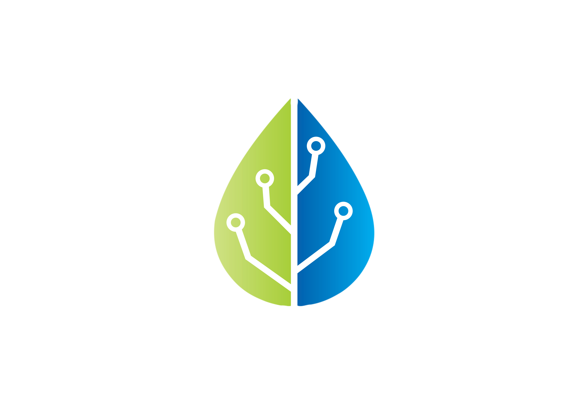

# About

<figure><figcaption></figcaption></figure>

## The PHP architecture layer that wires your system together — so you build features, not infrastructure

Ecotone gives you a set of composable building blocks on a single messaging foundation. You write the business logic; Ecotone is the wiring — connecting it in a decoupled way whether steps run synchronously or asynchronously, within one application or across many. Your business logic stays the first-class citizen while the infrastructure is abstracted away — which is what keeps even the most complex systems simple to build. Communication, reliability, and scalability are the layer's defaults — not code you write.

It runs on the Laravel, Symfony or Tempest you already use — your ORM, routing, and deployment stay. What Ecotone adds is the architecture layer.

```bash
composer require ecotone/laravel    # or ecotone/symfony-bundle, ecotone/tempest
```

***

## See it in one screen

```php
class OrderService
{
    #[CommandHandler]
    public function placeOrder(PlaceOrder $command, EventBus $eventBus): void
    {
        // your business logic
        $eventBus->publish(new OrderWasPlaced($command->orderId));
    }

    #[QueryHandler('order.getStatus')]
    public function getStatus(string $orderId): string
    {
        return $this->orders[$orderId]->status;
    }
}

class NotificationService
{
    #[Asynchronous('notifications')]
    #[EventHandler]
    public function whenOrderPlaced(OrderWasPlaced $event, NotificationSender $sender): void
    {
        $sender->sendOrderConfirmation($event->orderId);
    }
}
```

That's the whole setup — no bus configuration, no handler registration, no retry wiring. Ecotone reads your attributes and wires the rest: command/query/event buses, event routing, async transport (RabbitMQ, SQS, Kafka, DBAL etc), per-handler failure isolation, retries, dead letter, and [OpenTelemetry tracing](modelling/recovering-tracing-and-monitoring/). Move a handler to the background, or switch the async provider from RabbitMQ to SQS, Kafka, or your database, in a single line of configuration. **You build features, not infrastructure.**

***

## What you get

* **Clean domain code** — business logic lives in plain PHP classes; no base classes to extend, no marker interfaces, no framework types leaking into your domain. Attributes declare intent; Ecotone wires the behaviour.
* **Every pattern on one codebase** — CQRS, event sourcing, sagas, workflows, projections, outbox, EIP routing, distributed messaging; added as attributes as your domain grows, no library swaps.
* **Per-handler failure isolation** — a copy of the message to every handler; one handler's failure never touches a sibling.
* **Production resilience by default** — transactional outbox, dead letter + replay, deduplication, retries with backoff.
* **Compose patterns without glue** — the attribute is the wiring; no event-to-handler mapping, no registration, no factory classes.
* **Multi-tenancy down to the channel** — tenant-isolated streams, tenant-routed queues, priority routing.
* **Framework-portable business code** — same classes on Laravel, Symfony, or any PSR-11 container.
* **Testable in-process** — [EcotoneLite](modelling/testing-support/) runs full sync *and* async flows in your test suite, in-memory or against a real broker — the same test either way.

[See every capability, side by side: Why Ecotone?](why-ecotone.md)

***

## Built for AI-assisted development

Because every feature reuses the same building blocks, an AI assistant already knows the shape of the code to generate — less context to feed in, less code to produce, fewer ways to get it wrong. Ecotone ships an [MCP server, agent skills, and `llms.txt`](other/ai-integration.md) so Claude Code, Cursor, and Copilot read and write Ecotone code accurately.

And because [EcotoneLite](modelling/testing-support/) exercises whole scenarios in isolation — sync and async alike, in-memory or against a real broker — the loop closes: developers *and* AI agents can write and verify even the most sophisticated flows. The agent runs a full red-green development loop instead of stalling on hallucinations or scenarios that are hard to test.

***

## Trusted in production

Runs in regulated production since 2017 — payment gateways, certification authorities, nationwide transit, and two-sided marketplaces. Maintained by SimplyCodedSoftware and its open-source contributors, no breaking changes across major versions. → [Why Ecotone?](why-ecotone.md)

***

## Start

**Laravel** — works with Eloquent, Laravel Queues, and Octane; configured through your standard Laravel config.\
`composer require ecotone/laravel`\
→ [Laravel Quick Start](quick-start-php-ddd-cqrs-event-sourcing/laravel-ddd-cqrs-demo-application.md) · [Laravel Module docs](modules/laravel/)

**Symfony** — works with Doctrine ORM and Symfony Messenger transports; Bundle auto-configuration, attributes auto-discovered in `src`.\
`composer require ecotone/symfony-bundle`\
→ [Symfony Quick Start](quick-start-php-ddd-cqrs-event-sourcing/symfony-ddd-cqrs-demo-application/) · [Symfony Module docs](modules/symfony/)

**Tempest** — works with Tempest active-record models as Aggregates and your Tempest database connection; zero-config, attributes auto-discovered from your app's PSR-4 roots (requires PHP 8.4+).\
`composer require ecotone/tempest`\
→ [Tempest Module docs](modules/tempest/)

**Any PHP framework** — Ecotone Lite runs on any PSR-11 container.\
`composer require ecotone/ecotone`\
→ [Ecotone Lite docs](modules/ecotone-lite/)

You don't need to migrate anything to try Ecotone: add `#[CommandHandler]` to one method, run your tests, and decide. If it fits, add more attributes alongside your existing code; if it doesn't, remove the package before you've invested.

* [Install](install-php-service-bus.md) — setup for any framework
* [Why Ecotone?](why-ecotone.md) — the full capability matrix and where Ecotone fits your stack
* [Composing Building Blocks](composing-building-blocks.md) — an Order Fulfillment system built end-to-end, with Symfony Messenger / Laravel Queues comparisons
* [Learn by example](quick-start-php-ddd-cqrs-event-sourcing/) — send your first command in five minutes
* [Go through the tutorial](tutorial-php-ddd-cqrs-event-sourcing/) — build a complete messaging flow step by step
* [Workshops, Support, Consultancy](other/contact-workshops-and-support.md) — hands-on training for your team


Join [Ecotone's Community Channel](https://discord.gg/GwM2BSuXeg) — ask questions and share what you're building.

