# Composing Building Blocks

Most PHP applications grow by accumulating glue: listener services, coordinator classes, job wrappers, cron jobs, status flags on entities. Each new feature adds another piece of code whose only job is to connect things that already exist.

Ecotone's building blocks — Aggregates, Sagas, Command Handlers, Event Handlers, Internal Handlers, Routers, Splitters — **compose directly through attributes**. No orchestrator class sits in the middle. Adding a new feature almost always means adding only handler's logic, not writing wiring code.

This page tells one story: we'll build an **Order Fulfillment** system feature by feature. Each section addresses a real composition problem, adds a new pattern to solve it, and keeps everything we built before untouched. You'll see where orchestration code would normally live, and you'll see Ecotone eliminate it.


**Prerequisites**: Familiarity with [Commands](modelling/command-handling/external-command-handlers/), [Events](modelling/command-handling/external-command-handlers/event-handling.md), and [Aggregates](modelling/command-handling/state-stored-aggregate/) will make this walk-through easier to follow.


## Start Here If You Already Use Symfony Messenger, Laravel Queues, or Vanilla PHP

Ecotone is not a replacement broker or a parallel universe. It runs **inside your existing Symfony or Laravel app** and uses **your existing transports**:

* **Symfony Messenger transports** — Ecotone channels can consume from and publish to the same AMQP, Redis, Doctrine, or SQS transports Messenger uses.
* **Laravel Queues** — Ecotone asynchronous channels run on Laravel's queue connection, sharing the same Redis/SQS/database driver your jobs use.
* **Existing handlers keep working** — Ecotone builds on top of your transport or provide it's own implementation for more advanced features.

You don't trade your broker for Ecotone. You add Ecotone's composition model on top of the broker you already run.

Before the walkthrough, here's the wedge: a concrete pattern you likely already write in given framework, and what it costs you.



Click **Symfony Messenger**, **Laravel Queues**, or **Vanilla PHP** to see the patterns you likely already write in your stack — and what they cost you in boilerplate, missing primitives, and orchestration code that isn't business logic.



**Problem 1 — No chaining primitive; every step is a new Command + Handler + transport route.** Messenger has no concept of "pass this message through N handlers in sequence." Each step must construct and dispatch the next command:

```php
use Symfony\Component\Messenger\Attribute\AsMessageHandler;
use Symfony\Component\Messenger\MessageBusInterface;

#[AsMessageHandler]
final class ValidateOrderHandler
{
    public function __construct(private MessageBusInterface $bus) {}

    public function __invoke(ValidateOrder $cmd): void
    {
        // validate…
        $this->bus->dispatch(new PriceOrder($cmd->orderId));
    }
}
// + PriceOrderHandler, ApplyDiscountsHandler, PlaceOrderHandler — each its own DTO, handler, route
```

A four-step pricing pipeline = 4 command DTOs + 4 handlers + 4 bus injections + 4 transport routes. The official answer for "make B run after A" is `DispatchAfterCurrentBusMiddleware` + `DispatchAfterCurrentBusStamp` — which is exactly the dispatch-the-next-command pattern, just with timing semantics. The community has been asking for `Bus::chain`-style chaining since RFC [#50462](https://github.com/symfony/symfony/issues/50462) (still open). Kris Wallsmith (Symfony core) [published his own gist workaround](https://gist.github.com/kriswallsmith/6514ca5a30db352ad0aea328607546b4); `phphd/pipeline-bundle` exists for the same reason.

**Problem 2 — Splitting one event into three handlers doesn't give you isolation either.** The natural Messenger shape for "OrderPlaced has three reactions" is three separate handler classes:

```php
#[AsMessageHandler]
final class SendConfirmationOnOrderPlaced {
    public function __invoke(OrderPlaced $event): void { /* mailer */ }
}

#[AsMessageHandler]
final class ReserveStockOnOrderPlaced {
    public function __invoke(OrderPlaced $event): void { /* stock */ }
}

#[AsMessageHandler]
final class CreditLoyaltyOnOrderPlaced {
    public function __invoke(OrderPlaced $event): void { /* loyalty */ }
}
```

It looks like three independent reactions. It isn't.

All three handlers run **inside the same envelope, on the same worker invocation**, in an order you cannot rely on. Pristine Messenger does track succeeded handlers via `HandledStamp` and skips them on retry — but the moment you enable `DoctrineTransactionMiddleware` (recommended in the docs, used by almost every Symfony app), it explicitly **strips all `HandledStamp`s** on failure because the rollback invalidated those handlers' DB writes. From the source: _"Remove all HandledStamp from the envelope so the retry will execute all handlers again."_

The consequence: handler A charged a card via Stripe, handler B failed → retry re-executes all three handlers on the same envelope, re-charging the card.

The shape that actually isolates is splitting into a dispatcher that emits one command per reaction, so each lands as its own transport message:

```php
#[AsMessageHandler]
final class OrderPlacedDispatcher
{
    public function __construct(private MessageBusInterface $bus) {}

    public function __invoke(OrderPlaced $event): void
    {
        $this->bus->dispatch(new SendConfirmationEmail($event->orderId));
        $this->bus->dispatch(new ReserveStock($event->orderId));
        $this->bus->dispatch(new CreditLoyaltyPoints($event->customerId));
    }
}
```

Each dispatch travels independently and lands in its own DLQ if it can't recover. Isolation is real; **you just recreated Problem 1** — three subscribers cost 1 dispatcher + 3 commands + 3 handlers + 3 routes.

**Problem 3 — No composable building blocks; every pattern is hand-built with seams between them.** Messenger ships handlers, the bus, and the envelope. None of them have first-class equivalents to the patterns this page builds with — **Aggregate** (domain entities with command/event handlers and identifier-based loading), **Saga** (stateful workflow with timeouts, branching, compensation), **Internal Handler + `outputChannelName`** (pipe one message through N steps with real data flow, no new DTOs per step), **Router** (declarative dispatch by payload, no dispatcher classes wrapping the bus), **Splitter** (fan one message into N independent messages, each with its own retry and DLQ), **Orchestrator** (routing slip composed declaratively), **identifier mapping** (events route to the right Saga/Aggregate instance without hand-rolled repository lookups), **Headers as parameter binds** (Messenger has stamps, but reading one inside a handler requires custom middleware or a custom argument resolver — there is no `#[Header]` parameter binding, no `#[AddHeader]` to enrich on the way out).

When you do build them, combining them means stitching your hand-rolled implementations to Messenger's primitives — every Saga is a Workflow Component + status column + process-manager-by-convention; every router is a dispatcher class wrapping the bus; every fan-out is a `foreach` + `dispatch`. Multi-tenancy is officially out of scope — Messenger, Scheduler, and Cache are designed for single-tenant setups by default. Correlation and causation IDs don't propagate either — community bundles exist solely to add this.

**Ecotone's answer**: every pattern above is a composable building block — they join and combine in any shape via attributes, with each step running sync or async as the need dictates. `#[EventHandler]` methods get independent copies and retries by default — the doctrine transaction middleware trade-off goes away. Ecotone **runs on top of Messenger transports** — your existing AMQP/Redis/Doctrine config keeps working.



**Problem 1 — The message and the job are fused; there is no metadata layer for messages in flight.** A Laravel Job is a class fusing **data** (constructor args) and **behavior** (`handle()`). There is no envelope, no header layer, no notion of "a message moving through handlers and being enriched along the way."

The consequences are everywhere:

* **Cross-cutting metadata has nowhere to live.** Correlation IDs, causation IDs, tenant context, request context — none of these flow across jobs unless you bake them into every job's constructor.
* **Step N+1 cannot see what step N produced.** `Bus::chain` bakes constructor args at dispatch time, before any step runs. If `PriceOrder` calculated a discount that `PlaceOrder` needs, you must persist it and re-query — there is no "pass the enriched message to the next step."
* **You cannot enrich or modify the message in flight.** Adding a header, switching a routing key, or marking the message as belonging to a tenant mid-pipeline is impossible because there is no message — only a job whose constructor was already called.

**Problem 2 — `Bus::chain` chains jobs, but doesn't build business workflows.** A workflow is a stateful, observable, testable process with branching, time, and compensation. `Bus::chain` is a fixed linked list of pre-constructed jobs.

The gap shows up the moment your business actually has a flow:

* **No state ownership.** No entity tracks "Order #123 fulfillment: validated ✓, priced ✓, discounts pending, place pending." You're guessing from queue inspection.
* **No business timeouts.** "If no `PaymentReceived` arrives within 30 minutes, cancel the order" requires polling jobs that re-dispatch themselves — a known anti-pattern.
* **No branching or looping.** "If discount > X, run an approval step." "Try three payment providers in order, fall through on failure." Both require breaking out of the chain entirely into ad-hoc dispatch logic.
* **No compensation primitive.** When the last step permanently fails, the work done by earlier steps (Stripe charged, stock reserved) is stranded. You can write a `failed()` method that calls back to undo earlier steps, but every chain has to invent its own rollback logic — there's no orchestrator owning "what does order-fulfillment compensation look like."
* **You cannot test the workflow as a flow.** You can unit-test each job, but "play the order-fulfillment process forward and assert on the resulting state" is not a primitive.

**Problem 3 — No composable building blocks that work the same sync or async.** Laravel ships Jobs, Listeners, and `Bus::chain`. None of them have first-class equivalents to the patterns this page builds with — **Aggregate** (domain entities with command/event handlers and identifier-based loading), **Saga** (stateful workflow with timeouts, branching, compensation), **Internal Handler + `outputChannelName`** (pipe one message through N steps with real data flow, no new DTOs per step), **Router** (declarative dispatch by payload, no `if/else` ladders), **Splitter** (fan one message into N independent messages, each with its own retry and DLQ), **Orchestrator** (routing slip composed declaratively), **per-handler isolation** + **identifier mapping** (each event subscriber loads its instance and runs in its own failure domain), **Headers** (`#[Header]`, `#[AddHeader]`, `changingHeaders` to read, enrich, and rewrite metadata as the message moves).

And in Laravel, switching a step from sync to async is a different code path per primitive — a Listener has to change interface (`ShouldQueue`), a Job is dispatched differently, `Bus::chain` is its own thing — and the primitives don't combine cleanly with each other either.

**Ecotone's answer**: every pattern above is a composable building block — they join and combine in any shape via attributes, with each step running sync or async as the need dictates. The chain/route/split/fan-out wiring is identical in either mode — no rewrite, no different abstraction. Ecotone runs **on top of Laravel's queue transport** — your existing driver config keeps working.



**Problem — you wire together pieces that were never designed to fit.** Each capability lives in a separate package with its own configuration, its own lifecycle, and its own assumptions. Standing up a working system means:

* gluing the queue, serializer, and dispatcher together with adapter code
* writing the boilerplate each library expects — bootstrap, registration, conversion at every seam
* repeating the same orchestration patterns (retry, dead-letter, correlation, deduplication, fan-out isolation) in your own code because no library owns the cross-cutting concern
* accepting that some compositions are not even possible — features that should be one attribute (per-handler isolation, identifier-based routing, distributed buses) require primitives the libraries don't expose

The integration code is where bugs hide and where every upgrade hurts. None of it is your domain.

**Ecotone's answer**: one install — every pattern (Aggregate, Saga, Internal Handler, Router, Splitter, Orchestrator) is a composable building block joining via attributes, with each step running sync or async as the need dictates. Cross-cutting concerns (retry, dead-letter, correlation, deduplication, per-handler isolation) are attributes too. Start with `#[CommandHandler]` and add `#[Asynchronous]`, `#[Deduplicated]`, `#[ErrorChannel]` as the need arises.



## The Story

| Problem to solve                                                                                                                                        | Composition pattern                      | Orchestration code saved              |
| ------------------------------------------------------------------------------------------------------------------------------------------------------- | ---------------------------------------- | ------------------------------------- |
| [Saving an aggregate and publishing its events](composing-building-blocks.md#saving-an-aggregate-and-publishing-its-events)                             | Command → Aggregate → Event              | Event publishing service              |
| [Reacting from one aggregate to another's events](composing-building-blocks.md#reacting-from-one-aggregate-to-anothers-events)                          | Aggregate → Aggregate via Event          | Coordinating service, listener class  |
| [Coordinating long-running workflows with state and timeouts](composing-building-blocks.md#coordinating-long-running-workflows-with-state-and-timeouts) | Aggregate → Saga via Event               | State machine class, cron job         |
| [Passing a message through a multi-step pipeline](composing-building-blocks.md#passing-a-message-through-a-multi-step-pipeline)                         | Command Handler → Internal Handler chain | Coordinator service, command-per-step |
| [Computing the workflow shape from data](composing-building-blocks.md#computing-the-workflow-shape-from-data)                                           | Orchestrator → dynamic step sequence     | Branching state-machine class         |
| [Branching a flow without if/else in domain code](composing-building-blocks.md#branching-a-flow-without-ifelse-in-domain-code)                          | Router → Aggregate / Command Handler     | `if/else` in domain code              |
| [Fanning out one event to per-item operations](composing-building-blocks.md#fanning-out-one-event-to-per-item-operations)                               | Splitter → Aggregate Command per item    | Loop in a service                     |
| [Moving a handler to async](composing-building-blocks.md#moving-a-handler-to-async)                                                                     | `#[Asynchronous]` on a single attribute  | Job class, serialization plumbing     |
| [Splitting bounded contexts across services](composing-building-blocks.md#splitting-bounded-contexts-across-services)                                   | Distributed Bus between contexts         | Transport code in domain              |

Each section below leads with a focused mini-diagram showing only that section's composition pattern, followed by the code. Solid arrows are normal channel flows; dotted arrows cross a different kind of boundary (a `QueryBus` call, a failure rerouted through an error channel, or a distributed-bus hop between services).

## Saving an aggregate and publishing its events

### Pattern: Command → Aggregate → Event

Start with an aggregate that accepts a command, records an event, and ends. No bus injection, no publisher service.

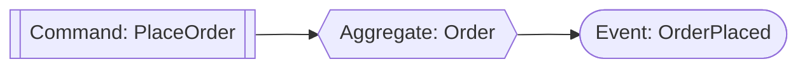

```php
#[Aggregate]
final class Order
{
    use WithEvents;

    #[Identifier]
    private string $orderId;
    private string $customerId;
    private OrderStatus $status;

    private function __construct(string $orderId, string $customerId)
    {
        $this->orderId = $orderId;
        $this->customerId = $customerId;
        $this->status = OrderStatus::Placed;

        $this->recordThat(new OrderPlaced($orderId, $customerId));
    }

    #[CommandHandler]
    public static function place(PlaceOrder $command): self
    {
        return new self($command->orderId, $command->customerId);
    }
}
```


**What Ecotone does for you**: finds the aggregate, loads it (or creates it), persists the new state, and publishes every event recorded via `recordThat()`. You never see an `EventBus`.



**Works with your ORM**: the aggregate above is a plain class. It can equally be a Doctrine ORM entity or an Eloquent Model — Ecotone delegates loading and persistence to your existing repository and runs inside your existing transaction.


The sending side of our system is complete. Everything that follows subscribes to `OrderPlaced` and other events we'll record — **without modifying `Order` once**.

## Reacting from one aggregate to another's events

### Pattern: Aggregate → Aggregate via Event

Customers earn loyalty points when they place orders. The natural place for that logic is the `LoyaltyAccount` aggregate itself — not a coordinator service.

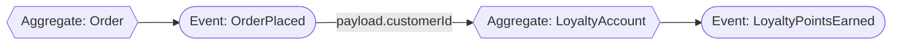

```php
#[Aggregate]
final class LoyaltyAccount
{
    use WithEvents;

    #[Identifier]
    private string $customerId;
    private int $points = 0;

    public static function open(OpenAccount $command): self { /* ... */ }

    #[EventHandler(identifierMapping: ['customerId' => 'payload.customerId'])]
    public function onOrderPlaced(OrderPlaced $event): void
    {
        $this->points += 10;
        $this->recordThat(new LoyaltyPointsEarned($this->customerId, 10));
    }
}
```


`identifierMapping` tells Ecotone which aggregate instance to load based on the event's payload. No query, no lookup service — Ecotone loads the right `LoyaltyAccount`, mutates it, and saves it.


**What's absent:** no `OrderPlacedListener` service, no `LoyaltyAccountRepository` call wired to an event subscriber, no `LoyaltyService::credit()`. The reaction lives in the aggregate that owns the behaviour.



Click **Symfony Messenger** or **Laravel Queues** to see the additional wiring — both event publishing and subscriber side — that those frameworks require on top of the Ecotone code above.



**Publishing the event.** Ecotone auto-publishes every `$this->recordThat(...)` from the aggregate. Messenger doesn't know about your aggregate — you must dispatch the event yourself from whoever saves the aggregate:

```php
use Symfony\Component\Messenger\Attribute\AsMessageHandler;
use Symfony\Component\Messenger\MessageBusInterface;

#[AsMessageHandler]
final class PlaceOrderHandler
{
    public function __construct(
        private OrderRepository $orders,
        private MessageBusInterface $bus,
    ) {}

    public function __invoke(PlaceOrder $command): void
    {
        $order = Order::place($command->orderId, $command->customerId);
        $this->orders->save($order);

        // Manual dispatch — otherwise no listener ever hears about it
        $this->bus->dispatch(new OrderPlaced($order->orderId, $order->customerId));
    }
}
```

**Subscribing to it.** Separate listener class — Messenger can't attach handlers to aggregate methods:

```php
#[AsMessageHandler]
final class CreditLoyaltyPointsOnOrderPlaced
{
    public function __construct(private LoyaltyAccountRepository $repo) {}

    public function __invoke(OrderPlaced $event): void
    {
        // Manual identifier lookup — no framework binding
        $account = $this->repo->findByCustomerId($event->customerId)
            ?? throw new LoyaltyAccountNotFound($event->customerId);

        $account->creditPoints(10);

        $this->repo->save($account);
    }
}
```

Plus `LoyaltyAccountRepository` with `findByCustomerId`. Plus the listener has to know about persistence. Plus transport routing per listener class for isolation. Plus remembering to call `$this->bus->dispatch(...)` every time `Order::place()` runs — miss it once and subscribers go silent.



**Publishing the event.** Ecotone auto-publishes every `$this->recordThat(...)` from the aggregate. Laravel has no aggregate model — you emit the event manually:

```php
$order = Order::create([
    'order_id' => $orderId,
    'customer_id' => $customerId,
]);

// Manual event emission — Laravel model events fire for Eloquent hooks,
// but domain events are on you to publish
event(new OrderPlaced($order->order_id, $order->customer_id));
```

**Subscribing to it.** `ShouldQueue` listener for isolation — fires as its own job:

```php
final class CreditLoyaltyPoints implements ShouldQueue
{
    public function handle(OrderPlaced $event): void
    {
        $account = LoyaltyAccount::where('customer_id', $event->customerId)
            ->firstOrFail();

        $account->increment('points', 10);
    }
}
```

Handler lives outside the aggregate. Lookup is `where()->first()`. No framework-level correlation between the event's identifier and the aggregate's identifier. Plus the `event(...)` call has to sit at every site that changes the order — easy to forget in a migration or a controller shortcut.



The Messenger and Laravel versions above aren't alternatives — they're **additions**. You still need the `LoyaltyAccount` aggregate method that credits points and records `LoyaltyPointsEarned`. What those frameworks add on top is **both the event-publishing call at the write site and the subscriber-side routing and lookup** — which Ecotone collapses into `$this->recordThat(...)` inside the aggregate and `#[EventHandler(identifierMapping: ...)]` on the receiver.

## Coordinating long-running workflows with state and timeouts

### Pattern: Aggregate → Saga via Event

Payment coordination is long-running: request payment, wait for gateway confirmation, retry on timeout, escalate after SLA. That's a Saga — a stateful workflow bound to an identifier.

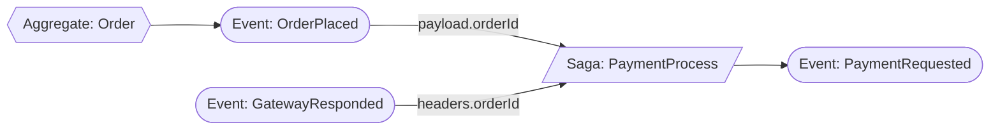

```php
#[Saga]
final class PaymentProcess
{
    use WithEvents;

    #[Identifier]
    private string $orderId;
    private PaymentStatus $status = PaymentStatus::Pending;

    private function __construct(string $orderId)
    {
        $this->orderId = $orderId;
    }

    #[EventHandler(identifierMapping: ['orderId' => 'payload.orderId'])]
    public static function start(OrderPlaced $event): self
    {
        $saga = new self($event->orderId);
        $saga->recordThat(new PaymentRequested($event->orderId));
        return $saga;
    }

    #[EventHandler(identifierMapping: ['orderId' => "headers['orderId']"])]
    public function onGatewayResponse(GatewayResponded $event): void
    {
        $this->status = $event->success
            ? PaymentStatus::Settled
            : PaymentStatus::Failed;
    }
}
```

Two different events, two different sources — one is our domain event carrying `orderId` in payload, the other is a gateway callback carrying `orderId` in message headers. `identifierMapping` handles both.


See [Identifier Mapping](modelling/command-handling/identifier-mapping.md) for the full set of mapping strategies: payload, headers, and expression references to DI services.



**Built on patterns you already know**: like aggregates, a Saga can be a Doctrine ORM entity or an Eloquent Model — Ecotone reuses your existing repository for loading and persistence, and runs inside your existing transaction. You're not learning a new persistence story; you're applying messaging composition on top of the patterns you already use.


#### Time-based actions — payment timeout via `#[Delayed]`

Payments don't always come back. The gateway may go silent, the customer may close the tab, the webhook may never fire. We need to time the saga out — but **without standing up a cron job, a scheduler service, or a polling worker**. Adding a delayed handler on `PaymentRequested` does it: the same event that starts the payment also schedules its timeout, and the broker holds the message for us until the deadline.

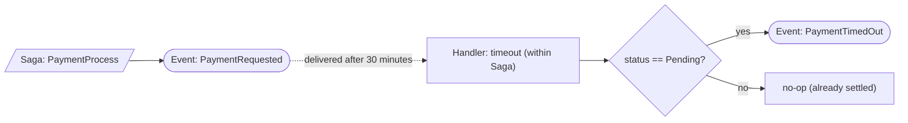

```php
#[Saga]
final class PaymentProcess
{
    // … existing identifier, status, start(), onGatewayResponse() above …

    #[Asynchronous('payments')]
    #[Delayed(new TimeSpan(minutes: 30))]
    #[EventHandler(identifierMapping: ['orderId' => 'payload.orderId'])]
    public function onTimeout(PaymentRequested $event): void
    {
        if ($this->status !== PaymentStatus::Pending) {
            return; // gateway already responded — nothing to time out
        }

        $this->status = PaymentStatus::TimedOut;
        $this->recordThat(new PaymentTimedOut($this->orderId));
    }
}
```

Three things happen for free:

1. **The same event drives both the immediate and delayed paths.** `PaymentRequested` reaches `start()` synchronously and `onTimeout()` 30 minutes later. No second message, no scheduled job — the broker holds the delayed copy until the deadline.
2. **The timeout is a normal saga method.** It loads the same `PaymentProcess` instance via `identifierMapping`, sees the up-to-date `status`, and decides whether to fire `PaymentTimedOut` or no-op. State is consulted at execution time, not at scheduling time.
3. **Replaces the cron job entirely.** No "every minute, look for orders older than 30 minutes that are still pending" query. No watcher service. No SLA-table polling. The deadline is encoded in the message itself.


**Same pattern, many uses**: trial expirations, abandoned-cart reminders, SLA escalations, cooldowns, retry windows, scheduled cleanups. Anywhere you'd reach for a cron, `#[Delayed]` (and its dynamic counterpart `#[Delayed(expression: '…')]` for per-message delays) gets you there with a handler instead of a job runner.




Click **Symfony Messenger** or **Laravel Queues** to see the wiring required to deliver the same 30-minute timeout — separate message/job class, manual dispatch of the delayed message, manual saga lookup at delivery time.



Messenger has no `#[Delayed]` attribute and no concept of "the same event drives both the immediate path and a delayed path." You dispatch a separate message with `DelayStamp` from the place that creates the saga, write a separate handler for the timeout-check message, and have it look up the saga to decide whether to act:

```php
use Symfony\Component\Messenger\MessageBusInterface;
use Symfony\Component\Messenger\Stamp\DelayStamp;

// Inside the saga-start handler — schedule the timeout check
final class HandleOrderPlacedForPayment
{
    public function __construct(private MessageBusInterface $bus) {}

    #[AsMessageHandler]
    public function __invoke(OrderPlaced $event): void
    {
        // … saga creation logic …

        $this->bus->dispatch(
            new CheckPaymentTimeout($event->orderId),
            [new DelayStamp(30 * 60 * 1000)] // milliseconds
        );
    }
}

// Separate message + separate handler
final class CheckPaymentTimeout
{
    public function __construct(public readonly string $orderId) {}
}

final class CheckPaymentTimeoutHandler
{
    public function __construct(
        private PaymentSagaRepository $repo,
        private MessageBusInterface $bus,
    ) {}

    #[AsMessageHandler]
    public function __invoke(CheckPaymentTimeout $cmd): void
    {
        $saga = $this->repo->findByOrderId($cmd->orderId);
        if ($saga === null || $saga->status !== PaymentStatus::Pending) {
            return; // already settled
        }

        $saga->markTimedOut();
        $this->repo->save($saga);
        $this->bus->dispatch(new PaymentTimedOut($cmd->orderId));
    }
}
```

Plus: a transport that supports `DelayStamp` (AMQP/Doctrine/Redis/SQS/Beanstalkd) routed to the `CheckPaymentTimeout` message. No cancellation if the gateway responds early — you rely on the saga's status check at delivery time. The "same event drives immediate + delayed" semantics that `#[Delayed]` gives you for free have to be assembled from a second message class, a second handler, and a second dispatch site.



Laravel has `delay()` on jobs, but no concept of attaching a delayed delivery to an event handler. You schedule a separate job from the listener that creates the saga, and the job loads the model to decide whether to act:

```php
// In the listener that creates the saga
final class HandleOrderPlacedForPayment implements ShouldQueue
{
    public function handle(OrderPlaced $event): void
    {
        PaymentSaga::firstOrCreate(
            ['order_id' => $event->orderId],
            ['status' => 'pending']
        );

        CheckPaymentTimeout::dispatch($event->orderId)
            ->delay(now()->addMinutes(30));
    }
}

// Separate job
final class CheckPaymentTimeout implements ShouldQueue
{
    use Queueable;

    public function __construct(public readonly string $orderId) {}

    public function handle(): void
    {
        $saga = PaymentSaga::where('order_id', $this->orderId)->first();
        if ($saga === null || $saga->status !== 'pending') {
            return;
        }

        $saga->update(['status' => 'timed_out']);
        event(new PaymentTimedOut($this->orderId));
    }
}
```

Plus: a queue driver that supports delays (database/redis/sqs do; sync doesn't). No cancellation if the gateway responds early — same status-check pattern at delivery. The connection between "saga started" and "saga must time out in 30 minutes" lives in the listener that dispatches the delayed job, not on the saga itself.





Click **Symfony Messenger** or **Laravel Queues** to see the additional wiring — event publishing, saga loading, identifier extraction from payload vs headers — that those frameworks require on top of the Ecotone saga above.



**Publishing the events.** Ecotone auto-publishes the saga's own emissions (`$saga->recordThat(new PaymentRequested(...))`) and `OrderPlaced` from the Order aggregate. In Messenger, both have to be dispatched by hand — typically from the command handler that saved the aggregate, and from the gateway webhook controller that received the callback. The `orderId` that Ecotone reads from message metadata becomes a payload field, since Messenger handlers receive the message object, not the envelope's stamps:

```php
// After saving the Order aggregate
$this->bus->dispatch(new OrderPlaced($order->orderId, $order->customerId));

// In the gateway webhook controller, after parsing the callback —
// the orderId that was a message header in Ecotone is now a payload field
$this->bus->dispatch(new GatewayResponded(
    transactionId: $txnId,
    orderId: $extractedOrderId,
    success: $success,
));

// After the saga transitions itself
$this->bus->dispatch(new PaymentRequested($saga->orderId));
```

**Subscribing — loading the saga and routing events to it.** Status column on a Doctrine entity, plus a class with one `#[AsMessageHandler]` method per event type (a single `__invoke` cannot bind to multiple message classes), each doing its own identifier extraction and lookup:

```php
use Symfony\Component\Messenger\Attribute\AsMessageHandler;

final class PaymentSagaHandlers
{
    public function __construct(private PaymentSagaRepository $repo) {}

    #[AsMessageHandler]
    public function onOrderPlaced(OrderPlaced $event): void
    {
        $saga = $this->repo->findByOrderId($event->orderId)
            ?? PaymentSaga::createFor($event->orderId);

        $saga->requestPayment();
        $this->repo->save($saga);
    }

    #[AsMessageHandler]
    public function onGatewayResponded(GatewayResponded $event): void
    {
        $saga = $this->repo->findByOrderId($event->orderId)
            ?? throw new PaymentSagaNotFound($event->orderId);

        $saga->handleGatewayResponse($event->success);
        $this->repo->save($saga);
    }
}
```

Plus `PaymentSaga` entity with `status` enum, plus `PaymentSagaRepository`, plus retry/compensation glue for each transition, plus every event dispatch site listed above. Messenger has no first-class Saga.



**Publishing the events.** No automatic domain-event emission. Every state change that "recorded" something in the Ecotone aggregate must explicitly `event(...)` it here:

```php
// In the Order flow
event(new OrderPlaced($order->order_id, $order->customer_id));

// In the gateway webhook controller
event(new GatewayResponded($txnId, $success, orderId: $extractedOrderId));

// In the saga transition
event(new PaymentRequested($saga->order_id));
```

**Subscribing — Eloquent model with status column + two `ShouldQueue` listeners:**

```php
final class HandleOrderPlacedForPayment implements ShouldQueue
{
    public function handle(OrderPlaced $event): void
    {
        PaymentSaga::firstOrCreate(
            ['order_id' => $event->orderId],
            ['status' => 'pending']
        );
        // plus: dispatch TakePayment job here
    }
}

final class HandleGatewayResponse implements ShouldQueue
{
    public function handle(GatewayResponded $event): void
    {
        $saga = PaymentSaga::where('order_id', $event->orderId)->firstOrFail();
        $saga->update([
            'status' => $event->success ? 'settled' : 'failed',
        ]);
    }
}
```

Saga state is a model column. Two listener classes — one per event. Header-based identifier extraction is manual. No framework guarantee that both listeners operate on the same saga instance with consistent versioning. Plus every publishing site — aggregate write, webhook callback, transition — has to remember to call `event(...)`.



The Messenger and Laravel versions above aren't alternatives — they're **additions**. You still need the `PaymentProcess` saga class with payment-state and transition logic. What those frameworks add on top is **publishing each event at every write site, plus saga loading and identifier extraction from payload vs headers on the subscriber side** — which Ecotone collapses into `$this->recordThat(...)` inside the saga and two `#[EventHandler(identifierMapping: ...)]` attributes on the receivers.

## Passing a message through a multi-step pipeline

### Pattern: Command Handler → Internal Handler chain

Before placing an order we want to compute pricing, apply discounts, then save. Each step is its own handler; they chain via `outputChannelName`.

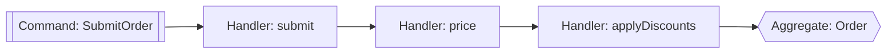

```php
final class OrderPricing
{
    #[CommandHandler(
        routingKey: 'order.submit',
        outputChannelName: 'order.price'
    )]
    public function submit(SubmitOrder $command): SubmitOrder
    {
        return $command; // validated — passes through
    }

    #[InternalHandler(
        inputChannelName: 'order.price',
        outputChannelName: 'order.applyDiscounts'
    )]
    public function price(SubmitOrder $command, PriceList $priceList): PricedOrder
    {
        return $command->withPricesFrom($priceList);
    }

    #[InternalHandler(
        inputChannelName: 'order.applyDiscounts',
        outputChannelName: 'order.place'
    )]
    public function applyDiscounts(PricedOrder $order, DiscountRules $rules): PricedOrder
    {
        return $order->withDiscounts($rules);
    }
}
```

The final link targets the aggregate we already have:

```php
#[CommandHandler(routingKey: 'order.place')]
public static function place(PricedOrder $order): self { /* ... */ }
```


**Pipes and Filters**: Each step is testable in isolation. Reorder, insert, or skip steps by changing `outputChannelName` — no service needs rewriting.




Click **Symfony Messenger** or **Laravel Queues** to see how the same four-step pipeline becomes four message classes, four handlers, and four bus injections in those frameworks — because a single message cannot be passed along through multiple handlers.



A pipeline of N steps requires N command classes and N handlers, each handler injecting `MessageBusInterface` to push the next message:

```php
use Symfony\Component\Messenger\Attribute\AsMessageHandler;
use Symfony\Component\Messenger\MessageBusInterface;

// Step 1 — validation pass-through
#[AsMessageHandler]
final class SubmitOrderHandler
{
    public function __construct(private MessageBusInterface $bus) {}

    public function __invoke(SubmitOrder $command): void
    {
        // validate…
        $this->bus->dispatch(new PriceOrder($command->orderId, $command->lineItems));
    }
}

// Step 2 — pricing
#[AsMessageHandler]
final class PriceOrderHandler
{
    public function __construct(
        private PriceList $priceList,
        private MessageBusInterface $bus,
    ) {}

    public function __invoke(PriceOrder $command): void
    {
        $priced = /* compute pricing from $this->priceList */;
        $this->bus->dispatch(new ApplyDiscounts($command->orderId, $priced));
    }
}

// Step 3 — discounts
#[AsMessageHandler]
final class ApplyDiscountsHandler
{
    public function __construct(
        private DiscountRules $rules,
        private MessageBusInterface $bus,
    ) {}

    public function __invoke(ApplyDiscounts $command): void
    {
        $final = /* apply $this->rules */;
        $this->bus->dispatch(new PlaceOrder($command->orderId, $final));
    }
}

// Step 4 — finalize (separate aggregate command)
#[AsMessageHandler]
final class PlaceOrderHandler { /* … saves the Order aggregate … */ }
```

Plus four message classes (`SubmitOrder`, `PriceOrder`, `ApplyDiscounts`, `PlaceOrder`), each potentially with its own normalizer, plus transport routing per command if any of them go async, plus correlation/causation propagation if you want to trace the chain end-to-end.



Job chaining ships in Laravel via `Bus::chain()` — the caller (controller, service) enumerates the steps:

```php
use Illuminate\Support\Facades\Bus;

Bus::chain([
    new ValidateOrderJob($orderId, $lineItems),
    new PriceOrderJob($orderId),
    new ApplyDiscountsJob($orderId),
    new PlaceOrderJob($orderId),
])->dispatch();
```

Notice every job takes only `$orderId` — that's not a stylistic choice, it's a constraint. **Jobs cannot pass or modify data between steps.** Each job's constructor args are baked in at the moment `Bus::chain()` is called, before any step has run. So if `PriceOrderJob` calculates pricing that `ApplyDiscountsJob` needs, the pricing has to be **persisted somewhere** — an `order_pricing` row, an extra column on the order, a side-table — and the next job re-queries it. Every transformation between steps becomes a write/read round-trip, every job loads its inputs again, and the workflow's "message in flight" lives in your schema instead of in the pipeline.

A change to the pipeline shape lives in whichever caller builds the chain — pricing, discount, and place-order aggregate all stay separate, but **the workflow definition is split between the caller and N job classes**, with no single declarative source.



The Messenger and Laravel versions above aren't alternatives — they're **additions**. The business logic of validation, pricing, discount application, and aggregate persistence stays the same. What those frameworks add on top is **N command/job classes, N dispatch sites, and (in Laravel's case) per-step state loading between handlers** — which Ecotone collapses into one `outputChannelName` per step on methods that pass the message object directly to the next link.

## Computing the workflow shape from data

### Pattern: Orchestrator → dynamic step sequence

The static pricing chain from the previous section hard-coded a four-step pipeline with `outputChannelName`. That's perfect when every order follows the same recipe. Fulfillment is different: digital downloads skip shipping, gift orders need wrapping, fraud-flagged orders need an extra verification step. Instead of branching with a chain of Routers, we compute the step list from data and let an `#[Orchestrator]` execute it.

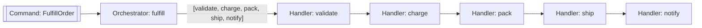

```php
final class FulfillmentWorkflow
{
    #[Orchestrator(inputChannelName: 'order.fulfill')]
    public function fulfill(Order $order): array
    {
        $steps = ['fulfill.validate', 'fulfill.charge'];

        if ($order->requiresFraudCheck()) {
            $steps[] = 'fulfill.verifyFraud';
        }

        if ($order->hasPhysicalGoods()) {
            $steps[] = 'fulfill.pack';
            $steps[] = 'fulfill.ship';
        }

        if ($order->isGift()) {
            $steps[] = 'fulfill.wrapGift';
        }

        return [...$steps, 'fulfill.notifyCustomer'];
    }

    #[InternalHandler('fulfill.validate')]
    public function validate(Order $order): Order { /* ... */ }

    #[InternalHandler('fulfill.charge')]
    public function charge(Order $order, Payments $payments): Order { /* ... */ }

    #[InternalHandler('fulfill.pack')]
    public function pack(Order $order, Warehouse $wh): Order { /* ... */ }

    // ... other step handlers
}
```


**The workflow definition lives in one place**. Reading `fulfill()` tells you every possible step and what drives the branching. Each step is an `InternalHandler` — individually testable and reusable across workflows.


Compare with the static chain (previous section) and the Router (next section): static chain = fixed linear sequence; Router = one decision point between two paths; Orchestrator = entire sequence computed from data. Each is the right tool for a different shape of workflow.


**Enterprise feature** — honest framing: Orchestrator lives in Ecotone's paid Enterprise bundle. The open-source equivalent is to combine static chains, Routers, and Sagas (covered in the surrounding sections) — that covers most workflow shapes, at the cost of not being able to return the step list as data. Reach for Orchestrator when the sequence itself is the thing that changes per message.

See [Orchestrators: Declarative Workflow Automation](modelling/business-workflows/orchestrators.md) for the full reference.




Click **Symfony Messenger** or **Laravel Queues** to see why dynamic-step workflows are usually **not built** in those frameworks — the plumbing volume makes them not worth it.



There's no built-in dynamic-workflow primitive. Reproducing the Ecotone version requires an `if/else` ladder that decides what to dispatch next, with each step being its own command class and its own handler that injects `MessageBusInterface` to push the next message:

```php
use Symfony\Component\Messenger\Attribute\AsMessageHandler;
use Symfony\Component\Messenger\MessageBusInterface;

// Entry point — picks the first step based on the order shape
#[AsMessageHandler]
final class FulfillOrderHandler
{
    public function __construct(private MessageBusInterface $bus) {}

    public function __invoke(FulfillOrder $command): void
    {
        $order = $command->order;

        // Always start with validation
        $this->bus->dispatch(new ValidateOrder($order, next: $this->nextAfterValidate($order)));
    }

    private function nextAfterValidate(Order $order): string
    {
        if ($order->requiresFraudCheck())   return 'verifyFraud';
        if ($order->hasPhysicalGoods())     return 'pack';
        if ($order->isGift())               return 'wrapGift';
        return 'notifyCustomer';
    }
}

// Each step has to know "what's next" or look it up in some shared planner
#[AsMessageHandler]
final class ValidateOrderHandler
{
    public function __construct(private MessageBusInterface $bus) {}

    public function __invoke(ValidateOrder $command): void
    {
        // validate…
        match ($command->next) {
            'verifyFraud'    => $this->bus->dispatch(new VerifyFraud($command->order, next: /*…*/)),
            'pack'           => $this->bus->dispatch(new Pack($command->order, next: /*…*/)),
            'wrapGift'       => $this->bus->dispatch(new WrapGift($command->order, next: /*…*/)),
            'notifyCustomer' => $this->bus->dispatch(new NotifyCustomer($command->order)),
        };
    }
}

// …repeat for VerifyFraudHandler, PackHandler, ShipHandler, WrapGiftHandler, NotifyCustomerHandler,
//    each duplicating the "what's next" decision or carrying it in the message payload
```

Six possible step combinations × N branches per handler = a state machine smeared across handlers, with the workflow shape encoded implicitly in each step's `match` expression. Adding a new optional step (say, `applyTax` only for international orders) means **touching every prior step's branching logic** to teach it about the new option.



`Bus::chain` requires the chain to be known at dispatch time — you build the array based on conditions in the caller:

```php
use Illuminate\Support\Facades\Bus;

$jobs = [new ValidateOrderJob($orderId), new ChargeOrderJob($orderId)];

if ($order->requiresFraudCheck()) {
    $jobs[] = new VerifyFraudJob($orderId);
}

if ($order->hasPhysicalGoods()) {
    $jobs[] = new PackJob($orderId);
    $jobs[] = new ShipJob($orderId);
}

if ($order->isGift()) {
    $jobs[] = new WrapGiftJob($orderId);
}

$jobs[] = new NotifyCustomerJob($orderId);

Bus::chain($jobs)->dispatch();
```

Plus a job class per step, each doing its own state lookup at the start of `handle()` because chained jobs don't pass return values forward. The workflow definition lives in whichever caller built the chain — controllers, services, listeners — with no single place that documents "here are the possible step sequences." Adding a new step means hunting down every site that builds a chain.



**The honest summary.** In Messenger and Laravel, workflows whose step sequence depends on data are technically possible but **rarely worth building** — the plumbing volume (command classes, handlers, dispatch sites, "what's next" decisions sprayed across handlers) costs more than the feature delivers. So teams reach for status flags, conditional fields on entities, big `if/else` blocks in service classes, or just don't model the workflow at all and let it emerge from request handlers.

Ecotone's Orchestrator collapses this to one method that returns an array of channel names. **Patterns that weren't worth building become worth building** — a fulfillment workflow that picks 3-of-7 steps based on order type is ten lines of code, not a 200-line refactor. The composition model lowers the cost floor for advanced patterns enough that they show up in projects where they previously wouldn't have.

## Branching a flow without if/else in domain code

### Pattern: Router → Aggregate / Command Handler

A Router's job is **dynamic redirection** — at runtime it inspects the message and returns the channel name to send it to next. Branching becomes a first-class step in the pipeline rather than an `if/else` baked into a handler. B2B customers require approval before placing; B2C orders skip straight to the aggregate. The Router decides per message — business code stays branch-free.

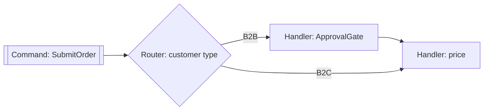

```php
final class OrderRouter
{
    #[Router(inputChannelName: 'order.submit')]
    public function route(SubmitOrder $command): string
    {
        return $command->isBusinessCustomer()
            ? 'order.requireApproval'
            : 'order.price';
    }
}

final class ApprovalGate
{
    #[InternalHandler(
        inputChannelName: 'order.requireApproval',
        outputChannelName: 'order.price'
    )]
    public function request(SubmitOrder $command, Approvals $approvals): SubmitOrder
    {
        $approvals->request($command->orderId);
        return $command;
    }
}
```

The pricing chain we built earlier is unchanged. The aggregate is unchanged. We added one Router and one InternalHandler — the B2B path is now a fully isolated concern.


**Adding more variants later**: a new flow for wholesale customers is a new case in the Router plus a new InternalHandler. Nothing downstream has to know.


## Fanning out one event to per-item operations

### Pattern: Splitter → Aggregate Command per item

When an order is placed, each line item needs a stock reservation on its own `Stock` aggregate. A Splitter fans out; each output message targets the aggregate's command handler.

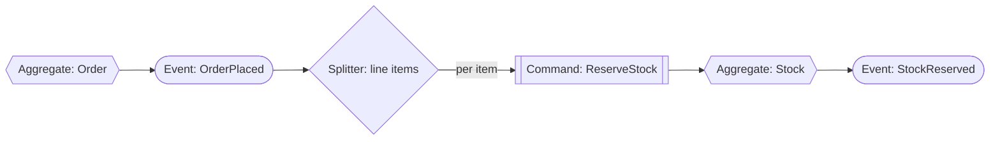

```php
final class StockReservations
{
    #[Splitter(
        inputChannelName: 'order.placed.reserveStock',
        outputChannelName: 'stock.reserve'
    )]
    public function split(OrderPlaced $event): array
    {
        return array_map(
            fn(LineItem $item) => new ReserveStock(
                $item->productId,
                $item->quantity,
                $event->orderId,
            ),
            $event->lineItems,
        );
    }
}

#[Aggregate]
final class Stock
{
    use WithEvents;

    #[Identifier]
    private string $productId;
    private int $available;

    #[CommandHandler('stock.reserve')]
    public function reserve(ReserveStock $command): void
    {
        if ($this->available < $command->quantity) {
            $this->recordThat(new ReservationRejected($command->orderId, $command->productId));
            return;
        }

        $this->available -= $command->quantity;
        $this->recordThat(new StockReserved($command->orderId, $command->productId));
    }
}
```

Wire the event into the splitter with one more subscription:

```php
#[EventHandler(outputChannelName: 'order.placed.reserveStock')]
public function fanOut(OrderPlaced $event): OrderPlaced { return $event; }
```


**Per-item isolation**: each reservation is a separate message. Retries, failures, and concurrency are per-product-aggregate — not per-order.




Click **Symfony Messenger** or **Laravel Queues** to see the additional wiring — manual per-item dispatch, per-item aggregate lookup, per-item `StockReserved` event publishing — that those frameworks require on top of the Ecotone Splitter above.



**Publishing — both the incoming event and every downstream one.** Ecotone auto-publishes `OrderPlaced` from the Order aggregate and `StockReserved` from each `Stock` aggregate after `reserve()`. Messenger needs both explicitly dispatched:

```php
use Symfony\Component\Messenger\Attribute\AsMessageHandler;
use Symfony\Component\Messenger\MessageBusInterface;

// Upstream: after Order is saved
$this->bus->dispatch(new OrderPlaced($order->orderId, $order->lineItems));

// Downstream: inside the ReserveStock handler after Stock::reserve() runs
#[AsMessageHandler]
final class ReserveStockHandler
{
    public function __construct(
        private StockRepository $stocks,
        private MessageBusInterface $bus,
    ) {}

    public function __invoke(ReserveStock $command): void
    {
        $stock = $this->stocks->findByProductId($command->productId)
            ?? throw new StockNotFound($command->productId);

        $stock->reserve($command->quantity, $command->orderId);
        $this->stocks->save($stock);

        // Manual emission per item — otherwise no downstream listener sees it
        $this->bus->dispatch(new StockReserved($command->orderId, $command->productId));
    }
}
```

**Fan-out — a separate handler that loops and dispatches N commands:**

```php
#[AsMessageHandler]
final class FanOutStockReservations
{
    public function __construct(private MessageBusInterface $bus) {}

    public function __invoke(OrderPlaced $event): void
    {
        foreach ($event->lineItems as $item) {
            $this->bus->dispatch(new ReserveStock(
                $item->productId,
                $item->quantity,
                $event->orderId,
            ));
        }
    }
}
```

Plus a `ReserveStock` command class, plus `ReserveStockHandler` as shown, plus transport routing for the `ReserveStock` queue, plus manual correlation/causation if you want the fan-out traced end-to-end.



**Publishing — both upstream and per-item.** `event(...)` at the write site, then again per successful reservation:

```php
use Illuminate\Contracts\Queue\ShouldQueue;
use Illuminate\Foundation\Queue\Queueable;

// Upstream: after Order is created
event(new OrderPlaced($order->order_id, $order->line_items));

// Per item: inside the job after the reservation succeeds
final class ReserveStockJob implements ShouldQueue
{
    use Queueable;

    public function __construct(
        public string $productId,
        public int $quantity,
        public string $orderId,
    ) {}

    public function handle(): void
    {
        $stock = Stock::where('product_id', $this->productId)->firstOrFail();
        $stock->decrement('available', $this->quantity);

        event(new StockReserved($this->orderId, $this->productId));
    }
}
```

**Fan-out listener:**

```php
final class FanOutStockReservations implements ShouldQueue
{
    public function handle(OrderPlaced $event): void
    {
        foreach ($event->lineItems as $item) {
            ReserveStockJob::dispatch(
                $item->productId,
                $item->quantity,
                $event->orderId,
            );
        }
    }
}
```

Same shape: fan-out listener, per-item job, manual repository lookup per item. Plus every reservation has to `event(new StockReserved(...))` for downstream handlers to hear about it. No framework binding between the event's line items and the per-item aggregate.



The Messenger and Laravel versions above aren't alternatives — they're **additions**. You still need the `Stock` aggregate with a `reserve()` method and the `ReserveStock` command shape. What those frameworks add on top is **manual fan-out, per-item repository lookup, and explicit publishing of both `OrderPlaced` upstream and `StockReserved` at every item** — which Ecotone collapses into `#[Splitter]` returning an array and `$this->recordThat(...)` inside the aggregate.

## Moving a handler to async

### Pattern: `#[Asynchronous]` on a single attribute

The loyalty handler from the aggregate-to-aggregate section doesn't need to block the order-placement request. Crediting points is fire-and-forget from the customer's point of view — they don't refresh and check their points balance immediately after checkout. Adding one attribute moves the loyalty work off the request thread onto a broker — every retry, DLQ, and isolation guarantee kicks in automatically.

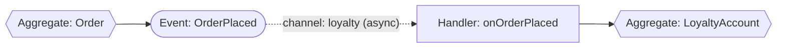

```php
#[Aggregate]
final class LoyaltyAccount
{
    use WithEvents;

    #[Identifier]
    private string $customerId;
    private int $points = 0;

    #[Asynchronous('loyalty')]
    #[EventHandler(
        endpointId: 'creditPointsOnOrderPlaced',
        identifierMapping: ['customerId' => 'payload.customerId'],
    )]
    public function onOrderPlaced(OrderPlaced $event): void
    {
        $this->points += 10;
        $this->recordThat(new LoyaltyPointsEarned($this->customerId, 10));
    }
}
```

Declare the channel once — any transport works:

```php
#[ServiceContext]
public function loyaltyChannel(): MessageChannelBuilder
{
    return AmqpBackedMessageChannelBuilder::create('loyalty');
    // or SqsBackedMessageChannelBuilder, KafkaBackedMessageChannelBuilder,
    // DbalBackedMessageChannelBuilder, RedisBackedMessageChannelBuilder
}
```


**Same code, different execution semantics**. The loyalty aggregate method is unchanged from when we first wrote it. Ecotone moves the delivery boundary for us. Other subscribers of `OrderPlaced` (the payment saga, the stock fan-out) are unaffected — each gets its own copy of the message; a failure in loyalty crediting never retries the others.


You can apply `#[Asynchronous]` to any handler in any chain we've built so far. The pricing chain, the stock fan-out, the payment saga — each is a candidate for an independent queue with independent retry and priority settings.



Click **Symfony Messenger** or **Laravel Queues** to see why moving one subscriber from sync to async per-handler isn't a one-line change in those frameworks.



Asynchronous delivery in Messenger requires routing the message class to a transport. You configure `messenger.yaml`:

```yaml
framework:
    messenger:
        transports:
            loyalty: '%env(MESSENGER_LOYALTY_DSN)%'
        routing:
            App\Order\Event\OrderPlaced: loyalty
```

But this routes the **whole event** to the `loyalty` transport — which means **every subscriber** of `OrderPlaced` is async on that queue, sharing its retry policy, sharing its consumer workers, and (most importantly) sharing its failure domain. If the loyalty subscriber fails, stock reservation and the payment saga get re-delivered too, because the transport only knows about the envelope, not which handler owns it.

To get per-handler async, you convert each subscriber into its own command and route each command to its own transport — trading one attribute for N command classes and N transport routes.



```php
use Illuminate\Contracts\Queue\ShouldQueue;

// Each subscriber needs its own ShouldQueue listener class
final class CreditLoyaltyPoints implements ShouldQueue
{
    public string $queue = 'loyalty';
    public int $tries = 3;
    public array $backoff = [30, 60, 120];

    public function handle(OrderPlaced $event): void { /* … */ }
}
```

Works, but each listener is a full job class with its own retry + queue config. Four subscribers = four classes, four queue configs. And if you want to move one subscriber from sync to async you restructure the class — `ShouldQueue` is an interface, not an attribute you toggle.



The Messenger and Laravel versions above aren't alternatives — they're **additions**. You still need the loyalty-crediting business logic from the aggregate-to-aggregate section. What those frameworks add on top is **transport routing per message class (Messenger) or per-listener queue config (Laravel)** — and in Messenger's case, the routing is at the wrong granularity (per message class, not per handler), forcing you back into command-per-subscriber to regain isolation.

## Splitting bounded contexts across services

### Pattern: Distributed Bus between contexts

Payment is a bounded context that deserves its own service and database. The `Order` service stays as-is; the `Payment` service exposes its handlers over a distributed bus.

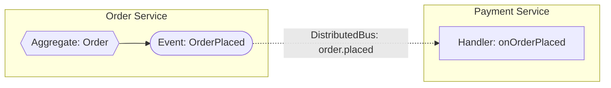

Inside the Order service — publish across the boundary:

```php
#[EventHandler]
public function onOrderPlaced(
    OrderPlaced $event,
    #[Reference] DistributedBus $distributedBus
): void {
    $distributedBus->convertAndPublishEvent(
        routingKey: 'order.placed',
        event: $event,
    );
}
```

Inside the Payment service — consume across the boundary:

```php
#[Distributed]
#[EventHandler('order.placed')]
public function onOrderPlaced(OrderPlaced $event): void
{
    // Same code as a local subscriber — Ecotone handles transport and conversion
}
```


**No shared classes required**. Each service defines its own `OrderPlaced` shape. Ecotone converts between them via registered converters. Messages flow over any supported broker — switching RabbitMQ for SQS is a configuration change.


The Saga from earlier can live on either side. Everything we built before continues to work — splitting the system is an infrastructure decision, not a code rewrite.

## Failures and Resume

At some point, one handler will fail. A mailer will time out. A third-party API will 500. In most message-bus setups this cascades — all subscribers on the event get re-delivered, already-succeeded work gets repeated, and the only way to recover is to manually purge the queue or write compensating logic.

Ecotone's per-handler isolation turns this into a surgical operation: **only the failing handler's message goes to its Dead Letter Queue. Everything else stays done. When you resume, only the failed handler replays — not the chain.**

Here's what happens when `OrderPlaced` triggers three async subscribers and one fails:

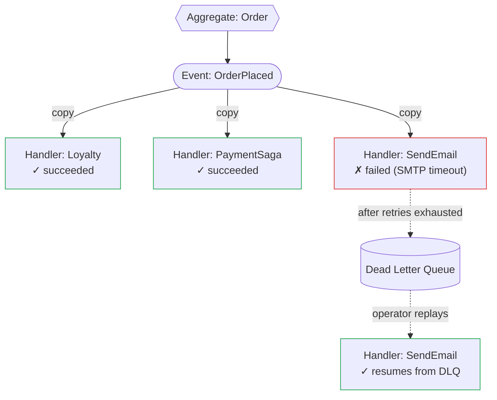

Three things to notice:

1. **Handlers 1 and 2 stay complete.** Ecotone delivered a separate copy of the message to each subscriber. A failure in handler 3 does not roll back the others, does not re-enqueue them, does not cause them to see the message twice.
2. **Handler 3's message lands in its own DLQ** after the configured retry policy is exhausted — not the "global DLQ" for the whole event.
3. **Replay is per-handler.** An operator (or an automated replay job) pulls the failed message out of the DLQ and sends it back to handler 3 only. The other subscribers are untouched; the aggregate state is untouched; no compensation logic runs.

Wiring the error channel and retry policy is one `ServiceContext`:

```php
#[ServiceContext]
public function emailResiliency(): ErrorHandlerConfiguration
{
    return ErrorHandlerConfiguration::createWithDeadLetterChannel(
        inputChannelName: 'notifications_error',
        retryTemplate: RetryTemplateBuilder::exponentialBackoff(1000, 10)
            ->maxRetryAttempts(3),
        deadLetterChannelName: 'dbal_dead_letter',
    );
}
```

One configuration block, three retries with exponential backoff, then to Dead Letter. Same policy works for RabbitMQ, SQS, Kafka, Redis, or Database channels — you don't rewrite it per broker.


**At-least-once semantics and idempotency.** The dotted arrows in the Finished System diagram — failures, emissions, distributed-bus hops — all carry at-least-once guarantees. Make handlers idempotent at the handler level (or use `#[Deduplicated]` with a stable key expression) when the operation isn't naturally safe to retry. Ecotone stores deduplication state in your application database, so it survives redeployments.


Failures aren't a separate discipline in Ecotone. They flow through the same channel composition model as the happy path, which is why resuming from them is a one-handler operation rather than a full-chain rewind.

## The Real Cost

The honest comparison isn't a file count. It's a cost dynamic that goes two ways — and Ecotone removes both.

**Option A — you don't build it.** Most of what this page demonstrated (a routing-slip Orchestrator computed from data, a Splitter with per-item retry, a Router that branches dynamically, a Saga with a 30-minute timeout, per-handler isolation on event fan-out) is technically possible to assemble by hand on top of any framework. But the cost of standing each one up — designing the message flow, wiring step-to-step, persisting interim state, threading correlation through, building the test harness — is high enough that **most teams don't build them**. The feature ships as a status column and a polling job, or as an `if/else` in a controller, or doesn't ship at all. The composition stays in someone's head as "we'd do that if it were cheap." The cost shows up as features the product never gets.

**Option B — you build it, and now you maintain it.** The orchestration code is real. It needs tests. It needs to be understood by everyone touching the feature. It needs updating when the flow changes. The developer reading the codebase has to understand both **the business flow** ("when an order is placed, credit loyalty, reserve stock, request payment, time it out at 30 minutes…") **and** the **orchestration scaffolding** that makes the flow run ("the OrderPlacedDispatcher fans out, the PaymentSagaStateMachine has a status enum that gates handler entry, the FulfillmentOrchestrator dispatches based on a switch on order type, the timeout-check job loads the saga and decides whether to act"). The wiring becomes part of the surface area you carry forward — every refactor crosses both layers.

Ecotone collapses both options. The composition is the attribute — there is nothing to scaffold and nothing to skip. A handler that needs to be a step in a chain gets `outputChannelName`. A handler that needs to time out gets `#[Delayed]`. A handler that needs to fan out gets `#[Splitter]`. The flow is testable as a flow with `EcotoneLite::bootstrapFlowTesting`. **The thing you read in the code is the business flow** — there is no orchestration layer underneath that you also have to read, test, and maintain.

Two trade-offs worth naming honestly:

* **Expression-language strings for identifier mapping** (`payload.orderId`, `headers['x']`) are runtime-evaluated. Renaming a payload field doesn't trigger a static error — it triggers a runtime miss. Prefer `identifierMetadataMapping` with a constant key when your event shapes are stable; use expressions when you need to reach into nested payloads or combine multiple sources.
* **Channel names are strings.** `outputChannelName: 'order.price'` isn't type-checked. If you rename a channel, grep-and-replace across the codebase. This is the same cost as Symfony's service-ID strings or Laravel's queue names — familiar, but real.

Everything else — retry policies, dead-letter routing, correlation/causation propagation, per-handler isolation, transport conversion — is code you no longer own.

## Works With AI-Assisted Coding

There's a second audience reading your code now: the AI assistants and agents you use to generate and refactor it. The composition model in this walk-through changes what they have to load and what they have to write.

**Less context to load per reasoning step.** When flows compose through attributes instead of orchestrator classes, an agent answering "what happens when `OrderPlaced` fires" doesn't need to read a listener registry, a process manager, a state-machine class, and a dispatcher. The subscribers are methods with `#[EventHandler]` on the event's class — the relationship is **structural**, not threaded through glue code. An agent can answer "what pipeline does this handler belong to?" from the file in front of it, without following dispatch chains across the repository.

**Less code to generate per change.** Adding a new reaction to `OrderPlaced` is one method with one attribute. Not a new listener class, not a new transport route, not a new job DTO, not a new dispatch site, not a new config entry. Each iteration of code generation touches a **small, focused surface** — faster cycles, fewer tokens, fewer places to introduce subtle bugs. The dispatch-site problem ("you forgot to emit `OrderPlaced` at this write location") disappears when the aggregate emits it automatically via `recordThat()`.

**Less plumbing for the AI to get subtly wrong.** Every feature an AI generates that carries its own orchestration — dispatch calls, state machines, listener registration, transport routing, retry configuration — is a new place where the AI could get something subtly wrong, and a new piece of code you have to read, review, and write tests for. Ecotone's attributes compose against framework-level behaviour that has already been tested on every release: publishing, delivery, per-handler isolation, conversion, retry, dead-lettering, correlation. The AI applies an attribute; the framework handles the rest. Review focus shifts from **"did the AI wire this feature's plumbing correctly"** to **"is the business logic inside this handler correct"** — because orchestration is abstracted away, the remaining thing to verify is the domain behaviour itself, not the scaffolding around it. Fewer new paths to audit per generation cycle, and the audit that remains is the one that actually matters.

**Review capacity scales with diff size.** When AI generates large amounts of code, review is where bugs get caught — or missed. Review quality degrades with diff length: past a certain point reviewers skim rather than read, miss edge cases, and rubber-stamp changes that smuggle in regressions. This is especially true when a diff contains framework plumbing that looks familiar from a hundred prior reviews — attention fatigues, pattern-matching replaces reading, and the subtle bug hides in the familiar-looking scaffolding. Keeping each generated cycle small — business logic plus a single attribute, not business logic plus a listener class plus a transport config plus a dispatch site — keeps reviewers' limited attention on the code that actually needs scrutiny. As AI-assisted generation scales up across a team, **controlling what reaches review is the safety valve**, and higher-level abstractions are one of the few techniques that downsize each change to the parts that matter.

**Consistent patterns across building blocks.** `#[EventHandler]` works the same way on an aggregate method, a saga method, or a free-standing service. `#[CommandHandler]`, `#[Asynchronous]`, `#[Identifier]` — all applicable everywhere they make sense. An agent that learned the attribute once applies it everywhere, without fresh scaffolding reasoning per task.

**Flow maps are shorter.** To understand an Ecotone flow, an agent reads attribute-annotated methods and follows channel names. To understand the equivalent Messenger flow it reads handler classes, dispatcher classes, a state-machine class, transport config, and the routing yaml — then reconstructs the graph. The Ecotone map fits in a smaller context window; the Messenger map often doesn't for a non-trivial flow.

The same property that lets a new human engineer read one handler and understand where it fits also lets an AI assistant plan a change from a smaller context snapshot — and produce a diff that matches the shape of the codebase instead of inventing yet another coordinator class.

## Where This Takes You

Each composition pattern is documented in depth on its own page.

* [Connecting Handlers with Channels](modelling/business-workflows/connecting-handlers-with-channels.md) — output channels, InternalHandlers, Splitters, Routers
* [Sagas: Workflows That Remember](modelling/business-workflows/sagas.md) — long-running workflows and identifier binding
* [Identifier Mapping](modelling/command-handling/identifier-mapping.md) — payload, header, and expression-based identifier resolution
* [Aggregate Event Handlers](modelling/command-handling/state-stored-aggregate/aggregate-event-handlers.md) — aggregate-to-aggregate subscription
* [Asynchronous Handling](modelling/asynchronous-handling/) — making any link asynchronous
* [Microservices PHP](modelling/microservices-php/) — Distributed Bus across bounded contexts
* [Recovering, Tracing, Monitoring](modelling/recovering-tracing-and-monitoring/) — error channels, retries, and OpenTelemetry

The composition model is the same at every scale. Start with a single handler on day one, and the same attributes carry you through a distributed system on year three — **without the orchestration code**.
