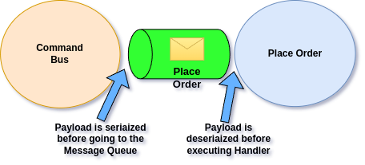
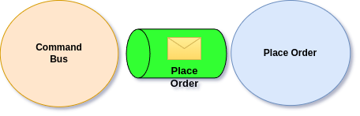

# Payload Conversion

To get general idea about conversion refer to previous [section](./). In this we will focus how Ecotone deals with Conversion for Asynchronous processing.&#x20;

## Outbound Messages Conversion

Suppose we have `Command Handler` endpoint, which expects `PlaceOrderCommand` class and Command Handler is considered Asynchronous.

<pre class="language-php"><code class="lang-php"><strong>#[Asynchronous('async')]
</strong><strong>#[CommandHandler("order.place")]
</strong>public function placeOrder(PlaceOrderCommand $command)
{
   // do something
}
</code></pre>

Then after Message is sent using Command Bus, it goes first to the **Message Channel (Queue)**, named **async**. Before Message lands in the Queue, Ecotone will serialize it, and just before method is executed it will deserialize it.\
\

<figure><figcaption>
Message serialization and deserialization
</figcaption></figure>

## Default Conversion Media Type

To which format this Command will be converted depends on our **defaultSerializationMediaType**, which can be configured in global configuration:

* [Ecotone Lite](../../../modules/ecotone-lite/#configuration)
* [Symfony](../../../modules/symfony/symfony-ddd-cqrs-event-sourcing.md)
* [Laravel](../../../modules/laravel/laravel-ddd-cqrs-event-sourcing.md)

## Native PHP Serialization

If default conversion will not be set up, the default serialization configuration will be to use PHP Serialization mechanism. \
What is important to understand is that PHP serialization expect class to be exactly the same as it was serialized and Command will land in Message Queue before it will be handled:\

<figure><figcaption>
Place Order lands in Queue, awaiting to be consumed
</figcaption></figure>

&#x20;The problem with this is, that if we change the Class Name or property name and deploy new version of our Application before this Message will be consumed, we won't be able to deserialize it anymore.\
Therefore PHP Native Serialization mechanism should not be considered as Production grade solution.\
\
There is no such problem when we use decoupled Media Type format like JSON or XML, as those allow for more losely coupled mapping between Serialized Message and PHP Class.\
Ecotone provides [JMS Converter Module](../../../modules/jms-converter.md), which without any additional configuration can do serialization to JSON or XML.


Packages like [JMS Converter](../../../modules/jms-converter.md) will change your default serialization configuration to JSON by default. No custom configuration is needed.

