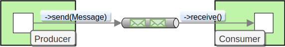

# Message Channel



In Symfony Messenger, you `dispatch()` and the framework chooses a transport. In Laravel, you `dispatch()` to a queue. A **Message Channel** is the same idea: it's the pipe. The point of giving channels first-class names ("orders", "notifications", "tenant_a_orders") is that **everything else in Ecotone — async processing, retries, dead letter, scaling — configures per channel**.

You'll declare a Message Channel explicitly when:

- You want a specific async handler to use a specific transport (one handler on RabbitMQ, another on a database queue).
- You want one handler to retry differently than another — different channels = different policies.
- You're going multi-tenant and want to isolate noisy tenants (see [Dynamic Channels](../../modelling/asynchronous-handling/dynamic-message-channels.md)).

A message channel may follow either point-to-point or publish-subscribe semantics. With a **point-to-point** channel, only one consumer can receive each message. **Publish-subscribe** channels broadcast each message to all subscribers.&#x20;

```php
interface MessageChannel
{
    /**
     * Send message to this channel
     */
    public function send(Message $message): void;
}
```

_`Pollable channels`_ extends Message Channels with capability of buffering Messages within a queue. The advantage of buffering is that it allows for throttling the inbound messages and preventing of message loss.&#x20;

```php
interface PollableChannel extends MessageChannel
{
    /**
     * Receive a message from this channel.
     * Return the next available {@see \Ecotone\Messaging\Message} or {@see null} if interrupted.
     */
    public function receive(): ?Message;

    /**
     * Receive with timeout
     * Tries to receive message till time out passes
     */
    public function receiveWithTimeout(int $timeoutInMilliseconds): ?Message;
}
```
