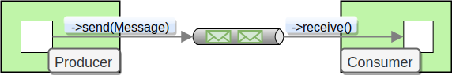

# Message Channel



_`Message channel`_&#x61;bstracts communication between components. It does allow for sending and receiving messages.\
A message channel may follow either point-to-point or publish-subscribe semantics. \
With a point-to-point channel, only one consumer can receive each message sent to the channel. \
Publish-subscribe channels, broadcast each message to all subscribers on the channel.&#x20;

```php
interface MessageChannel
{
    /**
     * Send message to this channel
     */
    public function send(Message $message): void;
}
```

_`Pollable channels`_ extends Message Channels with capability of buffering Messages within a queue. The advantage of buffering is that it allows for throttling the inbound messages and preventing of message loss.&#x20;

```php
interface PollableChannel extends MessageChannel
{
    /**
     * Receive a message from this channel.
     * Return the next available {@see \Ecotone\Messaging\Message} or {@see null} if interrupted.
     */
    public function receive(): ?Message;

    /**
     * Receive with timeout
     * Tries to receive message till time out passes
     */
    public function receiveWithTimeout(int $timeoutInMilliseconds): ?Message;
}
```
