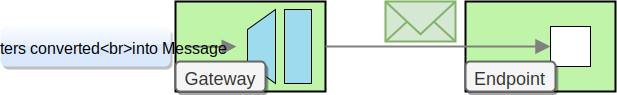

# Messaging Gateway



The Messaging Gateway encapsulates messaging-specific code (The code required to send or receive a [Message](message.md)) and separates it from the rest of the application code.

It takes Application specific data and convert it [Message](message.md) which then is sent via [Message channel.](message-channel.md) \
This hide Messaging specific code, from user's code.&#x20;


Command/Query/Event Buses are implementations of Messaging Gateways.


Ecotone aims for eliminating Framework related code from Business related code, that's why Gateway can defined as interface in user's code base. \
Ecotone is responsible for generating implementation for any interface.&#x20;

### Implementing custom Gateway

To implement custom Gateway, we will be using **clear interfaces** and **message channel**.

```php
namespace Product;

use Ecotone\Messaging\Annotation\Gateway;

//1
interface ProductGateway
{
    #[MessageGateway("buyProduct")]  // 2
    public function buy(string $product) : void;
}

// An Command Handler that we want to call from our Gateway
class ProductService
{
   #[CommandHandler("buyProduct")]
   public function buyProduct(string $product): void
   {
      // do something
   }
}
```

1. By default gateway will be available under interface name in DI, in that case `Product\ProductGateway.`\
   If you want to register it under different name for example "productGateway", then pass it to annotation `#[ClassReference("productGateway")]`



If you are using Symfony Integration, then it will be auto registered in Dependency Container with possibility to auto-wire the gateway.


As Command/Query/Event buses are Gateways, you can auto-wire them. \
They can be injected into Controller and called directly.




In Lite Configuration you can retrieve it using messaging system configuration.

```php
$productGateway = $messagingSystem->getGatewayByName(ProductGateway::class);
```



&#x20; 2\. `Gateway` enables method to be used as Messaging Gateway. You may have multiple Gateways defined within interface. The `"buyProduct"` is a channel name that we will be requesting.&#x20;

### Building your own Bus

Using combination of Messaging Gateway and [Router](message-endpoint/message-routing.md) we can build our own Buses. \
Messaging Gateway will be responsible for building Message and sending to the Router. \
And Router will be then based on need route it by payload / headers or whatever is needed.

### Invoking Handler directly

In some cases you may want to invoke Query/Command Handler directly, not via Bus. \
In that case you may define Message Gateway that routes to given Handler.

**Service Command Handler:**

```php
class OrderService {
    #[CommandHandler("placeOrder")]
    public function makeOrder(string $order)
    {
        // make order
    }
}
```

**Gateway:**

```php
interface OrderGateway {
    #[MessageGateway("placeOrder")] 
    public function placeOrder(string $order): void;
}
```


This also works for Query Handlers. This way we can build an interface, which provides API for given set of behaviours e.g. `OrderApi`.


### Invoking Aggregate's Handler directly

You may expose Aggregate's Command and Query Handlers through interface.&#x20;

**Aggregate:**

```php
#[Aggregate]
class Order {
    #[CommandHandler("cancelOrder")]
    public function makeOrder(CancelOrder $command)
    {
        // do something
    }
}
```

**Gateway:**

```php
interface OrderGateway {
    #[MessageGateway("cancelOrder")] 
    public function placeOrder(#[AggregateIdentifier] string $orderId, #[Payload] CancelOrder $command)): void;
}
```

### Gateway reply

```php
    #[MessageGateway("getPrice")] 
    public function getPrice(string $productName) : int;
```

Gateway may return values, but as you probably remember, everything is connected via [Message Channels](message-channel.md). So how does we get the reply? \
During [Message](message.md) building, gateway adds header `replyChannel` which contains automatically created Channel. During [Endpoint's method invocation](../conversion/method-invocation.md), if any value was returned it will be sent via reply Channel. \
This way gateway may receive the reply and return it.&#x20;

### Gateway reply Content Type

If you have registered [Converter](../conversion/) for specific Media Type, then you can tell `Ecotone` to convert result of any [Gateway](messaging-gateway.md) to specific format. This is especially useful, when we are dealing with `QueryBus`, when we want to return the result to the caller of the request. \
In order to do this, we need to make use of `Metadata`and `replyContentType` header.



```php
{
   public function __construct(private QueryBus $queryBus)
   {
       $this->queryBus = $queryBus;   
   }
   
   public function getTicketStatusAction(Request $request) : Response
   {
      return new Response(
         $this->queryBus->sendWithMetadata(
            new GetTicketStatusQuery($request->get("ticketId")),
            ["replyContentType" => "application/json"]
         );
      )    
   }
}
```



### Repository Interfaces

Repository implemented via interfaces are just higher level abstraction of Message Gateway. \
You enable them by marking attribute _#\[Repository]_.

```php
interface OrderRepository
{
    #[Repository]
    public function getOrder(string $twitId): Order;

    #[Repository]
    public function findOrder(string $twitId): ?Order;

    #[Repository]
    public function save(Twitter $twitter): void;
}
```

Read more about Repositories in [Command Handling section](../../modelling/command-handling/repository/).

### Parameters to Message Conversion

In order to build [Message](message.md),  Parameter Converters are introduced. \
You may configure them manually or let _Ecotone_ make use of default parameter converters.

```php
#[MessageGateway("orders")]
public function placeOrder(#[Payload] Order $order, #[Header("executorId")] string $executorId);
```

Parameter converter types:

* This will convert string passed under `$content` parameter to message payload

```php
public function sendMail(#[Payload] string $content) : void;
```

* This convert `$content` to message's payload and will add to headers under "_receiverEmail_" key value of `$toEmail`

```php
public function sendMail(#[Payload] string $content, #[Header()] string $toEmail) : void;
```

