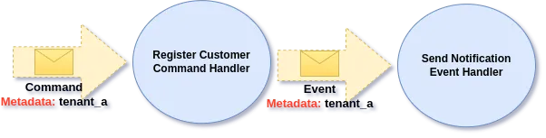

# Events and Tenant Propagation

When Customer is registered we may want to trigger side effects, like sending an Email with Welcome Message. For those situation we can define Events and Event Handlers.

```php
final readonly class CustomerService
{
    #[CommandHandler]
    public function handle(RegisterCustomer $command, EventBus $eventBus)
    {
        // register Customer

        $eventBus->publish(new CustomerWasRegistered($command->customerId));
    }

    #[EventHandler]
    public function sendNotificationWhen(CustomerWasRegistered $event, NotificationSender $notificationSender)
    {
        $customer = Customer::find($event->customerId);

        $notificationSender->sendWelcomeNotification($customer);
    }
}
```

When Customer is registered, we publish CustomerWasRegistered Event Message using Event Bus. Then all methods marked with Event Handler that subscribe to it (First parameter indicates Event we subscribe too) will be executed as a result.

## Context and Metadata Propagation <a href="#id-6e45" id="id-6e45"></a>

Ecotone by default propagate all Message Headers automatically. This as a result preserve context Tenant. In our case sending Notification will happen in context of the same Tenant, as Customer Registration was done:

<figure><figcaption><p>Metadata is automatically propagated from Command to published Event</p></figcaption></figure>

This way we can of course access Tenant name in our Event Handlers too:

```php
#[EventHandler]
public function audit(
  CustomerWasRegistered $event, 
  AuditRepository $auditRepository,
  #[Header('tenant')] string $tenantName
)
{
    $auditRepository->store($event, $tenantName);
}
```


Whatever metadata we send at the beginning of the flow (e.g. Register Customer Command), we will be able to access in any **synchronous** or **asynchronous** sub-flows (e.g. Customer was Registered Event Handlers). This means we can easily pass things that are not directly related to Customer Registration Command and access them, in context which make sense. For example we could pass HTTP Domain, IP Address in Metadata, and access it in Event Handler that stores those for auditing.


## Database Message Channel <a href="#id-8762" id="id-8762"></a>

We can define our Event Handler as asynchronous and choose Database Queue as the Message Channel.

```php
final readonly class CustomerService
{
    #[CommandHandler]
    public function handle(RegisterCustomer $command, EventBus $eventBus)
    {
        Customer::register($command)->save();

        $eventBus->publish(new CustomerWasRegistered($command->customerId));
    }

    // We will be using notifications Message Channel (Database Queue)
    #[Asynchronous('notifications')]
    #[EventHandler(endpointId: "notificationSender")]
    public function sendNotificationWhen(
        CustomerWasRegistered $event,
        NotificationSender $notificationSender
    )
    {
        $notificationSender->sendWelcomeNotification(
           Customer::find($event->customerId)
        );
    }
}
```

and then define Database Queue as Message Channel:

```php
final readonly class EcotoneConfiguration
{
    #[ServiceContext]
    public function databaseChannel(): DbalBackedMessageChannelBuilder
    {
        return DbalBackedMessageChannelBuilder::create('notifications');
    }
}
```

When we publish Message to Asynchronous Database Message Channel, Ecotone will publish it to the Database related to given Tenant by default. However this means that we need to consume Messages from multiple Databases.

Depending on Business Domain we work in, we may have hundreds of Tenants, so running hundreds of Message Consumers may be far from ideal. For those situations, Ecotone by default use Round-Robin strategy to **consume using single process**. This means that we will be fetching from each Tenant in order:

<figure><figcaption><p>Ecotone using Round Robin Strategy to consume Messages from multiple Tenants</p></figcaption></figure>

This way of consuming works out of the box, we don’t need to do any customer configuration to make it happen.&#x20;
