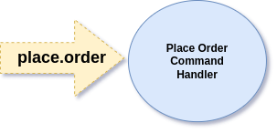
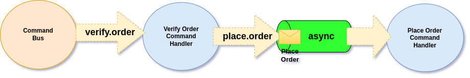

# The Basics - Stateless Workflows

Almost any business requires Workflows. The type of Workflows we will need to build will depend on the Business Domain we work in. This may be related fully automated flows like uploading images, resizing and storing them or flows that require human interaction like verifying and signing Documents.

## Input / Output Pipes (Channels)

Before we will dive into examples, let's first understand the main idea which Ecotone promotes for building Workflows, which is Input / Output Pipes.


Ecotone foundation is Messaging based on [EIP](https://enterpriseintegrationpatterns.com/) book, this means that every Message Handler is connected via Message Channel. This means, we can easily bind different Message Handlers together, creating an Workflow.&#x20;


Let's consider placing an Order Command Handler:

```php
#[CommandHandler('place.order')]
public function place(PlaceOrder $command): void
```

What actually happens under the hood is that, we've created an place.order [Message Channel](../messaging-concepts/message-channel.md).

<figure><figcaption><p>Channel connected to our Message Handler</p></figcaption></figure>

When we do execute Command Bus, we are actually routing an Message via Channel to given Message Handler:

<figure><figcaption><p>Command Bus routes the Message to Command Handler</p></figcaption></figure>

This means that, if other Message Handler would send an Message to this Channel, we could actually connected them together. For example we could create an flow, which before order is placed, verifies it:

<figure><figcaption><p>Putting Verify Order Command Handler, before placing an Order</p></figcaption></figure>

From the code perspective this would like this:

```php
class ProcessOrder
{
    #[CommandHandler(
        'verify.order',
        // where to push the Message after it's returned from this method
        outputChannelName: 'place.order'
    )]
    public function verify(PlaceOrder $command): PlaceOrder
    {
        // verify the order
    }

    #[CommandHandler('place.order')]
    public function place(PlaceOrder $command): void
    {
        // place the order
    }
}
```

By simply adding the **outputChannelName**, we are stating where the result of the execution go next. \
This way within few lines of code, we actually created simple Workflow.


In above example, we have used same **PlaceOrder Command** for both Message Handlers.\
Ecotone does not force us to create separate Command Classes per each Command Handler when routing is applied. \
More often than not keeping the same class actually makes things much easier to follow, as there is no need for repacking between each of Workflow step.


## Internal Message Handler

So far we've used Command Handlers, however Command Handlers are executable via Command Bus. This means that we are actually exposing each step to be executed directly. \
For example we could execute Place Order Command Handler without verifying it first. \
In our scenario, we want Place Order to be internal part of the Workflow, therefore not to be exposed via Command Bus.

To do it Ecotone provides **InternalHandler** which can be executed only by binding other Message Handers to it.

```php
class ProcessOrder
{
    #[CommandHandler(
        'verify.order',
        outputChannelName: 'place.order'
    )]
    public function verify(PlaceOrder $command): PlaceOrder
    {
        // verify the order
    }

    #[InternalHandler('place.order')] // Using Internal Message Handler
    public function place(PlaceOrder $command): void
    {
        // place the order
    }
}
```

By using InternalHandler we state explicitly that this actually part of something larger and we block possibility of executing it directly using Command Bus.


Our Workflows, contains of two steps however we could easily add more to it. To do it we would simply add **outputMessageChannel** to our PlaceOrder Handler.\
To distribute the flow to multiple Handlers we could make use of [Router pattern](../messaging-concepts/message-endpoint/message-routing.md).


## Asynchronous Workflows

We often state that given Message is Asynchronous. In reality Message is just an piece of data, it's neither asynchronous or synchronous, however execution of given logic may be synchronous or asynchronous. In case of Ecotone we mark given Message Handler as asynchronous, to state the execution should be done asynchronously.

Continuing on our above example, we could keep our Order verification logic as synchronous and when we know that the Order is correct we could Place the Order asynchronously. This way we would ensure that Order [won't be lost](../../modelling/recovering-tracing-and-monitoring/resiliency/), even if there will problems with processing it.

```php
class ProcessOrder
{
    #[CommandHandler(
        'verify.order',
        outputChannelName: 'place.order'
    )]
    public function verify(PlaceOrder $command): PlaceOrder
    {
        // verify the order
    }

    // Executing this logic asynchronously
    #[Asynchronous('async')]
    #[InternalHandler('place.order')]
    public function place(PlaceOrder $command): void
    {
        // place the order
    }
}
```

All we need to do is to add Asynchronous attribute for Message Handler which should be handled asynchronously and define what kind of [Message Channel we want to use](../../modelling/asynchronous-handling/).\
What will happen right now is that, before our **Place Order Command Handler** will be executed, Message will first go through async Message Channel.

<figure><figcaption><p>Before Place Order Command is executed, Command first lands in Message Queue</p></figcaption></figure>

This way, we can may given part of the Workflow asynchronous.


Even so we combine different Message Handlers using Chain like behaviour, use asynchronous processing, we have not implemented or extended a single Framework Class. \
This is thanks to Ecotone's declarative configuration, which aims to push our focus on actual business side of the code.


## Delaying Business Logic

When our Message Handler is Asynchronous, we can also delay the execution. This may be especially useful, when we've we want to give time for performing manual action, and after given time passes trigger an action.

In our Workflow, we could give Customer 24 hours for doing payment for the Order, and if Order was not repaid within this time frame, then cancel out the Order.

<figure><figcaption><p>We cancel Order if it was not paid after 24 hours</p></figcaption></figure>

We could either use **Output Channel**, or we can **publish an Event**. \
However publishing an Event allows more Message Handlers to subscribe to this Message and trigger an action, therefore we will go for the second option.

```php
class ProcessOrder
{
    (..)

    #[Asynchronous('async')]
    #[InternalHandler('place.order')]
    public function place(PlaceOrder $command, EventBus $eventBus): void
    {
        // place the order
        
        $eventBus->publish(new OrderWasPlaced($command->orderId));
    }
}
```

And then we can subscribe to it with Delay:

```php
class ProcessOrder
{
    (..)

    #[Delayed(new TimeSpan(days: 1))]
    #[Asynchronous('async')]
    #[EventHandler('place.order')]
    public function cancel(OrderWasPlaced $event, OrderRepository $orderRepository): void
    {
        $order = $orderRepository->get($event->id);
        
        if ($order->notPaid()) {
            $order->cancel();
            $orderRepository->save($order);
        }
    }
}
```

This Event Handler will be executed 24 hours after Order Was Placed.&#x20;

## Stopping the Workflow

We can also stop the Workflow from moving forward by simply **returning null**.

```php
class ProcessOrder
{
    #[CommandHandler(
        'verify.order',
        outputChannelName: 'place.order'
    )]
    public function verify(PlaceOrder $command): ?PlaceOrder
    {
        // verify the order
        
        if ($incorrectOrder) {
            // Trigger additional logic
        
            // stop the Workflow from moving to output Channel
            return null;
        }
    }
    
    (..)
```

## Adding Message Headers

Along the way, we may actually want to enrich our Message with additional details. This may be especially useful, when in order to make the decision we need more details about Customer. \
\
For example we could have Credit Card Agreement Process, which would need to fetch Customer Credit Card History, before we will evaluate is he is eligible for receving the Card.\


### Modifying Message Payload

```php
class ProcessOrder
{
    #[InternalHandler(
        inputChannelName: 'credit_card.add_details',
        outputChannelName: 'credit_card.verifry'
    )]
    public function addDetails(CustomerDetails $command): CustomerDetailsWithHistory
    {
        // fetch details and return new object
        
        return new CustomerDetailsWithHistory();
    }
    
    
    #[InternalHandler('credit_card.verifry')]
    public function addDetails(CustomerDetailsWithHistory $command): void
    {
        // handle verification step
    }
}
```

Whatever we will return will go to our output channel in form of Message's Payload.

### Modifying Message Headers

However we don't need to modify the payload, using **InternalHandler** we can enrich Message Headers, this way we can preserve same Payload Object between steps.

```php
class ProcessOrder
{
    #[InternalHandler(
        inputChannelName: 'credit_card.add_details',
        outputChannelName: 'credit_card.verifry',
        // State we will be modifying Message Headers instead of Payload
        changingHeaders: true
    )]
    public function addDetails(CustomerDetails $command): array
    {
        // fetch details and return array which will be added to Headers
        
        return [
            'history' => new CustomerHistory()
        ]
    }
    
    
    #[InternalHandler('credit_card.verifry')]
    public function addDetails(
        CustomerDetailsWithHistory $command,
        #[Header('history')] CustomerHistory $customerHistory,
    ): void
    {
        // handle verification step
    }
}
```

After we enriched Message Headers, we can access them in next Workflow steps, as Message Headers are [automatically propagated](../../modelling/extending-messaging-middlewares/message-headers.md#automatic-header-propagation).

## Workflows Types

What we've discussed in this section is actually an **Stateless Workflow.** \
Those Workflows are really easy to build and understand, as decisions are made based on input Messages.\
However we may have Workflows where decisions will be based on the state from previous executions, and for those situations Ecotone's provide [Stateful Workflows](stateful-workflows-saga.md).
