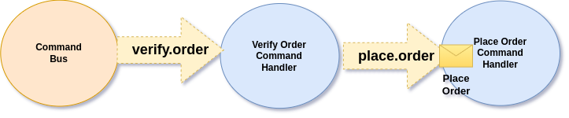
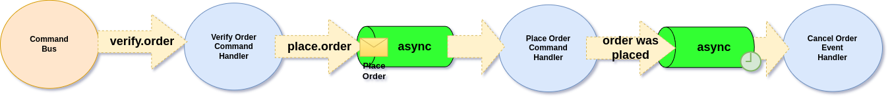

# Connecting Handlers with Channels

Building business workflows is essential for most applications. Whether you need fully automated processes (like image processing pipelines) or human-interactive flows (like document approval), Ecotone makes it simple by connecting message handlers through channels.

## Understanding the Flow: From Handler to Handler

The key concept in Ecotone is that **every message handler can be connected to other handlers** using channels. Think of channels as pipes that carry messages between different parts of your application.


**Core Concept**: Each message handler has an input channel (where messages come in) and can have an output channel (where results go out). By connecting these channels, you create workflows.


## Step 1: Understanding Single Handlers

Let's start with a simple command handler:

```php
#[CommandHandler('place.order')]
public function place(PlaceOrder $command): void
{
    // Place the order logic here
}
```

**What happens behind the scenes:**
1. Ecotone creates a channel named `place.order`
2. Your handler listens to this channel
3. When you use the Command Bus, it sends messages to this channel

<figure><figcaption><p>A single handler connected to its input channel</p></figcaption></figure>

## Step 2: Connecting Handlers Together

Here's where it gets powerful: **any handler can send messages to another handler's channel**. This lets you chain handlers together to create workflows.

Let's add order verification before placing the order:

<figure><figcaption><p>Two handlers connected: verify → place order</p></figcaption></figure>

**The magic happens with `outputChannelName`:**

```php
class ProcessOrder
{
    #[CommandHandler(
        'verify.order',
        outputChannelName: 'place.order'  // 👈 This connects the handlers!
    )]
    public function verify(PlaceOrder $command): PlaceOrder
    {
        // Verify the order
        if ($this->isValidOrder($command)) {
            return $command; // Pass it to the next handler
        }
        throw new InvalidOrderException();
    }

    #[CommandHandler('place.order')]
    public function place(PlaceOrder $command): void
    {
        // Place the order
        $this->orderRepository->save($command);
    }
}
```

**How the flow works:**
1. You send `PlaceOrder` to `verify.order` channel
2. The `verify()` method processes it and returns the command
3. Ecotone automatically sends the returned command to `place.order` channel
4. The `place()` method receives and processes it


**Pro Tip**: You can use the same command class for multiple handlers in a workflow. This eliminates the need to convert between different classes at each step, making your code simpler and easier to follow.


## Making Handlers Internal (Private to Workflow)

**Problem**: With `CommandHandler`, anyone can call `place.order` directly through the Command Bus, bypassing your verification step!

**Solution**: Use `InternalHandler` to make handlers private to your workflow:

```php
class ProcessOrder
{
    #[CommandHandler(
        'verify.order',
        outputChannelName: 'place.order'
    )]
    public function verify(PlaceOrder $command): PlaceOrder
    {
        // verify the order
        return $command;
    }

    #[InternalHandler('place.order')] // 👈 Can't be called directly!
    public function place(PlaceOrder $command): void
    {
        // place the order
        $this->orderRepository->save($command);
    }
}
```

**What this means:**
- ✅ `verify.order` can be called via Command Bus (entry point)
- ❌ `place.order` can only be reached through the workflow
- 🔒 This ensures orders are always verified before being placed


**Extending Workflows**: You can easily add more steps by adding `outputChannelName` to any handler. To send messages to multiple handlers, use the [Router pattern](../../messaging/messaging-concepts/message-endpoint/message-routing.md).


## Adding Asynchronous Processing

Sometimes you want parts of your workflow to run asynchronously (in the background). This is perfect for:
- Heavy processing that shouldn't block the user
- Ensuring messages aren't lost if something goes wrong
- Scaling parts of your workflow independently

**Example**: Keep verification synchronous (fast feedback) but make order placement asynchronous (reliable processing):

```php
class ProcessOrder
{
    #[CommandHandler(
        'verify.order',
        outputChannelName: 'place.order'
    )]
    public function verify(PlaceOrder $command): PlaceOrder
    {
        // This runs immediately (synchronous)
        if (!$this->isValidOrder($command)) {
            throw new InvalidOrderException();
        }
        return $command;
    }

    #[Asynchronous('async')]  // 👈 This makes it asynchronous!
    #[InternalHandler('place.order')]
    public function place(PlaceOrder $command): void
    {
        // This runs in the background (asynchronous)
        $this->orderRepository->save($command);
        $this->emailService->sendConfirmation($command);
    }
}
```

**What happens now:**
1. `verify()` runs immediately and returns a response
2. The message goes to a queue/background processor
3. `place()` runs later in the background
4. If `place()` fails, the message can be retried

<figure><figcaption><p>Asynchronous handlers process messages through a queue</p></figcaption></figure>


**The Beauty of Ecotone**: You've built a complete workflow with asynchronous processing without extending any framework classes or complex configuration. Everything is declared through simple attributes!


## Adding Delays and Timeouts

Asynchronous handlers can also be delayed, which is perfect for business scenarios like:
- Giving customers time to complete actions
- Implementing timeout behaviors
- Scheduling follow-up actions

**Example**: Give customers 24 hours to pay, then automatically cancel unpaid orders:

<figure><figcaption><p>Delayed cancellation after 24 hours</p></figcaption></figure>

**Strategy**: Use events to trigger delayed actions (events allow multiple handlers to react):

```php
class ProcessOrder
{
    // ... previous methods ...

    #[Asynchronous('async')]
    #[InternalHandler('place.order')]
    public function place(PlaceOrder $command, EventBus $eventBus): void
    {
        // Place the order
        $this->orderRepository->save($command);

        // Trigger the timeout mechanism
        $eventBus->publish(new OrderWasPlaced($command->orderId));
    }
}
```

**Now add the delayed cancellation handler:**

```php
class OrderTimeoutHandler
{
    #[Delayed(new TimeSpan(days: 1))]  // 👈 Wait 24 hours
    #[Asynchronous('async')]
    #[EventHandler]
    public function cancelUnpaidOrder(
        OrderWasPlaced $event,
        OrderRepository $orderRepository
    ): void {
        $order = $orderRepository->get($event->orderId);

        if ($order->isNotPaid()) {
            $order->cancel();
            $orderRepository->save($order);

            // Could trigger more events here (email notifications, etc.)
        }
    }
}
```

**Timeline:**
- ⏰ **T+0**: Order placed, event published
- ⏰ **T+24h**: Cancellation handler runs automatically

## Controlling Workflow Flow

### Stopping the Workflow

You can stop a workflow from continuing by returning `null`:

```php
class ProcessOrder
{
    #[CommandHandler(
        'verify.order',
        outputChannelName: 'place.order'
    )]
    public function verify(PlaceOrder $command): ?PlaceOrder
    {
        if (!$this->isValidOrder($command)) {
            // Log the issue, send notification, etc.
            $this->logger->warning('Invalid order rejected', ['orderId' => $command->orderId]);

            // Stop here - don't continue to place.order
            return null;
        }

        // Continue the workflow
        return $command;
    }

    // This won't be called if verify() returns null
    #[InternalHandler('place.order')]
    public function place(PlaceOrder $command): void
    {
        $this->orderRepository->save($command);
    }
}
```

## Enriching Messages in Workflows

Sometimes you need to add information as messages flow through your workflow. There are two approaches:

### Option 1: Transform the Payload

Return a new/modified object that contains additional data:

```php
class CreditCardProcessor
{
    #[InternalHandler(
        inputChannelName: 'credit_card.add_details',
        outputChannelName: 'credit_card.verify'
    )]
    public function addDetails(CustomerDetails $customer): CustomerDetailsWithHistory
    {
        // Fetch additional data
        $history = $this->creditHistoryService->getHistory($customer->id);

        // Return enriched object
        return new CustomerDetailsWithHistory($customer, $history);
    }

    #[InternalHandler('credit_card.verify')]
    public function verify(CustomerDetailsWithHistory $enrichedCustomer): void
    {
        // Now we have both customer details and history
        if ($enrichedCustomer->history->isGoodCredit()) {
            $this->approveCard($enrichedCustomer->customer);
        }
    }
}
```

**When to use**: When the additional data is core to the next step's logic.

### Option 2: Add Data to Message Headers

Keep the original payload unchanged and add extra data as headers:

```php
class CreditCardProcessor
{
    #[InternalHandler(
        inputChannelName: 'credit_card.add_details',
        outputChannelName: 'credit_card.verify',
        changingHeaders: true  // 👈 This tells Ecotone we're modifying headers
    )]
    public function addDetails(CustomerDetails $customer): array
    {
        // Fetch additional data
        $history = $this->creditHistoryService->getHistory($customer->id);

        // Return array that becomes headers
        return [
            'creditHistory' => $history,
            'riskScore' => $this->calculateRisk($history)
        ];
    }

    #[InternalHandler('credit_card.verify')]
    public function verify(
        CustomerDetails $customer,  // Original payload unchanged
        #[Header('creditHistory')] CreditHistory $history,  // From headers
        #[Header('riskScore')] int $riskScore
    ): void {
        // Use both original data and enriched headers
        if ($riskScore < 50 && $history->hasGoodPaymentRecord()) {
            $this->approveCard($customer);
        }
    }
}
```

**When to use**: When you want to keep the original payload intact and add supplementary data.


**Header Propagation**: Headers automatically flow through your entire workflow, so any handler can access data added by previous steps.


## Testing Your Workflows with Ecotone Lite

Testing workflows is crucial for ensuring your business logic works correctly. Ecotone Lite makes testing handler chains simple and straightforward.

### Setting Up Tests

```php
use Ecotone\Lite\EcotoneLite;
use PHPUnit\Framework\TestCase;

class WorkflowTest extends TestCase
{
    public function test_order_verification_workflow(): void
    {
        // Arrange - Set up your handlers
        $orderProcessor = new ProcessOrder();

        $ecotoneLite = EcotoneLite::bootstrapFlowTesting(
            [ProcessOrder::class],           // Classes to register
            [$orderProcessor],               // Service instances
        );

        // Act - Send a command to start the workflow
        $command = new PlaceOrder('order-123', 'customer-456');
        $result = $ecotoneLite->sendCommand($command);

        // Assert - Verify the workflow executed correctly
        $this->assertNull($result); // Void return from final handler

        // Verify side effects (database changes, sent emails, etc.)
        $this->assertTrue($orderProcessor->wasOrderPlaced('order-123'));
    }
}
```

### Testing Handler Chains

Test complete workflows from start to finish:

```php
class ProcessOrder
{
    private array $placedOrders = [];
    private array $verifiedOrders = [];

    #[CommandHandler(
        'verify.order',
        outputChannelName: 'place.order'
    )]
    public function verify(PlaceOrder $command): PlaceOrder
    {
        $this->verifiedOrders[] = $command->orderId;

        if ($command->orderId === 'invalid-order') {
            throw new InvalidOrderException('Order validation failed');
        }

        return $command;
    }

    #[InternalHandler('place.order')]
    public function place(PlaceOrder $command): void
    {
        $this->placedOrders[] = $command->orderId;
    }

    // Test helpers
    public function wasOrderVerified(string $orderId): bool
    {
        return in_array($orderId, $this->verifiedOrders);
    }

    public function wasOrderPlaced(string $orderId): bool
    {
        return in_array($orderId, $this->placedOrders);
    }
}

class WorkflowChainTest extends TestCase
{
    public function test_successful_order_workflow(): void
    {
        $processor = new ProcessOrder();
        $ecotoneLite = EcotoneLite::bootstrapFlowTesting(
            [ProcessOrder::class],
            [$processor]
        );

        // Send to the first step of the workflow
        $command = new PlaceOrder('order-123', 'customer-456');
        $ecotoneLite->sendDirectToChannel('verify.order', $command);

        // Verify both steps executed
        $this->assertTrue($processor->wasOrderVerified('order-123'));
        $this->assertTrue($processor->wasOrderPlaced('order-123'));
    }

    public function test_workflow_stops_on_validation_error(): void
    {
        $processor = new ProcessOrder();
        $ecotoneLite = EcotoneLite::bootstrapFlowTesting(
            [ProcessOrder::class],
            [$processor]
        );

        // This should fail validation and not reach the place step
        $this->expectException(InvalidOrderException::class);

        $command = new PlaceOrder('invalid-order', 'customer-456');
        $ecotoneLite->sendDirectToChannel('verify.order', $command);

        // Verify verification was attempted but placement was not
        $this->assertTrue($processor->wasOrderVerified('invalid-order'));
        $this->assertFalse($processor->wasOrderPlaced('invalid-order'));
    }
}
```

### Testing Header Enrichment

Test workflows that modify message headers:

```php
class HeaderEnrichmentProcessor
{
    #[InternalHandler(
        inputChannelName: 'enrich.headers',
        outputChannelName: 'use.headers',
        changingHeaders: true
    )]
    public function enrichHeaders(CustomerData $customer): array
    {
        return [
            'customerType' => $customer->isPremium() ? 'premium' : 'standard',
            'riskScore' => $this->calculateRisk($customer)
        ];
    }

    #[InternalHandler('use.headers')]
    public function useHeaders(
        CustomerData $customer,
        #[Header('customerType')] string $customerType,
        #[Header('riskScore')] int $riskScore
    ): string {
        return "Customer: {$customer->name}, Type: {$customerType}, Risk: {$riskScore}";
    }

    private function calculateRisk(CustomerData $customer): int
    {
        return $customer->isPremium() ? 10 : 50;
    }
}

public function test_header_enrichment_workflow(): void
{
    $processor = new HeaderEnrichmentProcessor();
    $ecotoneLite = EcotoneLite::bootstrapFlowTesting(
        [HeaderEnrichmentProcessor::class],
        [$processor]
    );

    $premiumCustomer = new CustomerData(name: 'John Doe', premium: true);
    $result = $ecotoneLite->sendDirectToChannel('enrich.headers', $premiumCustomer);

    $this->assertEquals('Customer: John Doe, Type: premium, Risk: 10', $result);
}
```

### Testing Asynchronous Workflows

Test async workflows in synchronous mode for easier testing:

```php
class AsyncProcessor
{
    private array $processedItems = [];

    #[CommandHandler(
        'start.async',
        outputChannelName: 'async.process'
    )]
    public function start(ProcessItem $item): ProcessItem
    {
        return $item;
    }

    #[Asynchronous('async')]
    #[InternalHandler('async.process')]
    public function processAsync(ProcessItem $item): void
    {
        $this->processedItems[] = $item->id;
    }

    public function getProcessedItems(): array
    {
        return $this->processedItems;
    }
}

public function test_async_workflow_in_sync_mode(): void
{
    $processor = new AsyncProcessor();
    $ecotoneLite = EcotoneLite::bootstrapFlowTesting(
        [AsyncProcessor::class],
        [$processor],
        ServiceConfiguration::createWithDefaults()
            ->withSkippedModulePackageNames(ModulePackageList::allPackagesExcept([ModulePackageList::CORE_PACKAGE]))
            // This makes async handlers run synchronously for testing
            ->withDefaultSerializationMediaType(MediaType::APPLICATION_X_PHP)
    );

    $item = new ProcessItem(id: 'item-123');
    $ecotoneLite->sendCommand($item);

    // Verify async processing completed
    $this->assertContains('item-123', $processor->getProcessedItems());
}
```

## Summary: What You've Learned

You now understand the fundamentals of connecting handlers with channels in Ecotone:

### Key Concepts
- **Channels**: Every handler has an input channel, and can send to output channels
- **Connection**: Use `outputChannelName` to chain handlers together
- **Privacy**: Use `InternalHandler` to make handlers private to workflows
- **Async Processing**: Add `#[Asynchronous]` for background processing
- **Delays**: Use `#[Delayed]` for time-based workflows
- **Flow Control**: Return `null` to stop workflows
- **Data Enrichment**: Transform payloads or add headers