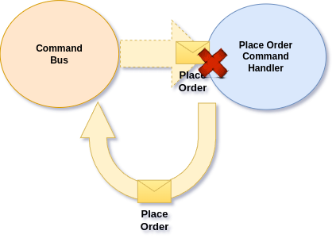

# Handling Failures

We may happen to face Errors on different stage of our Workflows. This may happen due to coding error and due to Network and Integration problems as well. \
Whatever the problem is, we want to be able to recover from that, or to be able to execute compensation action that will handle this failure. &#x20;

Ecotone provides different ways to deal with the problems and depending on the context, we may want to choose different solution.

## Uncovered Business Scenarios

It happens that **uncovered business scenario** are treated as failures. This may happen for example when Customer have made two payments for the same Order and our system basically throws an Exception.&#x20;


Uncovered Business Scenarios are not failures. It's just gap in the knowledge about what we need to do. In those situations we just need confirm with our Product people how to deal with those situations and implement given behaviour.


When double payment happens, we could for example trigger an automatic refund, or store this information in order to provide manual refund. \
Even things which looks like external problems can actually be uncovered scenarios. For example failing on taking subscription payment, may actually reveal that we need to reattempt it after some time.&#x20;


If our Architecture let us, it's good to treat exceptions as something exceptional, not as something to steer the Workflow. This way we can make it explicit in the code, what different scenarios we expect to happen.


## Let the Exception propagate

The most basic solution we could apply is to let the Exception propagate and catch it in the place where we can make meaning out of it, for example Controller. This can make sense in **Synchronous Scenarios**, where we return to the Customer details about the problems based on Exception.&#x20;

```php
final readonly class OrderController
{
    public function __construct(private CommandBus $commandBus) {}
    
    public function placeOrder(Request $request): Response
    {
        $orderId = $request->get('orderId');
        $customerId = $request->get('customerId');
        $items = $request->get('items');

        try {
            $this->commandBus->send(PlaceOrder::create($orderId, $customerId, $items));   
        }catch (InvalidOrder $exception) {
            // Customize Response based on the Exception details
            return new Response($exception->getMessage(), 422);
        }

        return new Response('Order placed');
    }
}
```

and our Command Handler

```php
class ProcessOrder
{
    #[CommandHandler(
        'verify.order',
        outputChannelName: 'place.order'
    )]
    public function verify(PlaceOrder $command): PlaceOrder
    {
        // verify the order
        
        if ($orderInvalid) {
            throw new InvalidOrder($orderInvalidDetails);
        }
    }
}
```

In above example Workflow will stop, as no Message will go to the next step **"place.order".** \
In the Controller then we can simply state, what was the problem.


Depending on the application architecture, we may actually validate the Order before it even enters the Workflow. This may happen for example with Symfony Forms, then we can consider Order to be valid when it enters the Workflow.


## Handling failures in the Message Handler

We may find out, that it happens that when we decline Order due to validation errors, some Customer are cancelling the Order completely, as most likely they got irritated and decide to go somewhere else to buy the products. This as a result make the Business lose they money, which of course we want to avoid in the first place.&#x20;

To solve that, we could accept all the Orders just as they are, and when given Order is considered to be invalid we still accept it. For example, if we lack of given Product, we can contact Customer to provide substitute and then if Customer agrees, change the Order and consider it valid.

```php
class ProcessOrder
{
    #[CommandHandler(
        'verify.order',
        outputChannelName: 'place.order'
    )]
    public function verify(PlaceOrder $command): ?PlaceOrder
    {
        // verify the order
        
        if ($orderInvalid) {
            // Store Order for reviewal process
            $this->orderToReviewRepository->save($order);        
            
            // This will stop the flow from moving forward to outputChannel
            return null;
        }
    }
}
```

So now when the Order is considered invalid we store for internal reviewal process. \
We also return null from the method now. This will stop the Workflow from moving forward to the **outputChannel**.


This kind of explicit way of solving problems allows us to switch the code from synchronous to asynchronous easily.  As now even if we would do Validation asynchronously Customer experience would stay the same.


## Recoverable Synchronous Errors

One of the problems that we need to accept is that [Network is not reliable](https://en.wikipedia.org/wiki/Fallacies_of_distributed_computing). This means that that when we will want to store something in our Database, send an Message to the Message Broker or call External Service, network may simply fail and there are various reasons why it may happen.

In our case, if we would want to store our Order synchronously, or send an Message to the Broker, it may happen that we will face an error. This of course means that Customer will not completely his Order, which is far from ideal.&#x20;

To solve this we can make use of [Instant Retries](../recovering-tracing-and-monitoring/resiliency/retries.md#instant-retries) on the Command Bus.&#x20;

<figure><figcaption><p>When failure happens, Command Bus is triggered again</p></figcaption></figure>

When failure happens Command Bus will automatically be triggered once more (depending on the configuration). This way we can self-heal application from transient error like network related problems.

## Recoverable Asynchronous Errors

So when Failure happens during Asynchronous handling of given Message, we've still can kick off [instant retries](../recovering-tracing-and-monitoring/resiliency/retries.md#asynchronous-instant-retries) to try to recover immediately. \
However we get a bit more options here now as we are no more in HTTP Context, we can now delay the Retry too. \
\
Delaying the retries may be especially useful when dealing with External Services, as it may happen that they will be down for some period of time, which instant retries will not solve. \
In those situations we still want to Application to seal-heal, so we don't need to bother with those situations and for this we can use [Delayed Retries](../recovering-tracing-and-monitoring/resiliency/retries.md#delayed-retries).

<figure><figcaption><p>Retrying the Command Handler with delay</p></figcaption></figure>

## Unrecoverable Asynchronous Errors

In case External Service is down for longer period of time, we may actually not be able to self-heal. \
In case of coding errors (bugs) we may also end up in situation where not matter how many retries we would do, we still won't recover.

For this situation, Ecotone provides [Dead Letter Storage](../recovering-tracing-and-monitoring/resiliency/error-channel-and-dead-letter/), which allows us to store the the Message and replay after the problem is fixed.&#x20;

<figure><figcaption><p>Store in Dead Letter when urecoverable and replay when needed</p></figcaption></figure>


Instant, Delayed Retries and Dead Letter creates a solution where Messages goes in circle till the moment they are handled or deleted. This ensure no data is lost along the way, and we more often than not do not need to deal with failures as our Application can self-heal from those problems.\
And if unrecoverable error happens, we get ability to easily replay the Message to resume the Workflow, after fix is applied.


## Customizing Global Error Handling

If we already have some solution to handle Asynchronous Errors in our Application, we can take over the process using Error Channel. Error Chanel is a Message Channel where all unhandled Asynchronous Errors go. \
\
You can read more about in [related documentation](../recovering-tracing-and-monitoring/resiliency/error-channel-and-dead-letter/#error-channel).

## Customizing Error Handling on Message Handler Level

We could also catch exception using Middleware like behaviour and provide custom logic that we would like to trigger. This can be easily built using Ecotone's Interceptors.

You can read more about in [related documentation](../extending-messaging-middlewares/interceptors/).
