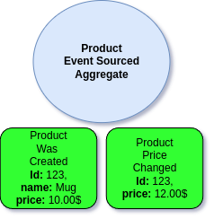

# Event Sourcing Introduction

Before diving into this section be sure to understand how Aggregates works in Ecotone based on [previous sections](../command-handling/state-stored-aggregate/).

## Difference between Aggregate Types

Ecotone provides higher level abstraction to work with Event Sourcing, which is based on Event Sourced Aggregates. Event Sourced Aggregate just like normal Aggregates protect our business rules, the difference is in how they are stored.&#x20;

### State-Stored Aggregates

Normal Aggregates are stored based on their current state:

<figure><figcaption><p>State-Stored Aggregate State</p></figcaption></figure>

Yet if we change the state,  then our previous history is lost:

<figure><figcaption><p>Price was changed, we don't know what was the previous price anymore</p></figcaption></figure>

Having only the current state may be fine in a lot of cases and in those situation it's perfectly fine to make use of [State-Stored Aggregates](../command-handling/state-stored-aggregate/#state-stored-aggregate). This is most easy way of dealing with changes, we change and we forget the history, as we are interested only in current state.&#x20;


When we actually need to know what was the history of changes, then State-Stored Aggregates are not right path for this. If we will try to adjust them so they are aware of history we will most likely complicate our business code. This is not necessary as there is better solution - **Event Sourced Aggregates**.


### Event Sourcing Aggregate&#x20;

When we are interested in history of changes, then Event Sourced Aggregate will help us. \
Event Sourced Aggregates are stored in forms of Events. This way we preserve all the history of given Aggregate:

<figure><figcaption><p>Event-Sourced Aggregate</p></figcaption></figure>

When we change the state the previous Event is preserved, yet we add another one to the audit trail (Event Stream).

<figure><figcaption><p>Price was changed, yet we still have the previous Event in audit trail (Event Stream)</p></figcaption></figure>

This way all changes are preserved and we are able to know what was the historic changes of the Product.

## Event Stream

The audit trail of all the Events that happened for given Aggregate is called **Event Stream**.\
Event Stream contains of all historic Events for all instance of specific Aggregate type, for example al Events for Product Aggregate

<figure><figcaption><p>Product Event Stream</p></figcaption></figure>

Let's now see how we can make use of it in the code.

## Building an first Event Sourced Aggregate

Event Sourcing support is available via separate Ecotone's Module:

```php
composer require ecotone/pdo-event-sourcing
```

We need to configure [DBAL Support](../../modules/dbal-support.md) in order to make use of it.


Ecotone Event Sourcing is based on well known and stable [Prooph's Event Store](https://github.com/prooph/event-store).\
It does provide support for three databases:\
\- PostgreSQL\
\- MySQL\
\- MariaDB


There are two ways, we can make use of Event Sourced Aggregates:

## A) Pure Event Sourced Aggregate

This way of handling events does allow for pure functions. This means that actions called on the Aggregate returns Events and are not changing internal state of Aggregate.

```php
#[EventSourcingAggregate] // 1
class Ticket
{
    use WithAggregateVersioning; // 2

    #[Identifier] // 1
    private string $ticketId;
    private string $ticketType;

    #[CommandHandler] // 2
    public static function register(RegisterTicket $command) : array
    {
        return [new TicketWasRegistered($command->getTicketId(), $command->getTicketType())];
    }

    #[CommandHandler] // 2
    public function close(CloseTicket $command) : array
    {
        return [new TicketWasClosed($this->ticketId)];
    }

    #[EventSourcingHandler] // 4
    public function applyTicketWasRegistered(TicketWasRegistered $event) : void
    {
        $this->ticketId       = $event->getTicketId();
        $this->ticketType     = $event->getTicketType();
    }
}
```

1. `EventSourcingAggregate` and `Identifier` [works exactly the same as State-Stored Aggregate](../command-handling/state-stored-aggregate/).
2. Event Sourced Aggregate must provide version. You may leave it to `Ecotone` using `WithAggregateVersioning` or you can implement it yourself.
3. `CommandHandler`for event sourcing returns events generated by specific method. This will be passed to the [`Repository`](../command-handling/repository.md) to be stored.&#x20;
4. `EventSourcingHandler` is method responsible for reconstructing `Aggregate` from previously created events. At least one event need to be handled in order to provide `Identifier`.

## B) Internal Recorder Aggregate

This way of handling events allow for similarity with [State Stored Aggregates](../command-handling/state-stored-aggregate/).\
This convention requires changing internal state of Aggregate to record Events. \
Therefore Pure ES Aggregate is recommended as it's not require for any internal state changes in most of the scenarios. \
However ES Aggregate with Internal Recorder may be useful for projects migrating with other solutions, or when our team is heavily used to working this way.

```php
#[EventSourcingAggregate] 
class Basket
{
    use WithEvents; // 1
    use WithVersioning;

    #[Identifier]
    private string $id;

    #[CommandHandler] // 2
    public static function create(CreateBasket $command) : static
    {
        $basket = new static();
        $basket->recordThat(new BasketWasCreated($command->getId()));

        return $basket;
    }

    #[CommandHandler] // 2
    public function addProduct(AddProduct $command) : void
    {
        $this->recordThat(new ProductWasAddedToBasket($this->id, $command->getProductName()));
    }

    #[EventSourcingHandler]
    public function applyBasketWasCreated(BasketWasCreated $basketWasCreated)
    {
        $this->id = $basketWasCreated->getId();
    }
}
```

1. In order to make use of alternative way of handling events, we need to provide trait **WithEvents**.
2. Command Handlers instead of returning events are acting the same as [State Stored Aggregates](../command-handling/state-stored-aggregate/).\
   All events which will be published using `recordThat`will be passed to the [`Repository`](../command-handling/repository.md) to be stored.&#x20;
