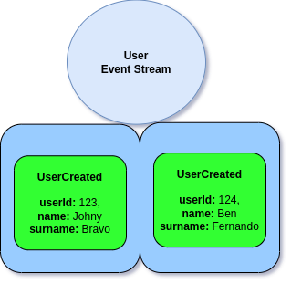
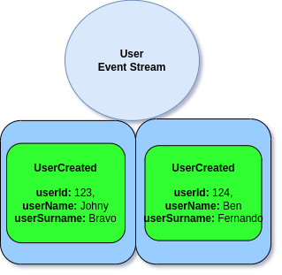

# Event Serialization and PII Data (GDPR)

## Event Serialization

Ecotone use [Converters](../../../../messaging/conversion/conversion/) in order to convert Events into serializable form. \
This means we can customize process of serializing and deserializing specific Events and add needed encrypting capabilities.&#x20;

So let's assume **UserCreated** Event:

```php
final readonly class UserCreated
{
    public function __construct(
        public string $userId,
        public string $name,
        public string $surname,
    )
    {

    }
}
```

<figure><figcaption><p>User Event Stream</p></figcaption></figure>

If we would want to change how the Event is serialized, we would define Converter

```php
final readonly class UserCreatedConverter
{
    #[Converter]
    public function toArray(UserCreated $event): array
    {
        return [
            'userId' => $event->userId,
            'userName' => $event->name,
            'userSurname' => $event->surname,
        ];
    }

    #[Converter]
    public function fromArray(array $event): UserCreated
    {
        return new UserCreated(
            $event['userId'],
            $event['userName'],
            $event['userSurname'],
        );
    }
}
```

Then the Event Stream would look like above

<figure><figcaption><p>User Event Stream with custom serialization</p></figcaption></figure>

This basically means we can serialize the Event in the any format we want.&#x20;

## Advanced Serialization Support with JMS

When using [JMS Converter](../../../../modules/jms-converter.md) support, we can even customize how we want to serialize given type globally between Messages. This follows on Ecotone's simplicity to ensure we spend as much as possible time on infrastructure part, and move the focus the business side of things.&#x20;

For example we could have User Created Event which make use of `UserName` class.

```php
final readonly class UserCreated
{
    public function __construct(
        public string $userId,
        public UserName $name,
        public string $surname,
    )
    {

    }
}
```

the `UserName` would be a simple Class which contains of validation so the name is not empty:

```php
final readonly class UserName
{
    public function __construct(
        public string $value,
    )
    {
        if ($value === "") {
           throw new \InvalidArgumentException("Name should not be empty");
        }
    }
}
```

Now if we would serialize it without telling JMS, how to handle this class we would end up with following JSON in the Event Stream:

```php
{
    "userId": "123",
    "name": {"value": "Johny"},
    "surname": "Bravo"
}
```

Now this is not fully safe, as if we would simply change property name in `UserName.value` to `UserName.name` it would break deserialization of our previous Events. Therefore we want to keep take over the serialization of objects, to ensure stability along the time.

```php
class UserNameConverter
{
    #[Converter]
    public function from(UserName $data): string
    {
        return $data->value;
    }

    #[Converter]
    public function to(string $data): UserName
    {
        return new UserName($data);
    }
}
```

Now with above Converter, whenever we will use `UserName` class, we will be actually serializing it to simple string type, and then when deserialize back from simple type to UserName class:

```php
{
    "userId": "123",
    "name": "Johny",
    "surname": "Bravo"
}
```

With this, with few lines of code we can ensure consistency across different Events, and keeping our Events bullet proof for code refactor and changes.&#x20;

## PII Data (GDPR)

In case of storing sensitive data, we may be forced by law to ensure that data should be forgotten (e.g. [GDPR](https://gdpr-info.eu/art-17-gdpr/)). This basically that if Customer will ask to delete his data, we will be obligated by law to ensure that this will happen.&#x20;

However in case of Event Sourced System we rather do not want to delete events, as this is critical operation which is considered dangerous. Deleting Events could affect running Projections, delete too much may raise inconsistencies in the System, and in some cases we may actually want to drop only part of the data - not everything.\
Therefore dropping Events from Event Stream is not suitable solution and we need something different.&#x20;

Solution that we can use is to change the way we serialize the Event. Like we saw in the previous sections, we can hook into serialization process and set up a way to do so. \
Therefore as Converter as in reality an Service registered in Dependency Container, we may inject anything to them in order to modify the serialization process.

So let's assume that we want to encrypt UserCreated Event:

```php
final readonly class UserCreatedConverter
{
    public function __construct(
        private EncryptingService $encryptingService
    ){}

    #[Converter]
    public function toArray(UserCreated $event): array
    {
        $key = Uuid::v4()->toString();
    
        return 
        [
            'key'  => $key,
            'data' => $this->encryptingService->encrypt(
                key: $key,
                resource: $event->userId,
                data: [
                    'userId' => $event->userId,
                    'userName' => $event->name,
                    'userSurname' => $event->surname,
                ]
            )
        ];
    }

    #[Converter]
    public function fromArray(array $event): UserCreated
    {
        $data = $this->encryptingService->decrypt($event['key']);
    
        return new UserCreated(
            $event['userId'],
            $event['userName'],
            $event['userSurname'],
        );
    }
}
```

So what we do here, is we hook into `serialization/deserialization` process and pass the data to `EncryptionService`. As you can see here, we don't store the payload here, we simply store an reference in form o a key.\
\
EncryptionService can as simple as storing this data in the table using key as Primary Key, so we can fetch it easily. It can be stored with plain text or it may be stored with encryption. \
It all depends on our Domain. \
\
However what is important is that we've provided the resource id to the EncryptionService

```php
$this->encryptingService->encrypt(
    key: $key,
    // our resource id, to group related records
    resource: $event->userId,
    data: [
        'userId' => $event->userId,
        'userName' => $event->name,
        'userSurname' => $event->surname,
    ]
)
```

Now this could be used to delete related Event's data.

```php
$this->encryptingService->delete(resource: $userId);
```

That that way this Data won't be available in the System anymore.\
Now we could just allow Converters fails, if those Events are meant to be deserialized, or we could check if given key exists and then return dummy data instead.&#x20;


If we allow Converters to fail when Serialization happens, we should ensure that related Projections are using simple arrays instead of classes, and handle those cases during Projecting.

