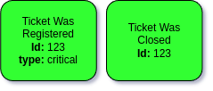
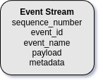
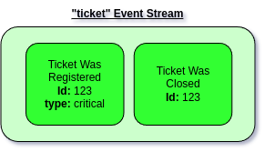
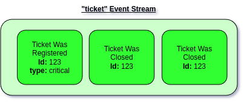
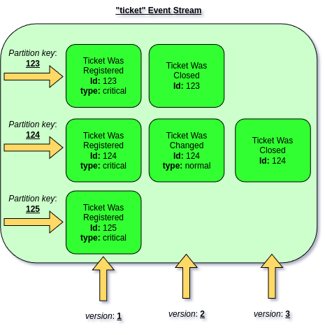
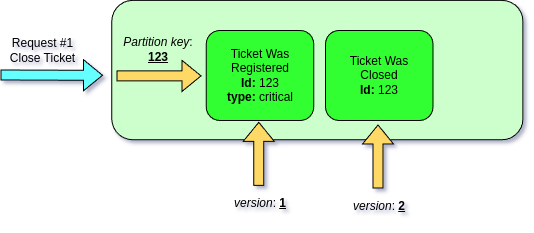
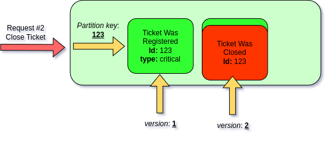

# Working with Event Streams

In [previous chapter ](./)we discussed that Event Sourcing Aggregates are built from Event Streams stored in the data store. Yet it's important to understand how those Events gets to the Event Stream in the first place.&#x20;

## Working with Event Stream directly

Let's start by manually appending Events using Event Store. This will help us understand better the concepts behind the Event Stream and Event Partitioning. After we will understand this part, we will introduce Event Sourcing Aggregates, which will abstract away most of the logic that we will need to do in this chapter.


Working with Event Stream directly may be useful when migrating from existing system where we already had an Event Sourcing solution, which we want to refactor to Ecotone.


## Creating new Event Stream

After installing Ecotone's Event Sourcing we automatically get access to Event Store abstraction. \
This abstraction provides an easy to work with Event Streams.&#x20;

Let's suppose that we do have Ticketing System like Jira, two basic Events we can think of are _"Ticket Was Registered"_ and _"Ticket Was Closed"_.\
Of course we need to identify to which Ticket given event is related, therefore will have some Id.

<figure><figcaption><p>Ticket Events</p></figcaption></figure>

In our code we can define classes for those:

```php
final readonly class TicketWasRegistered
{
    public function __construct(
        public string $id, 
        public string $type
    ) {}
}

final readonly class TicketWasClosed
{
    public function __construct(
        public string $id, 
    ) {}
}
```

To store those in the Event Stream, let's first declare it using Event Store abstraction.


Event Store is automatically available in your Dependency Container after installing Symfony or Laravel integration. In case of Ecotone Lite, it can be retrievied directly.&#x20;


Event Store provides few handy methods:

```php
interface EventStore
{
    /**
     * Creates new Stream with Metadata and appends events to it
     *
     * @param Event[]|object[] $streamEvents
     */
    public function create(string $streamName, array $streamEvents = [], array $streamMetadata = []): void;
    /**
     * Appends events to existing Stream, or creates one and then appends events if it does not exists
     *
     * @param Event[]|object[] $streamEvents
     */
    public function appendTo(string $streamName, array $streamEvents): void;

    /**
     * @return Event[]
     */
    public function load(
        string $streamName,
        int $fromNumber = 1,
        int $count = null,
        MetadataMatcher $metadataMatcher = null,
        bool $deserialize = true
    ): iterable;
}
```

As we want to append some Events, let's first create an new Event Stream

```php
$eventStore->create("ticket", streamMetadata: [
    "_persistence" => 'simple', // we will get back to that in later part of the section
]);
```

This is basically enough to create new Event Stream. \
But it's good to understand what actually happens under the hood.

### What is the Event Stream actually

In short Event Stream is just audit of series of Events. From the technical point it's a table in the Database. Therefore when we create an Event Stream we are actually creating new table in the Database.

<figure><figcaption><p>Event Stream table</p></figcaption></figure>

Event Stream table contains:

* **Event Id** - which is unique identifier for Event
* **Event Name** - Is the named of stored Event, which is to know to which Class it should be deserialized to
* **Payload** - is actual Event Class, which is serialized and stored in the database  as JSON
* **Metadata** - Is additional information stored alongside the Event

## Appending Events to Event Stream

To append Events to the Event Stream we will use **"appendTo"** method

```php
$eventStore->appendTo(
    "ticket",
    [
        new TicketWasRegistered('123', 'critical'),
        new TicketWasClosed('123')
    ]
);
```

This will store given Event in Ticket's Event Stream

<figure><figcaption><p>Two Events stored in the Event Stream</p></figcaption></figure>

Above we've stored Events for Ticket with id "123". However we can store Events from different Tickets in the same Event Stream

```php
$eventStore->appendTo(
    "ticket",
    [
        new TicketWasRegistered('124', 'critical'),
    ]
);
```

<figure><figcaption></figcaption></figure>

We can now load those Events from the Event Stream

```php
$events = $eventStore->load("ticket");
```

This will return iterator of Ecotone's Events

```php
class Event
{
    private function __construct(
        private string $eventName,
        private object|array $payload,
        private array $metadata
    )
    
    (...)
```

As we can see this maps to what we've been storing in the Event Stream table. \
Payload will contains our deserialized form of our event, so for example `TicketWasRegistered`.


We could also fetch list of Events without deserializing them. \
\
$events = $eventStore->load("ticket", deserialize: false);

In that situations payload will contains an associative array.\
\
This may be useful when iterating over huge Event Streams, when there is no need to actually work with Objects. Besides that ability to load in batches may also be handy.


## Concurrent Access

Let's consider what may actually happen during concurrent access to our System. This may be due more people working on same Ticket or simply because our system did allow for double clicking of the same action.&#x20;

In those situations we may end up storing the same Event twice

```php
// concurrent request 1

$eventStore->appendTo(
    "ticket",
    [
        new TicketWasClosed('123'),
    ]
);

// concurrent request 2
$eventStore->appendTo(
    "ticket",
    [
        new TicketWasClosed('123'),
    ]
);
```

That's not really ideal, as we will end up with Event Stream with incorrect history:

<figure><figcaption><p>Ticket was closed is duplicated in the Event Stream</p></figcaption></figure>

This is the place where we need to get back to how we created this Stream

```php
$eventStore->create("ticket", streamMetadata: [
    "_persistence" => 'simple'
]);
```

We've created this Stream with "simple" persistence strategy. This means we can just apply new Events and there are no guards at all. This is fine in scenarios where we are dealing with scenarios with no business logic involved like for example collecting metrics, where all we to do is to push push Events into the Event Stream. \
\
However in more sophisticated scenarios where we want to ensure corrects of the Event Stream, we may want to ensure that the history line make sense (e.g. ensure that no ticket is closed twice). \
For this scenarios there is another persistence strategy called "partition".

## Partitioning Events

Event Stream can be split in partitions. Partition is just an sub-stream of Events related to given Identifier, in our context related to Ticket.

<figure><figcaption><p>Ticket Event Stream partioned for each Ticket</p></figcaption></figure>

As we can see in this scenario in order to partition the Stream, we need to know partition key (in our case Ticket Id) and version of preceding Event. By knowing those, we can apply an Event at the correct position in the partition.\
\
To create partitioned stream, we would create Event Stream with different strategy:

```php
$eventStore->create("ticket", streamMetadata: [
    "_persistence" => 'partition',
]);
```

This will create Event Stream table with constraints, which will require:

* **Aggregate Id** - This will be our partition key
* **Aggregate Type** - This may be used if we would store more Aggregate types within same Stream (e.g. User), as additional partition key
* **Aggregate Version -** This will ensure that we won't apply two Events at the same time to given partition

We append those as part of Event's metadata:

```php
$eventStore->appendTo(
    $streamName,
    [
        Event::create(
            new TicketWasRegistered('123', 'Johnny', 'alert'),
            metadata: [
                '_aggregate_id' => 1,
                '_aggregate_version' => 1,
                '_aggregate_type' => 'ticket',
            ]
        )
    ]
);
```

Let's now see, how does it help us ensuring that our history is always correct. Let's assume that currently we do have single Event in the partition

<figure><figcaption></figcaption></figure>

Now let's assume two requests happening at the same time:

<figure><figcaption><p>First request will succeed as will be quicker to store at position 2</p></figcaption></figure>

<figure><figcaption><p>Second request will fail due to database constraint, as position two is already taken</p></figcaption></figure>

This way allows us to be sure that within request we are dealing with latest Event Stream, because if that's not true we will end up in concurent exception. This kind of protection is crucial when dealing with business logic that depends on the previous events, as it ensures that there is no way to bypass it.&#x20;
