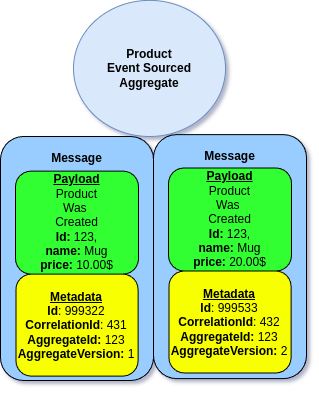

# Working with Metadata

All Events may contain additional Metadata. This is especially useful for storing information that are not required for Command to be handled, yet are important for auditing and projecting purposes.

## Metadata

In Ecotone any communication happens via Messages, and **Messages** contains of **Payload** and **Headers** (Metadata).

So far we've discussed only the Payload part, for example **ProductWasCreated** Event Class is actually an **Payload**.

<figure><figcaption><p>Product Was Created is Payload of Message stored in Event Stream</p></figcaption></figure>

What we actually **store in the Event Stream is Message**, so Payload and Metadata.

<figure><figcaption><p>Example Event Stream containing of two Events for same Aggregate Instance</p></figcaption></figure>

Ecotone Framework use the Metadata for Framework related details, which can be used for identifying messages, correlating, and targeting (which Aggregate it's related too).\
However we can also use the Metadata for additional information in our Application too.

## Metadata Propagation

Ecotone provides Metadata propagation, which take cares of passing Metadata between Command and Events without the need for us to do it manually.\
This way we can keep our business code clean, yet still be able to access the Metadata later.

```php
$this->commandBus->send(new AssignPerson(1000, 12), metadata: [
    'executorId' => '123
]);
```

```php
#[EventSourcingAggregate]
class Ticket
{
    use WithAggregateVersioning;

    #[Identifier]
    private string $ticketId;

    (...)

    #[CommandHandler]
    public function assign(AssignPerson $command) : array
    {
        return [new PersonWasAssigned($this->ticketId, $command->personId)];
    }
}
```

<figure><figcaption><p>executor id is propagated to the Event's metadata</p></figcaption></figure>

Even so, the Metadata is not used in our Ticket Aggregate, when the Event will be stored in the Event Stream, it will be stored along side with our provided Metadata.\
Therefore we will be able to access it in any Event Handlers:

```php
public function handle(
    PersonWasAssigned $event, 
    // Accessing Metadata
    #[Header("executorId")] $executorId
): void
{
    // do something with metadata
};
```

## Manual Propagation

We can also manually add Metadata directly from Command Handler, by packing the our data into Event class.

<pre class="language-php"><code class="lang-php"><strong>#[EventSourcingAggregate]
</strong>class Ticket
{
    use WithAggregateVersioning;

    #[Identifier]
    private string $ticketId;
    private string $type;

    (...)

    #[CommandHandler]
    public function assign(AssignPerson $command) : array
    {
        return [
            Event::create(
                new PersonWasAssigned($this->ticketId, $command->personId), 
                [
                   'ticketType' => $this->ticketType
                ]
            )
        ];
    }
}
</code></pre>

and then access it from any subflows:

```php
public function handle(
    PersonWasAssigned $event, 
    // Accessing Metadata
    #[Header("ticketType")] $ticketType
): void
{
    // do something with metadata
};
```

## Accessing Metadata in Command Handler

We may access metadata sent from Command Bus in Command Handler when needed:

```php
#[EventSourcingAggregate]
class Ticket
{
    use WithAggregateVersioning;

    #[Identifier]
    private string $ticketId;
    private string $ownerId;

    (...)

    #[CommandHandler]
    public function change(
        ChangeTicket $command, 
        // Accessing Metadata
        #[Header("executorId")] $executorId
    ) : array
    {
        // do something with executorId
    }
```

## \[Enterprise] Accessing Metadata during Event Application


This feature is available as part of **Ecotone Enterprise.**


We may also access Metadata inside our Event Sourcing Handler.\
This may be useful when we need to protect business invariants based on the data, that is stored as part of Metadata.

```php
#[EventSourcingAggregate]
class Ticket
{
    use WithAggregateVersioning;

    #[Identifier]
    private string $ticketId;
    private string $ownerId;

    (...)

    #[CommandHandler]
    public function change(ChangeTicket $command, #[Header] $executorId) : array
    {
        if ($this->ownerId !== $executorId) {
            throw new \InvalidArgumentException("Only owner can change Ticket");
        }
    
        return new TicketChanged($this->ticketId, $command->type);
    }
    
    #[EventSourcingHandler]
    public function applyTicketCreated(
        TicketCreated $event,
        // Accessing Metadata
        #[Header("executorId")] $executorId,
    ) : void
    {
        $this->id = $event->id;
        $this->ownerId = $executorId;
    }
}
```
