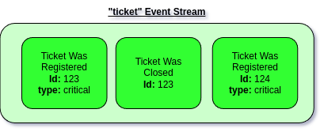
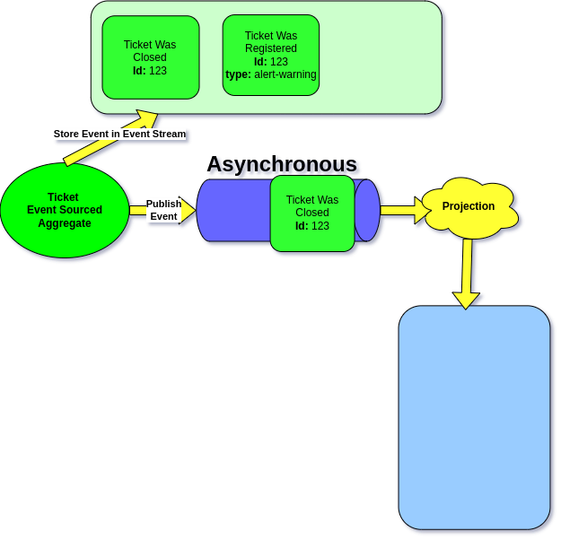

# Projection Introduction

Before diving into this topic, read the [Event Sourcing Introduction](../event-sourcing-introduction/) first.

## Introduction

The power of Event Sourcing is not only the full history of what happened. \
As we do have a full history, it's easy to imagine that we may want to use it for different purposes.\
One most of our purposes will be related with the need to view this history in specific way. \


Let's take as an example our Ticket's Event Stream:

<figure><figcaption></figcaption></figure>

Having the whole history of our Ticket is great, yet in most of the situations we would also want to know how given Ticket looks like at this very moment, and for this we can use Projections.&#x20;

## Projections and Read Models

So we may be in need to build the list of all the tickets and their current status

<figure><figcaption><p>List of tickets available in the system with current status</p></figcaption></figure>

This is an list of our tickets with their current status. This is the approach that we would most likely implement when there would be no Event Sourcing involved at all. \
For example this list can be stored in the database table with three columns:

* id
* type
* status

The difference between the traditional approach and ES approach is that we will be delivering this view from the Event Stream. Therefore this will be only the representation build up from the past events, and will be used only for reading. This kind of data delivered from Events, we call **Read Models**.

## Building first Projection

Ecotone provides abstraction to quickly build new Projections, it does follow Ecotone's declarative configuration. Before we will jump into implementation, let's quickly review how our Ticket Event Sourced Aggregate could look like:

```php
#[EventSourcingAggregate]
class Ticket
{
    use WithAggregateVersioning;

    #[Identifier]
    private string $ticketId;

    public static function register(RegisterTicket $command): array
    {
        return [new TicketWasRegistered($command->id, $command->type)];
    }

    #[CommandHandler]
    public function close(CloseTicket $command) : array
    {
        return [new TicketWasClosed($this->ticketId)];
    }
}
```

So we do have two Events here, **TicketWasRegistered** and **TicketWasClosed**. \
We will be subscribing to those in order to build our new **Ticket List Projection.**\


* Let's first define our new **Ticket List Projection**

```php
#[Projection("ticket_list", Ticket::class)]
class TicketListProjection {

    // This is Connection to our Database
    public function __construct(private Connection $connection) {}

(...)
```

We do start by creating new class, which we mark with **Projection** attribute.\
The first argument is the name of our new projection "ticket\_list", the second is the related ES Aggregate from which we will be subscribing to Events. The second argument is important, and we will see why a bit further in the road.

* Ecotone **will take care of creating the Projection for us**, therefore we can tell him how to do it

```php
#[ProjectionInitialization]
public function initializeProjection() : void
{
    if ($this->getConnection()->createSchemaManager()->tablesExist('ticket_list')) {
        return;
    }

    $table = new Table('ticket_list');

    $table->addColumn('id', Types::STRING);
    $table->addColumn('type', Types::STRING);
    $table->addColumn('status', Types::STRING);

    $this->connection->createSchemaManager()->createTable($table);
}
```

* Now we are ready to subscribe to Ticket related Events

```php
#[EventHandler]
public function onTicketWasPrepared(TicketWasRegistered $event) : void
{
    $this->connection->insert('ticket_list', [
        "id" => $event->id,
        "ticket_type" => $event->type,
        "status" => "open"
    ]);
}
```

This is enough for Ecotone to know that this should be triggered whenever TicketWasRegistered happens. In here we basically store new ticket in the our table

We also want to change the status, when ticket is closed, so let's add that now:

```php
#[EventHandler]
public function onTicketWasCancelled(TicketWasCancelled $event) : void
{
    $this->connection->update(
        'ticket_list, 
        ["status" => "cancelled"], 
        ["ticket_id" => $event->getTicketId()]
    );
}
```

This is all to make our Projection work. There is no any additional configuration needed as we are working from higher level abstraction. We tell what events we want to have delivered, and Ecotone will take care of delivering and triggering our Projections.

## How is this triggered

By default this Projection will be triggered synchronously. This means that after Event Sourced Aggregate is called, Events will first be stored in the Event Stream, and then Projection will be called.&#x20;

<figure><figcaption><p>Event Sourced Aggregate stores Event in the Event Stream and then it's published</p></figcaption></figure>

So when Command Handler returns Events, they are first stored in the Event Stream and then published. Our Projection subscribe to those Events, therefore it will be triggered as a result

<figure><figcaption><p>Projection is executed as a result of published Event</p></figcaption></figure>


By default projections work synchronously as part of the same process of execution of Command Handler. This ensures that our Projection is always consistent with changes in the Event Stream.&#x20;


<figure><figcaption><p>Command Handler and Projection execution is wrapped in same transaction</p></figcaption></figure>


Synchronous projects are done within same transaction as the Command execution. This way Ecotone ensures consistency of the data by default.\
\
Synchronous projections are simpler in development, as we can immediately fetch the data from Read Model and be sure that is consistent with the changes.


This works well for scenarios when there are no much changes to happening to given instance of Event Sourced Aggregate. How Ecotone handles Concurrency was described in more details in [previous section](../event-sourcing-introduction/working-with-event-streams.md). However was is important here is that for low writes this solution will work perfectly for high volume of writes we will want to push Projections into background process.

## Asynchronous Projections

Ecotone provides great abstraction for making the code asynchronous. From end user perspective the code stays the same like asynchronous, yet under the hood thanks to Messaging abstraction it can be easily switched to work [asynchronously via Message Channels](../../asynchronous-handling/asynchronous-message-handlers.md).&#x20;

So to make the Projection asynchronous, the only thing which we need to do, is to mark it as asynchronous.

```php
#[Asynchronous('async')]
#[Projection("ticket_list", Ticket::class)]
class TicketListProjection
```

Ecotone will take care of delivering the triggering Event via given **async** channel to the Projection. \
This way we can start with synchronous projections, and when we will the need simply switch them to Asynchronous without any line of code being changed.&#x20;

You may read more about execution process in [next section](executing-and-managing/).\
We need to touch on one more important topic. Where do we actually get the data from for Projections.

## The source of data for Projection

What is important here is that triggering Events are not actually a source for the data for Projections.\
The one reason for that is. if we would lose Event Message due some failure (We can avoid that by using [Outbox](../../recovering-tracing-and-monitoring/resiliency/outbox-pattern.md)) or it would land in [Dead Letter](../../recovering-tracing-and-monitoring/resiliency/error-channel-and-dead-letter.md), then we would basically skip over an Event.

Let's take as an example Asynchronous Projection, where we want to store Ticket with new alert-warning type. However let's suppose we've created column with limited size for type - which is up to  10 characters. Therefore our Projection will fail on storing that:

<figure><figcaption></figcaption></figure>

Now after that Ticket was closed comes in, yet there is no ticket in our Read Model that it can reference to, therefore this event will be lost:

<figure><figcaption></figcaption></figure>

So this is obviously not way of ensuring consistency in the system. \
Ecotone does it differently and treats the incoming Events just as "triggers". \
This is information for the Projection to fetch the Events from the Event Stream and start Projecting.\


<figure><figcaption><p>Projection fetches the Event from Event Stream. Incoming Event is just a trigger.</p></figcaption></figure>

This way if even so Ticket Was Registered failed, when Ticket was Closed would come after it would still get the original event first. So if we would fix the problem with column size, it would basically self-heal automatically.&#x20;
