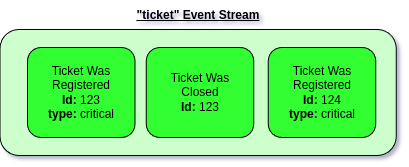

# Projection Introduction

## The Problem

Once you start storing storing events instead of updating rows — you will quickly find out your users still need a ticket list page, a dashboard, a report. How do you turn a stream of "what happened" into a table you can query?

In traditional applications, when a ticket is created you run an `INSERT`, when it's closed you run an `UPDATE`. The database always holds the current state. But with Event Sourcing, you store **what happened** — `TicketWasRegistered`, `TicketWasClosed` — as an append-only log of events.

Think of it like a bank account: instead of storing "balance = 500", you store every deposit and withdrawal. The balance is derived by replaying the history.

But your users don't want to replay history every time they load a page. They need a ready-to-query table. That's what **Projections** do.

## What is a Projection?

A **Projection** reads events from an **Event Stream** (the append-only log) and builds a read-optimized view from them — a database table, a document, a cache entry. Think of it as a **materialized view** built from events.

Another analogy: the Event Stream is like your **Git history** — every commit ever made. The Projection is like your **working directory** — the current state of the files, derived from that history.

The views built by Projections are called **Read Models**. They exist only for reading and can be rebuilt at any time from the Event Stream.

<figure><figcaption><p>Events stored in the Event Stream</p></figcaption></figure>

From these events, we want to build a list of all tickets with their current status:

<figure><figcaption><p>Read Model: list of tickets with current status</p></figcaption></figure>

## Building Your First Projection

Let's say we have a `Ticket` Event Sourced Aggregate that produces two events — `TicketWasRegistered` and `TicketWasClosed`. We want to build a read model table showing all in-progress tickets.

```php
#[ProjectionV2('ticket_list')]
#[FromAggregateStream(Ticket::class)]
class TicketListProjection
{
    public function __construct(private Connection $connection) {}

    #[ProjectionInitialization]
    public function init(): void
    {
        $this->connection->executeStatement(<<<SQL
            CREATE TABLE IF NOT EXISTS ticket_list (
                ticket_id VARCHAR(36) PRIMARY KEY,
                ticket_type VARCHAR(25),
                status VARCHAR(25)
            )
        SQL);
    }

    #[EventHandler]
    public function onTicketRegistered(TicketWasRegistered $event): void
    {
        $this->connection->insert('ticket_list', [
            'ticket_id' => $event->ticketId,
            'ticket_type' => $event->type,
            'status' => 'open',
        ]);
    }

    #[EventHandler]
    public function onTicketClosed(TicketWasClosed $event): void
    {
        $this->connection->update(
            'ticket_list',
            ['status' => 'closed'],
            ['ticket_id' => $event->ticketId]
        );
    }

    #[ProjectionDelete]
    public function delete(): void
    {
        $this->connection->executeStatement('DROP TABLE IF EXISTS ticket_list');
    }

    #[ProjectionReset]
    public function reset(): void
    {
        $this->connection->executeStatement('DELETE FROM ticket_list');
    }
}
```

That's all you need. Let's break down what each part does:

1. `#[ProjectionV2('ticket_list')]` — marks this class as a Projection with name `ticket_list`
2. `#[FromAggregateStream(Ticket::class)]` — tells the Projection to read events from the Ticket aggregate's stream
3. `#[ProjectionInitialization]` — called when the Projection is first set up (creates the table)
4. `#[EventHandler]` — subscribes to specific event types. Ecotone routes events by the type-hint.
5. `#[ProjectionDelete]` and `#[ProjectionReset]` — called when the projection is deleted or reset

There is no additional configuration needed. Ecotone takes care of delivering events, initializing, and triggering the Projection.

## Position Tracking

Each Projection remembers **where it left off** in the Event Stream — like a bookmark in a book. When a new event triggers the Projection, it fetches only the events after its last position.

This means:
- **New Projections** start from the beginning of the stream and catch up to the present
- **Existing Projections** only process new events they haven't seen yet
- **After a failure**, the Projection resumes from its last successfully committed position

This is what makes it possible to deploy a new Projection at any point in time and have it automatically build up from the full event history.

## Feature Overview

Ecotone Projections come in two editions. The open-source edition covers the full projection lifecycle for globally tracked projections. Enterprise adds scaling, advanced operations, and deployment strategies.

| Feature | Open Source | Enterprise |
|---------|:----------:|:----------:|
| **Global (non-partitioned) projection** | Yes | Yes |
| [Synchronous event-driven execution](execution-modes.md) | Yes | Yes |
| [Asynchronous event-driven execution](execution-modes.md) | Yes | Yes |
| [Lifecycle management](lifecycle-management.md) (init, delete, reset, trigger) | Yes | Yes |
| [Multiple event streams](event-streams-and-handlers.md) | Yes | Yes |
| [Projection state](projections-with-state.md) | Yes | Yes |
| [Event emission](emitting-events.md) (EventStreamEmitter) | Yes | Yes |
| [Sync backfill](backfill-and-rebuild.md) | Yes | Yes |
| [Batch size configuration](execution-modes.md#batch-size-and-flushing) | Yes | Yes |
| [Gap detection](gap-detection-and-consistency.md) | Yes | Yes |
| [Self-healing / automatic recovery](failure-handling.md) | Yes | Yes |
| [Polling execution](scaling-and-advanced.md#polling-projections) | — | Yes |
| [Partitioned projections](scaling-and-advanced.md#partitioned-projections) | — | Yes |
| [Streaming projections](scaling-and-advanced.md#streaming-projections) (Kafka, RabbitMQ) | — | Yes |
| [Async backfill](backfill-and-rebuild.md#async-backfill-enterprise) (parallel workers for partitioned) | — | Yes |
| [Rebuild](backfill-and-rebuild.md#rebuild--reset-and-replay-enterprise) (sync and async with parallel workers) | — | Yes |
| [Blue-green deployments](blue-green-deployments.md) | — | Yes |
| [High-performance flush state](projections-with-state.md#high-performance-projections-with-flush-state-enterprise) | — | Yes |
| [Multi-tenant projections](scaling-and-advanced.md#multi-tenant-projections) | — | Yes |
| Custom extensions (StreamSource, StateStorage, PartitionProvider) | — | Yes |

## What's Next

- [Event Streams and Handlers](event-streams-and-handlers.md) — control which events reach your projection
- [Execution Modes](execution-modes.md) — sync, async, and when to use each
- [Lifecycle Management](lifecycle-management.md) — CLI commands, initialization, reset
- [Projections with State](projections-with-state.md) — keep state between events without external storage
- [Emitting Events](emitting-events.md) — notify after the projection is up to date
- [Backfill and Rebuild](backfill-and-rebuild.md) — populate with historical data
- [Failure Handling](failure-handling.md) — transactions, rollback, self-healing
- [Gap Detection](gap-detection-and-consistency.md) — how Ecotone guarantees no events are lost
- [Scaling and Advanced](scaling-and-advanced.md) — partitioned, streaming, polling (Enterprise)
- [Blue-Green Deployments](blue-green-deployments.md) — zero-downtime projection changes (Enterprise)
