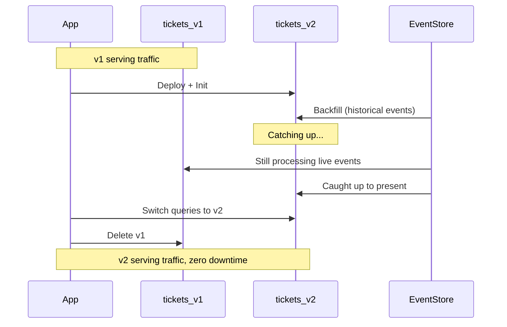

# Blue-Green Deployments

## The Problem

You need to add a column to your projection's table and change how events are processed. But rebuilding takes 30 minutes, and during that time your users see an empty dashboard. How do you deploy projection changes with zero downtime?


The features described on this page are available as part of Ecotone Enterprise.


## Why This Matters: Rebuild Cost Shapes Team Behavior

If a rebuild takes hours or days, people stop running them. They batch projection changes into rare "rebuild windows." They modify projection tables directly instead of running their changes through a rebuild. They manually patch rows to fix individual bugs. Once enough manual patches accumulate, nobody trusts a rebuild anymore — running one would erase fixes that exist only in production.

The promise of event sourcing — that the read model is just a function of the event log — only holds if replay is cheap enough to actually run. Blue-green deployments preserve that promise by making the most disruptive part of a rebuild (the period where the table is empty or inconsistent) invisible to users: v1 keeps serving while v2 catches up.

## The Blue-Green Strategy

Instead of rebuilding the existing projection in-place (which clears the data), deploy a **new version** alongside the old one:

1. **v1** continues serving traffic normally
2. **v2** is deployed and catches up from historical events in the background
3. Once v2 is fully caught up, switch traffic from v1 to v2
4. Delete v1

Both projections run against the **same Event Store** — no data migration or copying needed.

## Using #[ProjectionName] for Versioned Tables

The key mechanism is `#[ProjectionName]` — it injects the projection name as a parameter into your handlers. Use it to dynamically name your tables, so `tickets_v1` and `tickets_v2` coexist in the same database:

```php
#[ProjectionV2('tickets_v1')]
#[FromAggregateStream(Ticket::class)]
class TicketsProjection
{
    public function __construct(private Connection $connection) {}

    #[ProjectionInitialization]
    public function init(#[ProjectionName] string $projectionName): void
    {
        $this->connection->executeStatement(<<<SQL
            CREATE TABLE IF NOT EXISTS {$projectionName} (
                ticket_id VARCHAR(36) PRIMARY KEY,
                ticket_type VARCHAR(25),
                status VARCHAR(25)
            )
        SQL);
    }

    #[EventHandler]
    public function onTicketRegistered(
        TicketWasRegistered $event,
        #[ProjectionName] string $projectionName
    ): void {
        $this->connection->insert($projectionName, [
            'ticket_id' => $event->ticketId,
            'ticket_type' => $event->type,
            'status' => 'open',
        ]);
    }

    #[EventHandler]
    public function onTicketClosed(
        TicketWasClosed $event,
        #[ProjectionName] string $projectionName
    ): void {
        $this->connection->update(
            $projectionName,
            ['status' => 'closed'],
            ['ticket_id' => $event->ticketId]
        );
    }

    #[ProjectionDelete]
    public function delete(#[ProjectionName] string $projectionName): void
    {
        $this->connection->executeStatement("DROP TABLE IF EXISTS {$projectionName}");
    }

    #[ProjectionReset]
    public function reset(#[ProjectionName] string $projectionName): void
    {
        $this->connection->executeStatement("DELETE FROM {$projectionName}");
    }

    #[QueryHandler('getTickets')]
    public function getTickets(#[ProjectionName] string $projectionName): array
    {
        return $this->connection->fetchAllAssociative(
            "SELECT * FROM {$projectionName}"
        );
    }
}
```

Because the table name comes from the projection name, deploying `tickets_v2` creates a completely separate table — no conflicts with `tickets_v1`.

## Deploying Version 2

When you need to deploy changes, create v2 with `#[ProjectionDeployment]`:

```php
#[ProjectionV2('tickets_v2')]
#[FromAggregateStream(Ticket::class)]
#[ProjectionDeployment(manualKickOff: true, live: false)]
class TicketsV2Projection extends TicketsProjection
{
    // Same handlers — or modified handlers with your schema changes
    // The table name will be 'tickets_v2' thanks to #[ProjectionName]
}
```

Two settings control the deployment:

- **`manualKickOff: true`** — the projection won't auto-initialize. You control when it starts.
- **`live: false`** — events [emitted via EventStreamEmitter](emitting-events.md) are suppressed during the catch-up phase. This prevents duplicate notifications to downstream consumers.

### Why `manualKickOff` Matters

Without it, deploying `tickets_v2` would let *any other action* in the system kick the projection into life. The moment a new event for `Ticket` arrives — or any trigger touches the projection's channel — v2 would auto-initialize and start trying to catch up.

For a globally tracked projection that has to chew through millions of historical events, that is exactly what you do not want happening during deploy. The async channel can be monopolised for half an hour while v2 races to catch up; other projections sharing the channel stall; the rest of the system feels the deploy. `manualKickOff: true` keeps v2 dormant until you explicitly run `ecotone:projection:init` — at the moment that suits your ops schedule, not whenever the next event happens to arrive.

## Step-by-Step Deployment Flow

### 1. Deploy v2

Deploy your code with the `tickets_v2` projection class. Because `manualKickOff: true`, nothing happens yet.

### 2. Initialize v2

Create the v2 table:



```bash
bin/console ecotone:projection:init tickets_v2
```



```bash
artisan ecotone:projection:init tickets_v2
```



### 3. Backfill v2

Populate v2 with all historical events:



```bash
bin/console ecotone:projection:backfill tickets_v2
```



```bash
artisan ecotone:projection:backfill tickets_v2
```



During this phase, v1 continues serving traffic normally. v2 processes historical events in the background.

### 4. Verify v2

This step is what makes blue-green safer than rebuild — but only if you actually do it. Skip it and you discover v2 is wrong only after users complain.

What to check, in order of effort:

- **Structural diff** — row counts, distinct values per column, null distribution. Anything wildly off is a sign that the v2 handler missed an event type or wrote the wrong type.
- **Spot checks** — pick a handful of known-good and known-tricky aggregates, query both tables, compare row-by-row. Tickets near edge cases (closed-then-reopened, type-changed mid-life, etc.) catch most handler bugs.
- **Edge-case sampling** — query for rows where the new logic should differ from v1 (the whole reason you're deploying v2). Confirm v2 actually produces the new values.
- **Shadow reads** — if you can afford it, run live queries against both tables and log discrepancies. Catches anything the static comparison missed.

If anything looks wrong, you have not lost anything: v1 is untouched, delete v2 and try again.

### 5. Switch Traffic

Update your application's query handlers to read from `tickets_v2` instead of `tickets_v1`.

### 6. Enable Live Mode

Update the v2 projection to remove `manualKickOff` and set `live: true`, so it processes new events and emits downstream events normally.

### 7. Delete v1



```bash
bin/console ecotone:projection:delete tickets_v1
```



```bash
artisan ecotone:projection:delete tickets_v1
```



This calls `#[ProjectionDelete]` which drops the `tickets_v1` table.



## Event Emission Control

The `live: false` setting is critical for projections that [emit events](emitting-events.md). Without it, the backfill phase would re-emit all historical events — sending thousands of duplicate notifications to downstream consumers.

With `live: false`:
- Events emitted during backfill are silently discarded
- Once you switch to `live: true`, new events are emitted normally
- Downstream consumers only see events once

## Upgrading from Global to Partitioned

Blue-green deployments also work for changing projection types. You can deploy v2 as a [Partitioned Projection](scaling-and-advanced.md) alongside your existing global v1:

```php
#[ProjectionV2('tickets_v2')]
#[FromAggregateStream(Ticket::class)]
#[Partitioned]
#[ProjectionDeployment(manualKickOff: true, live: false)]
class TicketsV2Projection extends TicketsProjection
{
    // Same handlers, now partitioned
}
```

The same Event Store backs both projections. The only difference is how events are tracked and processed — v2 uses per-aggregate partitions instead of a single global position. Once v2 catches up, switch traffic and delete v1.
