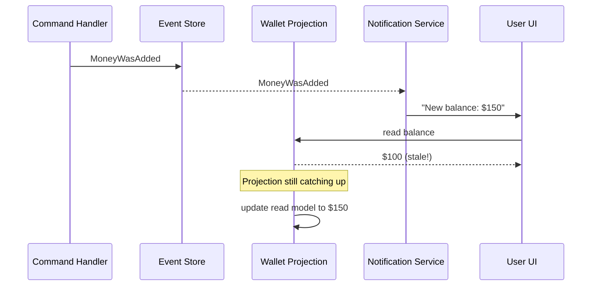

# Emitting Events

## The Problem

A user adds money to their wallet. The `MoneyWasAddedToWallet` event is published. A notification service subscribes to that event and sends a "Your new balance is X" WebSocket message. The user clicks the notification, opens the dashboard, and sees the **old** balance.

The notification arrived before the projection finished updating the read model.



This is not a bug — it is the consequence of subscribing to **what happened in the domain** when what you actually need is **the moment the read model reflects that fact**.

### Why Common Workarounds Fail

- **Version-based retry** — the subscriber polls the read model until the version matches. Adds latency, adds load, leaks projection internals to consumers.
- **Synchronous projections** — keep everything in the command's transaction. Solves the race but blocks every write on every projection; one slow projection slows down the whole write path, plus failure in projection rollbacks the event itself.
- **Event enrichment** — pack the new balance directly into `MoneyWasAddedToWallet`. Couples every subscriber to the projection's internal schema, inflates the domain event, and still doesn't help anyone who reads other fields from the read model.

What you actually want is a second event — a *derived fact* — that fires **after** the projection has committed.

## The Solution: Emit Events from Projections

Instead of subscribing to domain events (which fire before the projection updates), subscribe to events **emitted by the projection itself** — these fire after the Read Model is up to date.


**The emitted event must live in the same storage as the read model.**

This is the rule that makes the whole pattern work. The emitted event, the read model write, and the position advancement all commit together in a single transaction. If you push the derived event straight to Kafka or RabbitMQ from inside the handler, the message flies out before the projection commits — the subscriber picks it up, queries the read model, and sees stale data. You are back where you started.

`EventStreamEmitter` writes to the Event Store, so the guarantee holds. If you need to bridge the derived event to an external broker afterwards, do it from a downstream handler that subscribes to the emitted event — by the time that handler runs, the read model is committed.


## Emit the Event

Use `EventStreamEmitter` inside your projection to emit events after updating the Read Model:

```php
#[ProjectionV2('wallet_balance')]
#[FromAggregateStream(Wallet::class)]
class WalletBalanceProjection
{
    #[EventHandler]
    public function whenMoneyWasAdded(
        MoneyWasAddedToWallet $event,
        EventStreamEmitter $eventStreamEmitter
    ): void {
        $wallet = $this->getWalletFor($event->walletId);
        $wallet = $wallet->add($event->amount);
        $this->saveWallet($wallet);

        $eventStreamEmitter->emit([
            new WalletBalanceWasChanged($event->walletId, $wallet->currentBalance)
        ]);
    }

    #[EventHandler]
    public function whenMoneyWasSubtracted(
        MoneyWasSubtractedFromWallet $event,
        EventStreamEmitter $eventStreamEmitter
    ): void {
        $wallet = $this->getWalletFor($event->walletId);
        $wallet = $wallet->subtract($event->amount);
        $this->saveWallet($wallet);

        $eventStreamEmitter->emit([
            new WalletBalanceWasChanged($event->walletId, $wallet->currentBalance)
        ]);
    }

    (...)
}
```

Emitted events are stored in the projection's own stream.


Events are stored in a stream called `project_{projectionName}`. In the example above: `project_wallet_balance`.


### The Cost of Per-Event Emission

Every projected event now does three things: read current state, write the updated read model, and emit a derived event. That is at least one extra write to the Event Store per domain event.

Worse, most of those emissions are noise. If a wallet receives twenty `MoneyWasAddedToWallet` events in the same batch — a payroll run, a webhook replay, a bulk import — you emit twenty `WalletBalanceWasChanged` events, even though every downstream consumer only cares about the **final** balance for the batch.

For low-volume read models the cost is negligible. For high-volume ones it dominates the workload.

## Batched Emission with Flush

When per-event emission becomes a bottleneck, move emission into `#[ProjectionFlush]`. The handler accumulates state across the batch; the flush handler writes the read model and emits a single derived event per partition per batch.

This pattern requires `#[Partitioned]` — the flush state is per-aggregate, so emission stays meaningful (one event per wallet per batch, not one event for *the whole batch* across all wallets).

```php
#[ProjectionV2('wallet_balance')]
#[FromAggregateStream(Wallet::class)]
#[Partitioned]
class WalletBalanceProjection
{
    #[EventHandler]
    public function whenMoneyWasAdded(
        MoneyWasAddedToWallet $event,
        #[ProjectionState] ?array $state
    ): array {
        $state ??= ['walletId' => $event->walletId, 'balance' => 0];
        $state['balance'] += $event->amount;
        return $state;
    }

    #[EventHandler]
    public function whenMoneyWasSubtracted(
        MoneyWasSubtractedFromWallet $event,
        #[ProjectionState] array $state
    ): array {
        $state['balance'] -= $event->amount;
        return $state;
    }

    #[ProjectionFlush]
    public function flush(
        #[ProjectionState] array $state,
        EventStreamEmitter $emitter
    ): void {
        $this->saveWallet($state['walletId'], $state['balance']);

        $emitter->emit([
            new WalletBalanceWasChanged($state['walletId'], $state['balance'])
        ]);
    }
}
```

Twenty `MoneyWasAdded` events in the same batch now produce **one** `WalletBalanceWasChanged` per wallet, with the final balance. The read model write and the emission still commit together — the consistency guarantee is untouched.

## Subscribing to Emitted Events

After emitting, you can subscribe to these events just like any other event — in a regular event handler or even another projection:

```php
class NotificationService
{
    #[EventHandler]
    public function when(WalletBalanceWasChanged $event): void
    {
        // Send WebSocket notification — the Read Model is already up to date
    }
}
```


All emitted events are stored in streams, so you can create another projection that subscribes to them — building derived views from derived views.


## Linking Events to Other Streams

In some cases you may want to emit an event to an existing stream (for example, to provide a summary event) or to a custom stream:

```php
$eventStreamEmitter->linkTo('wallet', [
    new WalletBalanceWasChanged($event->walletId, $wallet->currentBalance)
]);
```


`linkTo` works from any place in the code. `emit` stores events in the projection's own stream and only works inside a projection.


### Public API Streams

`linkTo` becomes especially useful for **publishing a curated event stream that other teams or other applications consume**. Rather than exposing your raw domain events — which leak internal aggregate structure and change every time you refactor — emit a named stream of high-level business facts:

- `completed_orders`
- `cancelled_subscriptions`
- `kyc_approved_customers`
- `flagged_transactions`

The downstream consumer subscribes to that stream. You own the contract; the domain stays free to evolve.

**Enriching the published event is fine — even encouraged.** A consumer reading `completed_orders` should not have to query back into your service for the customer, total, or shipping carrier. Pack what consumers need onto the emitted event:

```php
$emitter->linkTo('completed_orders', [
    new OrderFullyCompleted(
        orderId: $state['orderId'],
        customerId: $state['customerId'],
        totalAmount: $state['totalAmount'],
        currency: $state['currency'],
        paidAt: $state['paidAt'],
        shippedAt: $state['shippedAt'],
        carrier: $state['carrier'],
    )
]);
```

This is the opposite of enriching **domain** events. Domain events stay minimal — only what the aggregate needs to rebuild itself. The *published* contract is where enrichment belongs: you control its shape, and consumers stay decoupled from your internals.

## Cross-Aggregate Correlation

Some business facts only exist when multiple aggregates have reached a particular state. An order is "fully completed" when the `Order`, `Payment`, and `Shipment` aggregates have all hit their terminal states. None of those aggregates can emit `OrderFullyCompleted` on their own — they don't know about each other.

A projection that subscribes to all three streams and tracks which conditions have been met can emit the derived fact when the conjunction is reached:

```php
#[ProjectionV2('order_lifecycle')]
#[FromAggregateStream(Order::class)]
#[FromAggregateStream(Payment::class)]
#[FromAggregateStream(Shipment::class)]
class OrderLifecycleProjection
{
    #[EventHandler]
    public function onOrderPlaced(
        OrderPlaced $event,
        #[ProjectionState] ?array $state
    ): array {
        return [
            'orderId' => $event->orderId,
            'customerId' => $event->customerId,
            'totalAmount' => $event->totalAmount,
            'currency' => $event->currency,
            'ordered' => true,
            'paid' => false,
            'shipped' => false,
        ];
    }

    #[EventHandler]
    public function onPaymentSettled(
        PaymentSettled $event,
        #[ProjectionState] array $state
    ): array {
        $state['paid'] = true;
        $state['paidAt'] = $event->settledAt;
        return $state;
    }

    #[EventHandler]
    public function onShipmentDelivered(
        ShipmentDelivered $event,
        #[ProjectionState] array $state
    ): array {
        $state['shipped'] = true;
        $state['shippedAt'] = $event->deliveredAt;
        $state['carrier'] = $event->carrier;
        return $state;
    }

    #[ProjectionFlush]
    public function flush(
        #[ProjectionState] array $state,
        EventStreamEmitter $emitter
    ): void {
        if ($state['ordered'] && $state['paid'] && $state['shipped']) {
            $emitter->linkTo('completed_orders', [
                new OrderFullyCompleted(
                    orderId: $state['orderId'],
                    customerId: $state['customerId'],
                    totalAmount: $state['totalAmount'],
                    currency: $state['currency'],
                    paidAt: $state['paidAt'],
                    shippedAt: $state['shippedAt'],
                    carrier: $state['carrier'],
                )
            ]);
        }
    }
}
```

The projection is the only place in the system that knows when "fully completed" happens. It owns the definition; the rest of the system just consumes `completed_orders`.

## Pipelines: Derived Streams as Input for Other Projections

Emitted events are just events. Another projection can subscribe to them and emit further derived facts — a multi-stage pipeline of progressively higher-level signals:

```
raw domain events
    → wallet_balance projection
        emits WalletBalanceWasChanged
    → high_value_wallets projection
        emits HighValueWalletDetected
    → risk_assessment projection
        emits ComplianceCheckTriggered
```

Each stage is autonomous: its own position tracker, its own failure handling, its own ability to catch up after a crash. If `high_value_wallets` fails, `wallet_balance` keeps running; `risk_assessment` pauses until `high_value_wallets` recovers, then resumes from where it stopped.

You build a chain of derived facts the same way you build the first one — there's no special syntax for "pipeline projections."

## Controlling Event Emission

### During Rebuild

When a projection is rebuilt (reset and replayed from the beginning), emitted events could be republished — causing duplicate notifications and duplicate linked events.

Ecotone handles this automatically: **events emitted during a reset/rebuild phase are not republished or stored**. This is safe by default.


This is the key difference between using `EventStreamEmitter` versus `EventBus`. The `EventBus` would simply republish events during a rebuild, causing duplicates. `EventStreamEmitter` suppresses them.


### With ProjectionDeployment (Enterprise)

You can also explicitly suppress event emission by setting `live: false` on `#[ProjectionDeployment]`:

```php
#[ProjectionV2('wallet_balance')]
#[FromAggregateStream(Wallet::class)]
#[ProjectionDeployment(live: false)]
class WalletBalanceProjection
{
    // EventStreamEmitter calls are silently skipped — no events are stored or published
}
```

This is important because **backfill will emit events** — it replays historical events through your handlers, and if those handlers call `EventStreamEmitter`, all those events will be published to downstream consumers. If you're backfilling a projection with 2 years of history, that means thousands of duplicate notifications.

Use `live: false` during backfill to prevent this, then switch to `live: true` once the projection is caught up. This is the pattern used in [blue-green deployments](blue-green-deployments.md).


`#[ProjectionDeployment]` is available as part of Ecotone Enterprise.


## Deleting the Projection

When a projection is deleted, Ecotone automatically deletes the projection's event stream (`project_{name}`).


Custom streams created via `linkTo` are not automatically deleted — they may be shared with other consumers.


## Demo

[Example implementation using Ecotone Lite.](https://github.com/ecotoneframework/quickstart-examples/tree/master/EmittingEventsFromProjection)
