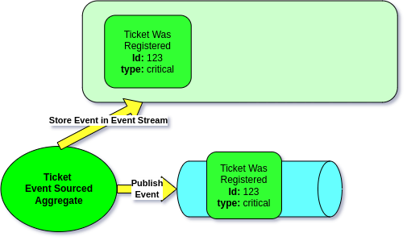
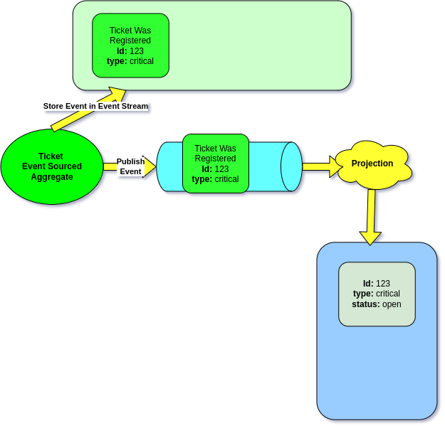
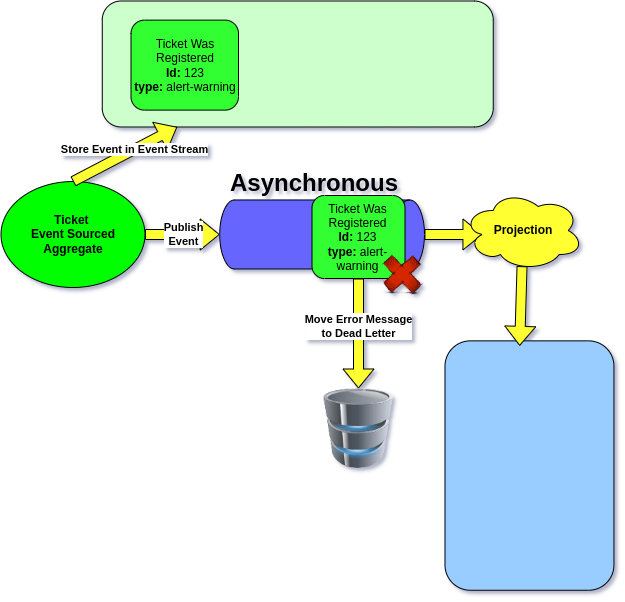

# Failure Handling

## The Problem

Your projection handler throws an exception halfway through processing a batch of 100 events. Are the first 50 events committed or rolled back? Does the failure block all other projections, or just this one? And when the bug is fixed, does the projection automatically recover?

## Trigger-Based Architecture

Most of the resilience properties on this page — self-healing recovery, failure isolation, safe batch retries — come from one design decision:

**The incoming event is a trigger, not the data being processed.** When Ecotone runs a projection, it does not feed the trigger event into your handler. It uses the trigger as a signal to read events **from the Event Store** starting at the projection's last committed position. The handler always processes events fetched from the source of truth, not events that happened to ride along in a message.

This is what lets crashed projections pick up exactly where they stopped after a fix is deployed: the Event Store still has every event, and the projection's stored position still points to the last successful commit. Restart the worker and it reads forward from that position — no manual reset, no backfill.

It is also what makes failure isolation work: each async projection receives its own copy of the trigger and tracks its own position. One projection's stuck position doesn't affect another's.

Keep this mental model in mind through the rest of this page. "Trigger arrives → projection reads from Event Store at last position → projection commits new position" is the whole loop.

## How Projections Are Triggered

By default, Projections run **synchronously**. When a Command Handler stores events in the Event Stream, the Projection is triggered immediately — in the same process and the same database transaction.

<figure><figcaption><p>Event Sourced Aggregate stores events, then they are published</p></figcaption></figure>

The Projection subscribes to those events and is executed as a result:

<figure><figcaption><p>Projection executes after events are published</p></figcaption></figure>

Because both the Event Store write and the Projection update happen in the same transaction, your Read Model is always consistent with the Event Stream:

<figure><figcaption><p>Command Handler and Projection wrapped in same transaction</p></figcaption></figure>

This is important for understanding what gets reverted on failure — when a synchronous projection fails, the entire transaction (including the Event Store write) is rolled back. For [asynchronous projections](execution-modes.md), the Event Store write and the Projection run in separate transactions.

## Transaction Boundaries

Each batch of events is wrapped in a **single database transaction**. If any event in the batch causes an exception:

1. The entire batch is **rolled back** — no partial writes
2. The projection's **position is not advanced** — the same events will be reprocessed on the next run
3. The projection's **state is not persisted** — no corrupted state

This is all-or-nothing per batch. You never end up with half-processed data.

## Batch Commits — Not One Giant Transaction

With `#[ProjectionExecution(eventLoadingBatchSize: N)]`, events are loaded in batches. Each batch gets its own transaction. Concretely, with `eventLoadingBatchSize: 500`:

* **Batch 1** (events 1–500): processed successfully → **committed**, position advanced to 500
* **Batch 2** (events 501–1000): exception thrown at event 750 → **entire batch rolled back**, position stays at 500
* Next run: resumes from event 501. Batch 1's work is safe — only the failing batch is replayed.

You never get partial writes from a failing batch, and you never lose committed work from earlier batches.

### Why Batching Matters Beyond Failure Recovery

For a backfill or rebuild that has to chew through millions of events, batching is not just about safe rollback — it is what keeps the worker alive. Without batches:

- **Memory grows unboundedly.** Doctrine's `EntityManager` keeps references to every entity it has seen until you flush and clear it. Process a million events in one transaction and the heap fills until the OS kills the worker.
- **Locks stay held.** A single 100,000-event transaction locks the projection table for the entire run.
- **Recovery cost is enormous.** A crash at event 999,000 means replaying all 999,000 events on restart.

Batched commits put a ceiling on all three. Ecotone manages transactions at batch boundaries automatically and, if you use Doctrine ORM, also flushes and clears the EntityManager at each batch boundary so memory stays flat across long runs.

```php
#[ProjectionV2('ticket_list')]
#[FromAggregateStream(Ticket::class)]
#[ProjectionExecution(eventLoadingBatchSize: 500)]
class TicketListProjection
{
    #[EventHandler]
    public function onTicketRegistered(TicketWasRegistered $event): void
    {
        // Processed in batches of 500
        // Each batch: load → process → flush → commit
    }

    #[ProjectionFlush]
    public function flush(): void
    {
        // Called after each batch, before commit
    }
}
```


Ecotone manages transactions at batch boundaries automatically. If you use Doctrine ORM, Ecotone also flushes and clears the EntityManager at each batch boundary, preventing memory leaks and stale entity state.


## Failure Isolation Between Projections

When running projections asynchronously, Ecotone delivers a **copy of the trigger message** to each async handler independently. This means if one projection fails, the failure does **not propagate** to other projections — even if they share the same message channel.

**Example:** You have `TicketListProjection` and `TicketStatsProjection` both running on the `projections` async channel. If `TicketStatsProjection` throws an exception, `TicketListProjection` continues processing normally. Each projection is isolated.


Multiple async projections on the same channel are fully isolated from each other. A failure in one projection never blocks or affects another.


## Failure Impact Within a Projection

Within a single projection, how a failure affects processing depends on the projection type:

### Global Projection

A failure **blocks the entire projection**. Because a global projection tracks a single position across all events in the stream, a failing event prevents any subsequent events from being processed — even events for unrelated aggregates.

**Example:** Event #50 fails for Ticket-A. Events #51-#100 (for Ticket-B, Ticket-C, etc.) cannot be processed until event #50 succeeds.

### Partitioned Projection (Enterprise)

A failure **blocks only the specific partition** (single aggregate instance). All other partitions continue processing normally.

**Example:** Ticket-A's partition fails on an event. Ticket-B and Ticket-C partitions continue processing independently. Only Ticket-A is stuck.

This is a major resilience advantage — one problematic aggregate doesn't bring down the entire projection.

### Streaming Projection (Enterprise)

A failure blocks whatever partition is defined on the Message Broker side (e.g., a Kafka partition). Other broker partitions continue independently.

## Recovery by Execution Mode

How the system recovers from a failure depends on the execution mode:

### Synchronous

The exception **propagates to the caller** (the command handler). There is no automatic retry — the failure is immediately visible to the user.

### Asynchronous

Handled by the messaging channel's retry configuration. You can configure retry strategies with backoff:

```php
DbalBackedMessageChannelBuilder::create('projections')
    ->withReceiveTimeout(1000)
```

When all retries are exhausted, the message can be routed to an [error channel or dead letter queue](../../recovering-tracing-and-monitoring/resiliency/error-channel-and-dead-letter/).

### Polling

The next poll cycle **implicitly retries** the failed batch. Since the position wasn't advanced, the poller will attempt the same events again.

## Self-Healing Projections

A key insight: the incoming event is just a **trigger**. The Projection does not process the event message directly — it fetches events from the **Event Stream** itself, starting at its last committed position.

This is what makes projections self-healing. Consider what happens when a Projection fails because a column only accepts 10 characters, but the event contains a 13-character ticket type:

<figure><figcaption><p>Projection fails because column is too small</p></figcaption></figure>

If the next event (`TicketWasClosed`) arrives, the Projection won't skip the failed event — it will fetch from the Event Stream starting at its last known position. Once you fix the column size, the next trigger will automatically process both events:

<figure><figcaption><p>Projection fetches from Event Stream — incoming event is just a trigger</p></figcaption></figure>

Because the projection's position is only advanced on successful commit, **fixing the bug and restarting is enough**. No manual intervention needed — no resetting, no backfilling. Deploy the fix and the projection catches up automatically.


Projections are self-healing. A bug in a handler doesn't permanently corrupt the Read Model — fix the code, and the projection recovers on the next trigger. This works because events are never lost — they stay in the Event Stream, and the projection always fetches from its last committed position.

