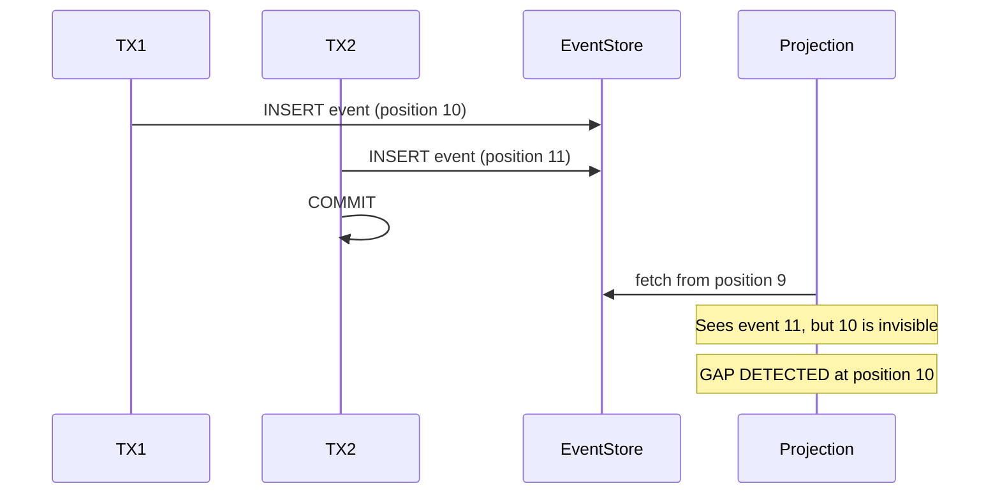
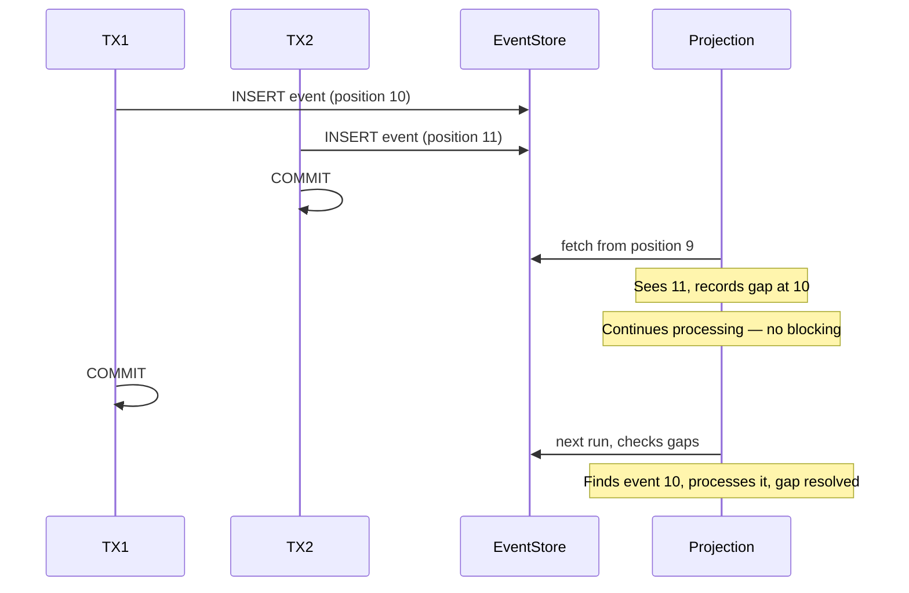

# Gap Detection and Consistency

## The Problem

Two users place orders at the exact same time. Both transactions write to the event store, but one commits a split-second before the other. Your projection processes event #11 but event #10 isn't visible yet — and silently gets skipped forever. How do you guarantee no events are lost?


**This is silent data loss.** No error. No log entry. No exception. The read model is permanently wrong, and you will not find out until someone reports the problem.

The projection logic looks correct in development — because your dev environment runs one request at a time. It is only under production concurrency that events start silently disappearing.


## Where the Problem Comes From

Gap detection matters specifically for **globally tracked projections**. A global stream combines events from many different aggregates into a single ordered sequence. When multiple transactions write events for different aggregates in parallel, they each get a position number — but they may commit in any order.

Consider two concurrent transactions:
- **TX1** writes event at position 10 (for Ticket-A), starts first but commits slowly
- **TX2** writes event at position 11 (for Ticket-B), starts second but commits first

When the projection queries the stream after TX2 commits, it sees position 11 — but position 10 is not yet visible (TX1 hasn't committed). If the projection simply advances its position to 11, event 10 is lost forever.



## Four Ways to Handle Gaps

Globally tracked projections all face the same race condition. The strategies for dealing with it form a spectrum trading throughput, complexity, and safety. Ecotone chose the last one — but understanding why the others fall short is what makes that choice motivated rather than arbitrary.

| Strategy | Safety | Throughput | Cost |
|---|---|---|---|
| No detection | ❌ Silently loses events | ✅ Maximum | Nothing — until production breaks |
| Time-based blocking | ✅ Eventually consistent | ❌ Cascading stalls | Latency, deadlocks under load |
| DB-level write locking | ✅ No gaps possible | ❌ Single global lock | Every write serializes; cannot scale |
| Track-based non-blocking | ✅ Eventually consistent | ✅ Never blocks | A compact gap list per projection |

### No Gap Detection

The naive approach: read events in order, advance the position, trust the database. In a single-threaded test it works perfectly. In production, the moment two transactions write concurrently and commit out of order, events disappear from the read model with no signal at all.

### Time-Based Blocking

Many event sourcing systems solve this by making the projection **wait** — "if I see position 11 but not 10, pause and wait for 10 to appear."

The problem with waiting:
- If TX1 takes 5 seconds to commit, the **entire projection halts** for 5 seconds
- All events after position 10 are blocked — even when they're from completely unrelated aggregates. A projection that only cares about Tickets can stall waiting on a slow Order transaction it never wanted to read.
- In high-throughput systems, this waiting cascades and can bring down the whole projection pipeline.

Time-based gap detection trades **throughput for safety** and still doesn't solve the problem at the root cause — it just defers the same race into a wait loop.

### Database-Level Write Locking

A more aggressive variant: serialize every event-store write through a single advisory lock (`SELECT pg_advisory_xact_lock(N)`). With only one writer in flight at a time, events can never commit out of order, so gaps cannot occur.

The cost is that a typical system has dozens of unrelated writes happening concurrently — order placement, payment processing, inventory adjustments, user registrations. None of them logically need to coordinate. With write locking, none of them can proceed in parallel either. Adding more workers does not help: extra workers just queue up on the lock and create contention, not throughput.

Write locking eliminates the gap problem by eliminating concurrency — which is rarely what you want.

## Ecotone's Approach: Track-Based Non-Blocking

Instead of waiting, Ecotone **records** the gap and moves on. The position is stored as a compact format that tracks both where the projection is and which positions are missing:

```
"11:10"          →  "I'm at position 11, but position 10 is a known gap"
"15:10,12,14"    →  "I'm at position 15, with known gaps at 10, 12, and 14"
```

On the next run:
- If event 10 has appeared (TX1 committed), it gets processed and removed from the gap list
- If event 10 is still missing, it stays in the gap list — the projection continues processing new events

This approach **never blocks**. The projection keeps making progress on events that are available, while tracking gaps for eventual catch-up.




Track-based gap detection is the safest and fastest approach: it never blocks processing, never loses events, and naturally catches up as late-arriving transactions commit. This is why Ecotone chose this strategy over time-based waiting.


## Gap Cleanup

Not all gaps will be filled — an event could be genuinely missing (deleted, or from a rolled-back transaction that was never committed). Ecotone cleans up stale gaps using two strategies:

- **Offset-based**: gaps more than N positions behind the current position are removed. They are too old to represent an in-flight transaction.
- **Timeout-based**: gaps older than a configured time threshold (based on event timestamps) are removed.

Both strategies ensure the gap list stays bounded and doesn't grow indefinitely.

## Why Partitioned Projections Don't Need Gap Detection

Partitioned projections track position **per aggregate**, not globally. Events within a single aggregate are guaranteed to be stored **in order** — each event's version is strictly `previous + 1`.

If two transactions try to write to the **same aggregate** concurrently, the Event Store raises an **optimistic lock exception** — one transaction will fail and retry. This is guaranteed at the Event Store level.

Because events within a partition can never be committed out of order, gaps within a partition **cannot happen**. Gap detection is only needed when tracking across multiple partitions in a global stream — exactly what globally tracked projections do.


This is another advantage of [Partitioned Projections](scaling-and-advanced.md): they sidestep the gap detection problem entirely, because each partition's event ordering is guaranteed by the Event Store's concurrency control.

