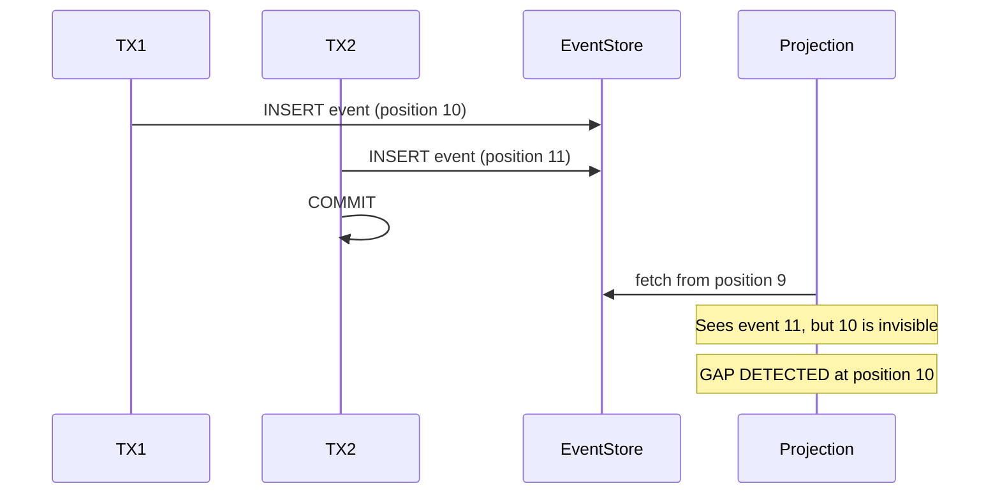
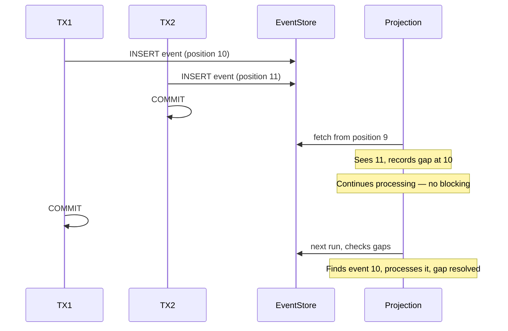

# Gap Detection and Consistency

## The Problem

Two users place orders at the exact same time. Both transactions write to the event store, but one commits a split-second before the other. Your projection processes event #11 but event #10 isn't visible yet — and silently gets skipped forever. How do you guarantee no events are lost?

## Where the Problem Comes From

Gap detection matters specifically for **globally tracked projections**. A global stream combines events from many different aggregates into a single ordered sequence. When multiple transactions write events for different aggregates in parallel, they each get a position number — but they may commit in any order.

Consider two concurrent transactions:
- **TX1** writes event at position 10 (for Ticket-A), starts first but commits slowly
- **TX2** writes event at position 11 (for Ticket-B), starts second but commits first

When the projection queries the stream after TX2 commits, it sees position 11 — but position 10 is not yet visible (TX1 hasn't committed). If the projection simply advances its position to 11, event 10 is lost forever.



## The Common (Flawed) Approach: Time-Based Waiting

Many event sourcing systems solve this by making the projection **wait** — "if I see position 11 but not 10, pause and wait for 10 to appear."

The problem with waiting:
- If TX1 takes 5 seconds to commit, the **entire projection halts** for 5 seconds
- All events after position 10 are blocked — even though they're from completely unrelated aggregates
- In high-throughput systems, this waiting cascades and can bring down the whole projection pipeline

Time-based gap detection trades **throughput for safety** and yet is not solving this problem at the root cause.    

## Ecotone's Approach: Track-Based Gap Detection

Instead of waiting, Ecotone **records** the gap and moves on. The position is stored as a compact format that tracks both where the projection is and which positions are missing:

```
"11:10"  →  "I'm at position 11, but position 10 is a known gap"
```

On the next run:
- If event 10 has appeared (TX1 committed), it gets processed and removed from the gap list
- If event 10 is still missing, it stays in the gap list — the projection continues processing new events

This approach **never blocks**. The projection keeps making progress on events that are available, while tracking gaps for eventual catch-up.




Track-based gap detection is the safest and fastest approach: it never blocks processing, never loses events, and naturally catches up as late-arriving transactions commit. This is why Ecotone chose this strategy over time-based waiting.


## Gap Cleanup

Not all gaps will be filled — an event could be genuinely missing (deleted, or from a rolled-back transaction that was never committed). Ecotone cleans up stale gaps using two strategies:

- **Offset-based**: gaps more than N positions behind the current position are removed. They are too old to represent an in-flight transaction.
- **Timeout-based**: gaps older than a configured time threshold (based on event timestamps) are removed.

Both strategies ensure the gap list stays bounded and doesn't grow indefinitely.

## Why Partitioned Projections Don't Need Gap Detection

Partitioned projections track position **per aggregate**, not globally. Events within a single aggregate are guaranteed to be stored **in order** — each event's version is strictly `previous + 1`.

If two transactions try to write to the **same aggregate** concurrently, the Event Store raises an **optimistic lock exception** — one transaction will fail and retry. This is guaranteed at the Event Store level.

Because events within a partition can never be committed out of order, gaps within a partition **cannot happen**. Gap detection is only needed when tracking across multiple partitions in a global stream — exactly what globally tracked projections do.


This is another advantage of [Partitioned Projections](scaling-and-advanced.md): they sidestep the gap detection problem entirely, because each partition's event ordering is guaranteed by the Event Store's concurrency control.

