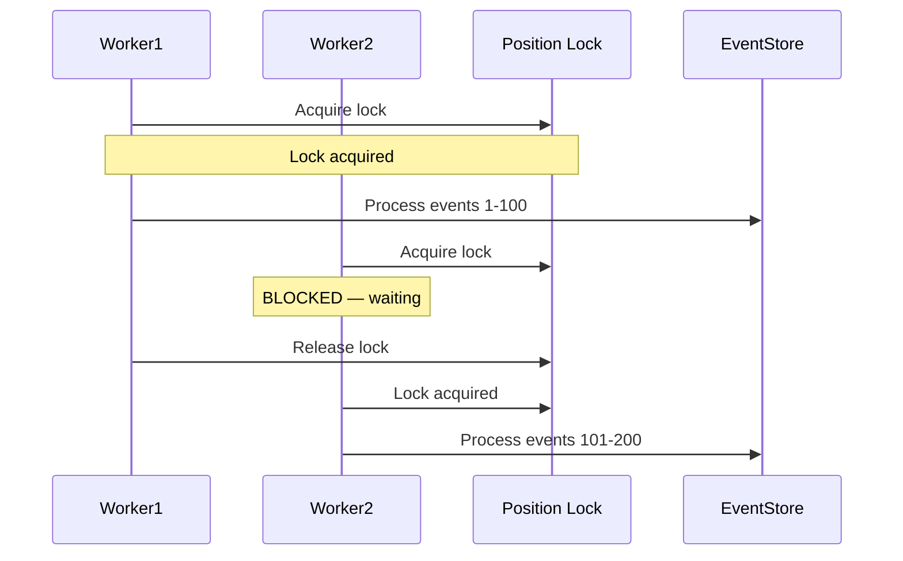
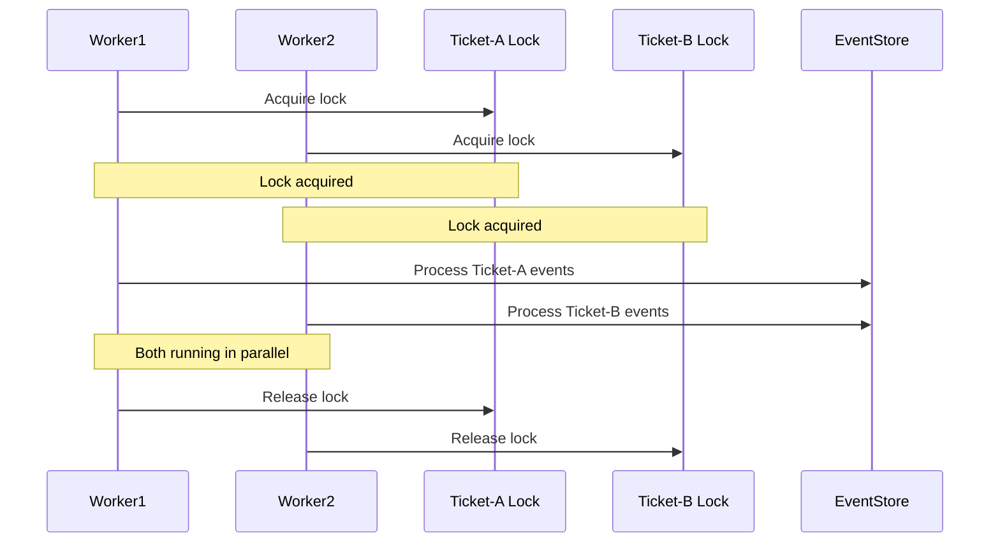
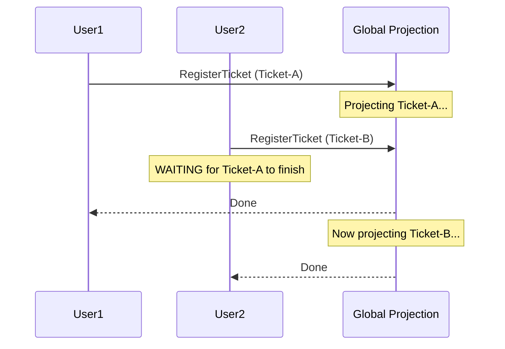
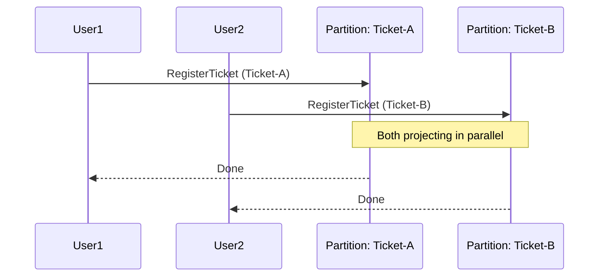
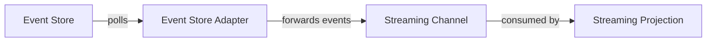

# Scaling and Advanced

## The Problem

Your projection processes events for 100,000 aggregates through a single global stream and it can't keep up. Or you need to consume events from Kafka instead of the database event store. How do you scale projections horizontally?


The features described on this page are available as part of Ecotone Enterprise.


## Comparing Projection Types

| | Global | Partitioned | Streaming |
|---|---|---|---|
| **Event source** | Database Event Store | Database Event Store | Message Broker (Kafka, RabbitMQ) |
| **Position tracking** | Single global position | Per aggregate | Broker-managed offsets |
| **Failure isolation** | One failure blocks everything | One failure blocks only that aggregate | One failure blocks broker partition |
| **Gap detection** | Required — [track-based](gap-detection-and-consistency.md) | Not needed — ordering guaranteed per partition | Not needed — broker guarantees delivery |
| **Event loading** | Scans entire stream sequentially | Fetches only relevant events per aggregate (indexed) | Pushed by broker |
| **Parallel processing** | Sequential, single consumer | Each partition independent, multiple workers | Broker-level parallelism |
| **Best for** | Simple projections, low volume | Production workloads, high volume | Cross-system integration, external events |
| **Licence** | Open source | Enterprise | Enterprise |


For production systems with growing event volumes, partitioned projections are the recommended choice. They are faster (indexed event loading), more resilient (failure isolation per aggregate), and scale horizontally (parallel workers).


### Transactional Scope: Why Global Projections Can't Scale

To understand why partitioned projections are necessary for scaling, it helps to see how the transactional scope differs between the two types.

**Globally tracked projections** have a single position tracker for the entire projection. When one process is projecting events, it holds a lock on that position. Any other process that wants to project must **wait** until the first one finishes and releases the lock. This is by design — the global stream must be processed in order, so only one consumer can advance the position at a time.



This means globally tracked projections are **not scalable by nature**. Adding more workers doesn't help — they queue up behind each other. Global projections are designed for building read models that need to aggregate data **across the entire stream** (e.g., a dashboard counting all tickets regardless of which aggregate produced them).

**Partitioned projections** have a separate position tracker **per aggregate**. The transactional scope is per projected aggregate, not per projection. This means Ticket-A and Ticket-B can project at the same time without blocking each other — each holds a lock only on its own partition state.



This is why partitioned projections are **scalable by nature** — adding more workers directly increases throughput.


In most cases, what you want to project is the state of a given aggregate — for this, partitioned projections are the right choice. Global projections are meant for the less common case where you need to build a read model across the entire stream (e.g., cross-aggregate reporting).


## Migrating from Global to Partitioned

The upgrade path from a global projection to a partitioned one is simple:

1. Deploy a second version of your projection with `#[Partitioned]` alongside the existing global one
2. Both projections are backed by the **same Event Store** — no data migration needed
3. Ecotone takes care of delivery and execution
4. You just choose the execution model (sync or async)

You can use [Blue-Green Deployments](blue-green-deployments.md) to make this transition with zero downtime — the old global projection continues serving traffic while the new partitioned one catches up.

## Partitioned Projections

A partitioned projection creates **one partition per aggregate**. Each partition tracks its own position, processes its own events, and can fail independently.

```php
#[ProjectionV2('ticket_details')]
#[FromAggregateStream(Ticket::class)]
#[Partitioned]
class TicketDetailsProjection
{
    public function __construct(private Connection $connection) {}

    #[EventHandler]
    public function onTicketRegistered(TicketWasRegistered $event): void
    {
        $this->connection->insert('ticket_details', [
            'ticket_id' => $event->ticketId,
            'type' => $event->type,
            'status' => 'open',
        ]);
    }

    #[EventHandler]
    public function onTicketClosed(TicketWasClosed $event): void
    {
        $this->connection->update(
            'ticket_details',
            ['status' => 'closed'],
            ['ticket_id' => $event->ticketId]
        );
    }

    #[ProjectionInitialization]
    public function init(): void { /* CREATE TABLE */ }

    #[ProjectionReset]
    public function reset(): void { /* DELETE FROM */ }
}
```

### The Difference in Practice: Sync and Async

This transactional scope difference affects both execution modes.

**Synchronous example:** Two users register tickets at the same time. With a global projection, one request must wait for the other's projection to finish before it can project — adding latency to the API response. With a partitioned projection, both requests project their own aggregate independently and return immediately.





**Asynchronous example:** With a global projection, it only makes sense to have a **single worker** running per projection — adding more workers doesn't help because they block each other waiting for the single position lock. With partitioned projections, each worker picks up a different aggregate's events. If you have 4 workers processing 4 different aggregates in parallel, throughput scales 4x.

### Performance: Why Partitioned Is Faster

Beyond resilience and scalability, partitioned projections have a significant **performance advantage** in event loading.

A globally tracked projection must scan the entire event stream — even events it doesn't care about — because it tracks a single position across all aggregates. It **cannot skip events**, because skipping would create [gaps](gap-detection-and-consistency.md) that need to be tracked and resolved. Even if your projection only handles `TicketWasRegistered`, it still reads past millions of `OrderWasPlaced` events to advance its position and maintain gap awareness.

A partitioned projection tracks position **per aggregate**. Because event ordering within a single aggregate is guaranteed by the Event Store's optimistic locking (no [gaps possible](gap-detection-and-consistency.md#why-partitioned-projections-dont-need-gap-detection)), Ecotone can **skip directly to the events the projection is interested in** — filtering by aggregate type at the database level using indexes. There is no need to read irrelevant events. On a high-volume event stream with millions of events across many aggregate types, this makes a massive difference in loading speed.

## Streaming Projections

Streaming projections consume events from a message channel (such as Kafka or RabbitMQ Streams) instead of reading from the database event store directly:

```php
#[ProjectionV2('external_orders')]
#[Streaming('orders_channel')]
class ExternalOrdersProjection
{
    #[EventHandler]
    public function onOrderReceived(OrderReceived $event): void
    {
        // Process events coming from the streaming channel
    }
}
```

**When to use:**
- Cross-system integration — events produced by other services via Kafka or RabbitMQ
- When you want to decouple event reading from the database Event Store
- Real-time event consumption from external sources


Streaming projections don't need `#[FromAggregateStream]` — events come from the message channel directly.


### Feeding a Streaming Channel from the Event Store

You don't need an external message broker to use streaming projections. Ecotone provides an **Event Store Adapter** that reads events from your database Event Store and forwards them to a streaming channel. This creates a bridge between the Event Store and the streaming projection:



Configure the adapter using `EventStreamingChannelAdapter`:

```php
#[ServiceContext]
public function eventStoreFeeder(): EventStreamingChannelAdapter
{
    return EventStreamingChannelAdapter::create(
        streamChannelName: 'product_stream_channel',
        endpointId: 'product_stream_feeder',
        fromStream: 'product_stream',
    );
}
```

This creates a polling endpoint (`product_stream_feeder`) that continuously reads events from the `product_stream` in the Event Store and forwards them to the `product_stream_channel` streaming channel.

Then your streaming projection consumes from that channel:

```php
#[ProjectionV2('product_catalog')]
#[Streaming('product_stream_channel')]
class ProductCatalogProjection
{
    #[EventHandler]
    public function onProductRegistered(ProductRegistered $event): void
    {
        // Process events forwarded from the Event Store
    }
}
```

Run both the feeder and the projection:



```bash
# Start the Event Store feeder (reads events, forwards to channel)
bin/console ecotone:run product_stream_feeder -vvv

# Start the streaming projection (consumes from channel)
bin/console ecotone:run product_catalog -vvv
```



```bash
artisan ecotone:run product_stream_feeder -vvv
artisan ecotone:run product_catalog -vvv
```



### Filtering Events in the Adapter

You can filter which events the adapter forwards using glob patterns:

```php
EventStreamingChannelAdapter::create(
    streamChannelName: 'ticket_channel',
    endpointId: 'ticket_feeder',
    fromStream: 'ticket_stream',
    eventNames: ['Ticket.*', 'Order.Created'],
)
```

Only events matching the patterns will be forwarded to the channel. Events that don't match are skipped.


The Event Store Adapter is useful when you want streaming projection benefits (channel-based consumption, broker-level parallelism) but your events live in the database Event Store. It bridges the two worlds without requiring an external message broker.


## Polling Projections

Polling projections run as a dedicated background process that periodically queries the event store:

```php
#[ProjectionV2('heavy_analytics')]
#[FromAggregateStream(Order::class)]
#[Polling('analytics_poller')]
class HeavyAnalyticsProjection
{
    #[EventHandler]
    public function onOrderPlaced(OrderWasPlaced $event): void
    {
        // Heavy processing — runs in dedicated process
    }
}
```

**When to use:**
- Heavy projections that need an isolated process
- Projections that should run independently of the event-driven flow

Run the poller:



```bash
bin/console ecotone:run analytics_poller -vvv
```



```bash
artisan ecotone:run analytics_poller -vvv
```



```php
$messagingSystem->run('analytics_poller');
```



## Custom Extensions

For advanced use cases, you can provide custom implementations of the projection infrastructure:

- `#[StreamSource]` — custom event source (alternative to the built-in Event Store reader)
- `#[StateStorage]` — custom state persistence (alternative to the built-in DBAL storage)
- `#[PartitionProvider]` — custom partition strategy (alternative to aggregate-based partitioning)

These are useful when integrating with non-standard event stores or storage backends.

## Multi-Tenant Projections

Ecotone supports projections in multi-tenant environments where each tenant has its own database connection:

```php
MultiTenantConfiguration::create(
    'tenant',
    [
        'tenant_a' => 'tenant_a_connection',
        'tenant_b' => 'tenant_b_connection',
    ]
)
```

Events are isolated per tenant, and projections process each tenant's events against their own database. The tenant is identified via message metadata.
