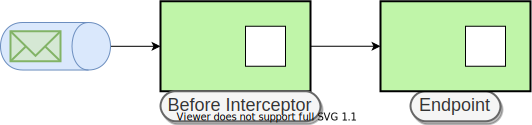
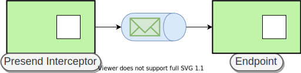

# Interceptors (Middlewares)

`Ecotone` provide possibility to handle [cross cutting concerns](https://en.wikipedia.org/wiki/Cross-cutting\_concern) via `Interceptors`. \
`Interceptor` as name the suggest, intercepts the process of handling the message. \
You may enrich the [message](../../messaging/messaging-concepts/message.md), stop or modify usual processing cycle, call some shared functionality, add additional behavior to existing code without modifying the code itself.&#x20;


If you are familiar with [Aspect Oriented Programming](https://en.wikipedia.org/wiki/Aspect-oriented\_programming) or Middleware pattern (used in most of PHP CQRS frameworks) you may find some similarities.


## Interceptor

```php
class AdminVerificator
{
    #[Before(precedence: 0, pointcut: "Order\Domain\*")]
    public function isAdmin(array $payload, array $headers) : void
    {
        if ($headers["executorId"] != 1) {
            throw new \InvalidArgumentException("You need to be administrator in order to register new product");
        }
    }
}
```

`Before` - Type of Interceptor more about it [Interceptor Types section](interceptors.md#interceptor-types)

### Precedence

Precedence defines ordering of called interceptors. The lower the value is, the quicker Interceptor will be called. It's safe to stay with range between -1000 and 1000, as numbers bellow -1000 and higher than 1000 are used by `Ecotone.` \
The precedence is done within a specific [interceptor type](interceptors.md#interceptor-types).&#x20;

### Pointcut

Every interceptor has `Pointcut` attribute, which describes for specific interceptor, which endpoints it should intercept.

* `CLASS_NAME` - indicates intercepting specific class or interface or class containing attribute on method or class level
* `NAMESPACE*` - Indicating all [Endpoints](../../messaging/messaging-concepts/message-endpoint/) starting with namespace prefix e.g. `App\Domain\*`
* `expression||expression` - Indicating one expression or another e.g. `Product\*||Order\*`&#x20;

## Interceptor Types

There are four types of interceptors. Each interceptor has it role and possibilities. \
Interceptors are called in following order:

* Before
* Around
* After
* Presend&#x20;

## Before Interceptor

### Exceptional Interceptor&#x20;

`Before interceptor` is called before endpoint is executed. \
Before interceptors can used in order to `stop the flow`, `throw an exception` or `enrich the` [`Message.`](../../messaging/messaging-concepts/message.md)\
\
We will intercept Command Handler with verification if executor is an administrator.

Let's start by creating `Attribute` called `IsAdministrator` in new namepace.

```php
#[\Attribute]
class RequireAdministrator {}
```

Let's create our first `Before Interceptor.`&#x20;

```php
class AdminVerificator
{
    #[Before(pointcut: RequireAdministrator::class)]
    public function isAdmin(array $payload, array $headers) : void
    {
        if ($headers["executorId"] != 1) {
            throw new \InvalidArgumentException("You need to be administrator in order to register new product");
        }
    }
}
```

We are using in here [Pointcut](interceptors.md#pointcut) here which is looking for `#[RequireAdministrator]` annotation in each of registered [Endpoints](../../messaging/messaging-concepts/message-endpoint/).\
The `void return type` is expected in here. It tells `Ecotone`that, this Before Interceptor is not modifying the Message and message will be passed through. The message flow however can be interrupted by throwing exception.

Now we need to annotate our Command Handler:

```php
#[CommandHandler]
#[RequireAdministrator] 
public function changePrice(ChangePriceCommand $command) : void
{
   // do something with $command
}
```

Whenever we call our command handler, it will be intercepted by AdminVerificator now.\
There is one thing worth to mention. Our `Command Handler` is using `ChangePriceCommand`class and our `AdminVerificator interceptor` is using `array $payload`. They are both the same payload of the [Message](../../messaging/messaging-concepts/message.md), but converted in the way [Endpoint](../../messaging/messaging-concepts/message-endpoint/) expected.&#x20;

### Payload Enriching Interceptor

If return type is `not void` new modified based on previous Message will be created from the returned type. \
We will enrich [Message](../../messaging/messaging-concepts/message.md) payload with timestamp.

```php
#[\Attribute]
class AddTimestamp {}
```

```php
class TimestampService
{
    #[Before(pointcut: AddTimestamp::class)] 
    public function add(array $payload) : array
    {
        return array_merge($payload, ["timestamp" => time()]);
    }
}
```

```php
class ChangePriceCommand
{
    private int $productId;
    
    private int $timestamp;
}

#[CommandHandler]
#[AddTimestamp]
public function changePrice(ChangePriceCommand $command) : void
{
   // do something with $command and timestamp
}
```

### Header Enriching Interceptor

Suppose we want to add executor Id, but as this is not part of our Command, we want add it to our [Message](../../messaging/messaging-concepts/message.md) Headers.

```php
#[\Attribute]
class AddExecutor {}
```

```php
class TimestampService
{
    #[Before(pointcut: AddExecutor::class, changeHeaders: true)] 
    public function add() : array
    {
        return ["executorId" => 1];
    }
}
```

If return type is `not void` new modified based on previous Message will be created from the returned type. If we additionally add `changeHeaders: true`it will tell Ecotone, that we we want to modify Message headers instead of payload.&#x20;

```php
#[CommandHandler]
#[AddExecutor] 
public function changePrice(ChangePriceCommand $command, array $metadata) : void
{
   // do something with $command and executor id $metadata["executorId"]
}
```

### Message Filter Interceptor

Use `Message Filter`, to eliminate undesired messages based on a set of criteria.\
This can be done by returning null from interceptor, if the flow should proceed, then payload should be returned.

```php
#[\Attribute]
class SendNotificationOnlyIfInterested {}
```

```php
class NotificationFilter
{
    #[Before(pointcut: SendNotificationOnlyIfInterested::class, changeHeaders: true)] 
    public function filter(PriceWasChanged $event) : ?array
    {
        if ($this->isInterested($event) {
           return $event; // flow proceeds 
        }
        
        return null;  // message is eliminated, flow stops.
    }
}
```

If return type is `not void` new modified based on previous Message will be created from the returned type. If we additionally add `changeHeaders=true`it will tell Ecotone, that we we want to modify Message headers instead of payload.&#x20;

```php
#[EventHandler]
#[SendNotificationOnlyIfInterested] 
public function sendNewPriceNotification(ChangePriceCommand $event) : void
{
   // do something with $event
}
```

## Around Interceptor

The `Around Interceptor` have access to actual `Method Invocation.`This does allow for starting some procedure and ending after the invocation is done.  At this moment all conversions are done, so we can't convert payload to different type.&#x20;

`Around interceptor`is a good place for handling transactions or logic shared between different endpoints, that need to access invoked object.&#x20;

```php
class TransactionInterceptor
{
    #[Around(pointcut: Ecotone\Modelling\CommandBus::class)]
    public function transactional(MethodInvocation $methodInvocation)
    {
        $this->connection->beginTransaction();
        try {
            $result = $methodInvocation->proceed();

            $this->connection->commit();
        }catch (\Throwable $exception) {
            $this->connection->rollBack();

            throw $exception;
        }

        return $result;
    }
}
```

As we used `Command Bus` interface as  pointcut, we told `Ecotone` that it should intercept `Command Bus Gateway.`  Now whenever we will call any method on Command Bus, it will be intercepted with transaction.\
\
The other powerful use case for Around Interceptor is intercepting Aggregate. \
Suppose we want to verify, if executing user has access to the Aggregate.

```php
#[Aggregate]
#[IsOwnedByExecutor] 
class Person
{
   private string $personId;

   #[CommandHandler]
   public function changeAddress(ChangeAddress $command) : void
   {
      // change address
   }
   
   public function hasPersonId(string $personId) : bool
   {
      return $this->personId === $personId;
   }
}
```

We have placed `@IsOwnerOfPerson` annotation as the top of class. For interceptor pointcut it means, that each endpoint defined in this class should be intercepted. No need to add it on each Command Handler now.

```php
#[\Attribute]
class IsOwnedByExecutor {}
```

```php
class IsOwnerVerificator
{
    #[Around(pointcut: IsOwnedByExecutor::class)] 
    public function isOwner(MethodInvocation $methodInvocation, Person $person, #[Headers] array $metadata)
    {
        if (!$person->hasPersonId($metadata["executoId"]) {
           throw new \InvalidArgumentException("No access to do this action!");
        }
        return $methodInvocation->proceed();
    }
}
```

## After Interceptor

`After interceptor` is called after endpoint execution has finished. \
It does work exactly the same as [`Before Interceptor.`](interceptors.md#before-interceptor)\
After interceptor can used to for example to enrich `QueryHandler` result.

```php
namespace Order\ReadModel;

class OrderService
{
   #[QueryHandler]
   public function getOrderDetails(GetOrderDetailsQuery $query) : array
   {
      return ["orderId" => $query->getOrderId()]
   }
}   
```

```php
class AddResultSet
{
    #[After(pointcut: "Order\ReadModel\*") 
    public function add(array $payload) : array
    {
        return ["result" => $payload];
    }
}
```

We will intercept all endpoints within Order\ReadModel namespace, by adding result coming from the endpoint under `result` key.

### Access attribute from interceptor

You may access attribute from the intercepted endpoint in order to perform specific action

```php
#[\Attribute]
class Cache 
{
    public string $cacheKey;
    public int $timeToLive;
    
    public function __construct(string $cacheKey, int $timeToLive)
    {
        $this->cacheKey = $cacheKey;
        $this->timeToLive = $timeToLive;
    }
}
```

```php
class NotificationFilter
{
    #[After] 
    public function filter($result, Cache $cache) : ?array
    {
        $this->cachingSystem($cache->cacheKey, $result, $cache->timeToLive);
    }
}
```

If you type hint for specific attribute, you do not need to add pointcut, as it will resolve it automatically.&#x20;

```php
class ProductsService
{
   #[QueryHandler]
   #[Cache("hotestProducts", 120)]
   public function getHotestProducts(GetOrderDetailsQuery $query) : array
   {
      return ["orderId" => $query->getOrderId()]
   }
}   
```

## Presend Interceptor

`Presend Interceptor`  is called before Message is actually send to the channel.\
In synchronous channel there is no difference between `Before` and `Presend.` \
The difference is seen when the channel is [asynchronous](../asynchronous-handling/scheduling.md).

#### &#x20;Before Interceptor



Before Interceptor is called after message is sent to the channel, before execution of Endpoint.

#### &#x20;Presend Interceptor



Presend Interceptor is called exactly before message is sent to the channel. \
\
`Presend Interceptor` can be used for example, when Command Bus is called from HTTP Controller. \
Then we may want to verify if data is correct and if not filter out the Message, or we may want to check, if user has enough permissions to do the action or validate payload.\
This will keep our asynchronous channel free of incorrect messages.

```php
class VerifyIfAuthenticated
{
    #[Presend(pointcut: Ecotone\Modelling\Attribute\CommandHandler::class)] 
    public function verify(#[Header("executorId")] ?string $executorId) : void
    {
        if (!$executorId) {
            throw new \InvalidArgumentException("User must be logged");
        }
    }
}


class IsEventAlreadyHandled
{
    private Storage $storage;

    #[Presend(pointcut: Ecotone\Modelling\Attribute\EventHandler::class)] 
    public function verify($payload, #[Header("messageId")] string $messageId)
    {
        if ($this->storage->isHandled($messageId)) {
            return null;
        }
        
        return $payload;
    }
}
```
