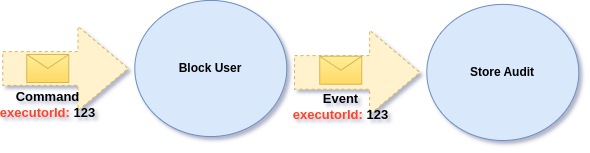
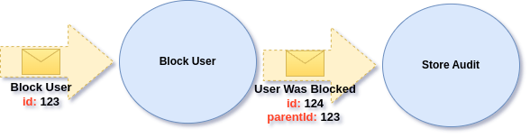
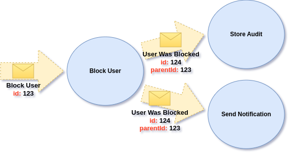
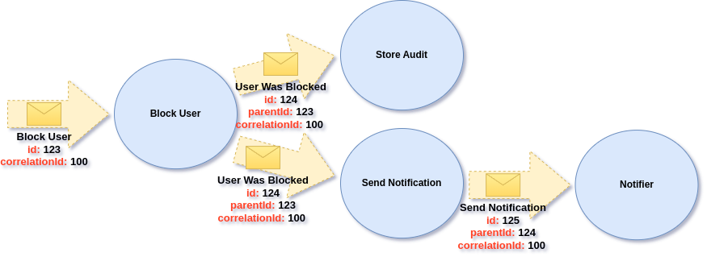

# Message Headers

Ecotone provides easy way to pass Message Headers with your Message and use it in your Message Handlers or [Interceptors](interceptors.md).\
In case of asynchronous scenarios, Message Headers will be automatically mapped and passed to your Message Broker.

## Passing headers to Bus:

Pass your metadata (headers), as second parameter.

```php
$this->commandBus->send(
   new CloseTicketCommand($request->get("ticketId")),
   ["executorUsername" => $security->getUser()->getUsername()]
);
```

Then you may access them directly in Message Handlers:

```php
#[CommandHandler]
public function closeTicket(
      CloseTicketCommand $command, 
      #[Header("executorUsername")] string $executor
) {
//        handle closing ticket
}  
```

## Converting Headers

If you have defined [Converter](../../messaging/conversion/method-invocation.md#default-converters) for given type, then you may type hint for the object and Ecotone will do the conversion:

```php
class UsernameConverter
{
    #[Converter]
    public function from(string $data): Username
    {
        return Username::fromString($data);
    }    
}
```

And then we can use Classes instead of scalar types for our Headers:

```php
#[CommandHandler]
public function closeTicket(
      CloseTicketCommand $command, 
      #[Header("executorUsername")] Username $executor
) {
//        handle closing ticket
}
```


Ecotone provides a lot of support for Conversion, so we can work with higher level business class not scalars. Find out more in [Conversion section](../../messaging/conversion/conversion/).


## Automatic Header Propagation

Ecotone by default propagate all Message Headers automatically. This as a result preserve context, which can be used on the later stage. \
For example we may provide **executorId** header and skip it in our Command Handler, however use it in resulting Event Handler.

<figure><figcaption><p>Automatic metadata propagation</p></figcaption></figure>

```php
$this->commandBus->send(
   new BlockerUser($request->get("userId")),
   ["executorId" => $security->getUser()->getCurrentId()]
);
```

This will execute Command Handler:

```php
#[CommandHandler]
public function closeTicket(BlockerUser $command, EventBus $eventBus) {
    // handle blocking user
    
    $eventBus->publish(new UserWasBlocked($command->id));
}
```

and then even so, we don't resend this Header when publishing Event, it will still be available for us:

```php
#[EventHandler]
public function closeTicket(
    UserWasBlocked $command, 
    #[Header('executorId')] $eventBus
) {
    // handle storing audit data
}
```


When publishing Events from Aggregates or Sagas, metadata will be propagated automatically too.


## Message Identification and Correlation

When using Messaging we may want to be able to trace where given Message came from, who was the parent how it was correlated with other Messages. \
In Ecotone all Messages contains of **Message Id**, **Correlation Id** and **Parent Id** within Metadata. Those are automatically assigned and propagated by the Framework, so from application level code we don’t need to deal manage those Messaging level Concepts.


Using Message Id, Correlation Id are especially useful find out what have happened during the flow and if any part of the flow has failed. \
Using already propagated Headers, we may build our own tracing solution on top of what Ecotone provides or use inbuilt support for [OpenTelemetry](../../modules/opentelemetry-tracing-and-metrics.md).


### Id

Each Message receives it's own unique Id, which is Uuid generated value. This is used by Ecotone to provide capabilities like [Message Deduplication](../recovering-tracing-and-monitoring/resiliency/idempotent-consumer-deduplication.md), [Tracing](../../modules/opentelemetry-tracing-and-metrics.md) and Message identification for [Retries and Dead Letter](../recovering-tracing-and-monitoring/resiliency/error-channel-and-dead-letter.md).

### Parent Id

**"parentId"** header refers to Message that was direct ancestor of it. In our case that can be correlation of Command and Event. As a result of sending an Command, we publish an Event Message.&#x20;

<figure><figcaption><p>id and parentId will be automatically assignated by Ecotone</p></figcaption></figure>

Parent id will always refer to the previous Message. What is important however is that, if we have multiple [Event Handlers each of them will receive it's own copy](../recovering-tracing-and-monitoring/message-handling-isolation.md) of the Message with same Id.

<figure><figcaption><p>Different Event Handlers receives same copy of the Event Message</p></figcaption></figure>

### Correlation Id

Correlation Id is useful for longer flows, which can span over multiple Message Handlers. In those situations we may be interested in how our Message flow have branched:

<figure><figcaption><p>Ecotone taking care of propagating CorrelationId between Message Handlers</p></figcaption></figure>
