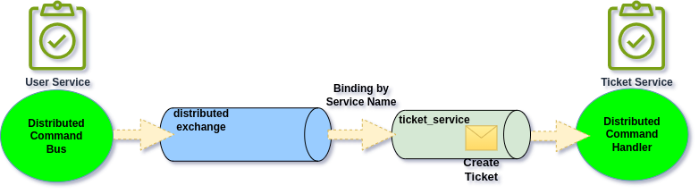
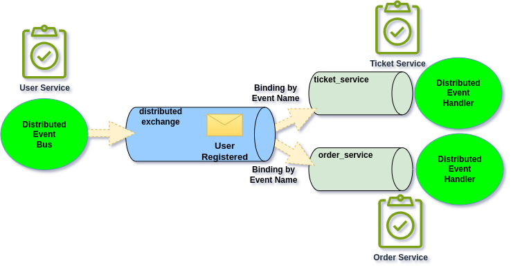

# AMQP Distributed Bus (RabbitMQ)

In case of RabbitMQ, Ecotone will create specific income queue for each Consuming Distributed Service (with by default the name of the service).&#x20;


From application perspective all we need to do, is to provide channel implementation.\
Ecotone will take care of whole publishing and consuming part.&#x20;


## Difference between Service Map and Amqp Bus Module

Ecotone provides [Distributed Bus with Service Map](../distributed-bus-with-service-map/) done on the Application level.\
This alternative can also be used with RabbitMQ integration. \
The main difference is on how the routing is done. In case of AMQP Distributed Bus routing is pushed to RabbitMQ, and whenever Distributed Handler is added, Ecotone's Message Consumer will add the bindings to related queues. On other hand with Service Map routing is done on the Application level, therefore it leave more space to Developers to make adjustments. \
\
**AMQP Distributed Bus**

* Routing is done on the RabbitMQ level, bindings are set up automatically by running Message Consumer.&#x20;
* It does not track of stale Event related bindings. Therefore it may still push Event to specific Service even so it's not interested anymore. However this is safe as this Event will be simply ignored.
* It requires single entrypoint queue per Service, which can't be shared for anything else

Distributed Bus with Service Map

* Routing is done on the Application level when Message is sent.&#x20;
* No stale bindings configuration, as it always sends accordingly to the Service Map.
* Queue can be reused for distribution and asynchronous application level processing
* Separate Queues for Event, Commands or even per Message can be introduced
* Ability to test Publishers and Consumers with In Memory implementations
* Depending on the configuration, for Events it may require more than one Message sending to publish the Message\


Service Map should be treated as preferred alternative as it provides more options, however AMQP Distributed Bus can be considered if we require to do the routing on the Message Broker level.

## How Command Distribution works

Distribution for Command and Generic Messages works by binding to the Service Name from **distributed exchange**. Ecotone registers distributed exchange automatically, and make use of it for Message forwarding between Services.

<figure><figcaption><p>Distributed Command is routed by Service Name to given Service</p></figcaption></figure>

When we are sending Distributed Command we are stating which Service do we target.&#x20;

```php
interface DistributedBus
{
    public function sendCommand(
        string $targetServiceName, 
        (...)
```

This way Ecotone knows where to send this Message too. Consumer on other hand automatically binds by Service Name to it's private queue. \
This way two sides can connect in seamless way.

## How Event Distribution works

In case of Events we don't target specific Service when the Event is being sent. Publisher is unaware of Services interested in the Event, it simply states that given fact has happened and publishes it. \
Therefore the routing part does happen on the side of the Consumers.

<figure><figcaption><p>Distributed Publisher send an Event Message and each interested Service can subscribe to it</p></figcaption></figure>

Whenever we run Distributed Message Consumer it already knows which distributed Events it's interested in.

```php
#[Distributed]
#[EventHandler("billing.detailsWereChanged")]
public function registerTicket(BillingDetailsWereChanged $event) : void
```

This way Ecotone knows which binding to create. So whenever given Event it will be able to be delivered to the correct interested Service.
