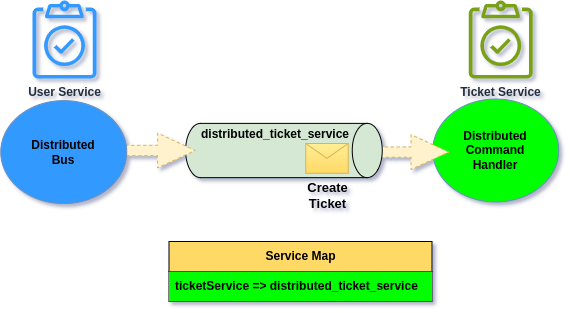
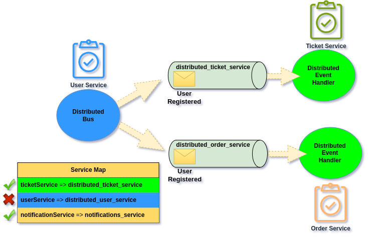

# Distributed Bus with Service Map

Ecotone comes with [Message Channel abstraction](../../../asynchronous-handling/) which allows for easily switching from [different Providers](../../../asynchronous-handling/) like Amazon SQS, RabbitiMQ, Redis, Kafka and more. \
This abstraction is used for Service (application) level asynchronous communication like Asynchronous Message Handlers. However this abstraction can also be combined with Distributed Bus mechanism to enable cross Service Communication using **Service Map**.


This functionality is available as part of **Ecotone Enterprise.**


## Distributed Service Map

It happens that communication between Services (Applications) is built using different Message Broker features to set up the topology. Which may require per feature configuration and provisioning, and in-depth knowledge about the Message Broker. This often end up as really complex solution, which becomes hard to understand and follow for Developers. When things becomes hard to understand, they become hard to change, as it raises the risk that potential modification may break something. As a result people try to avoid doing changes and development slows down. \
\
Therefore there is a need for different approach which keeps the things simple, easy to understand and change. Changes to the integration should not be scary, they should be straight forward and testable, so Developers can feel confidence in doing so. The best solution does not only make things simple to change, but also make things explicit, so just by looking people get more knowledge about the overal system design. And for this Ecotone comes with approach for Service to Service integration based on Service Ma&#x70;**.**

**Service Map** is a map of integrated Services (Applications), and points to specific Message Channels to which Messages for given Service should be sent:

<figure><figcaption><p>Distributed Service Map</p></figcaption></figure>

&#x20;In this approach **Message Channels (Pipes) are simple transport layer**, and the **routing is done on the Application (Endpoint)** level using **Service Map to make the decision**.

<figure><figcaption><p>Distributed Bus making decision to which Message Channel send the Message</p></figcaption></figure>

Making Service available for integration is matter of adding it to the Service Map:

```php
#[ServiceContext]
public function serviceMap(): DistributedServiceMap
{
    return DistributedServiceMap::initialize()
              ->withServiceMapping(
                        serviceName: "ticketService", 
                        channelName: "distributed_ticket_service"
              )
}
```

and defining implementation of the Message Channel:

```php
#[ServiceContext]
public function serviceMap(): DistributedServiceMap
{
    return SqsBackedMessageChannelBuilder::create("distributed_ticket_service")
}
```

We may choose any Message Channel Provider we want, or even different providers depending on the integrated Service. This opens possibilities for using right tool for right job, as for example in one integration we could use Redis and for other one RabbitMQ or Kafka.


Having the routing map on the Application level instead of Message Broker level means we avoid vendor-lock. In case of need to switch to different Message Broker Provider, we can simply change Message Channel implementation and our integration will continue to work.&#x20;


Approach of treating Message Brokers as simple transport layer and doing the routing on the Application level to send to the right Message Channel follows [smart endpoint dump pipes](https://martinfowler.com/articles/microservices.html#SmartEndpointsAndDumbPipes) approach. \
\
This as a result make System easy to reason about and understand. Every developer can simply take look on the Map to understand where the Message will land. Adding new integration does not require specific Message Broker knowledge, as it all comes up to adding an Service to the Map and defining the Message Channel provider. Therefore Developers can add easily maintain and change such integration.

As we understand the concepts behind Distributed Bus with Service Map now, let's dive into practical example.

## How Command Distribution works

Let’s suppose **User Service** wants to create Ticket by sending Command to **Ticket Service.**\
\
In Ticket Service we will explicitly state that we allow given Command Handler to be executed in Distributed way. This makes it clear for everyone that we can't simply delete this Command Handler, as other Services may rely on this integration:

```php
#[Distributed]
#[CommandHandler("ticketService.createTicket")]
public function changeBillingDetails(CreateTicket $command) : void
{
    // create new Ticket
}
```

on the side of User Service we would call Distributed Bus for Command to do so:

```php
public function whenPersonRegistered($personId, DistributedBus $distributedBus)
{
    $distributedBus->convertAndSendCommand(
        targetServiceName: "ticketService",
        routingKey: "ticketService.createTicket",
        command: new CreateTicket($personId, "Call Customer to collect more details")
    );
}
```

**Our topology will look like this:**

<figure><figcaption><p>Topology of our Service to Service Communication</p></figcaption></figure>

As we can see above, we do have our two Services "**UserService"** and "**TicketService".** \
**Ticket Service** will be consuming incoming messages from "**distributed\_ticket\_service"** Messsage Channel. Therefore when we send Messages to ticketService we need to send it to that Message Channel, this will be done automatically by DistributedBus using Service Map.

In User Service let's then define Service Map using [ServiceContext](../../../../messaging/service-application-configuration.md) configuration:

```php
#[ServiceContext]
public function serviceMap(): DistributedServiceMap
{
    return DistributedServiceMap::initialize()
              ->withServiceMapping(
                        serviceName: "ticketService", 
                        channelName: "distributed_ticket_service"
              )
}
```

Now when we will send Command to ticketService it will land in **distributed\_ticket\_service** channel.

### Two level routing

It's important to understand two level routing which will happen. Let's zoom in how do we call our Distributed Bus:

```php
$distributedBus->convertAndSendCommand(
    targetServiceName: "ticketService",
    routingKey: "ticketService.createTicket",
    command: new CreateTicket($personId, "Call Customer to collect more details")
);
```

**targetServiceName** will be used to target specific Service therefore it will make use Message Channel defined in the Service Map. When Message will land in given Service, it will then use routingKey to target specific Command Handler within the Application.

<figure><figcaption><p>How Distributing Command works under the hood</p></figcaption></figure>

As you can under the hood before DistributedCommandHandler is executed we actually have so called Distributed Handler. This Handler triggering Command/Event Bus with given routing key, and a result our Distributed Command Handler is executed.&#x20;

## How Event Distribution works

Event distribution is a bit different from Command distribution. In case of Command we do have single Service that will receive the Message, in case of Events however there may be multiple of them.\
\
Let's expand our previous example to include Order Service, and our scenario is that whenever new User is registered in User Service, we will publish this event to both Ticket and Order Services.

<figure><figcaption><p>Publishing Event to all known Services</p></figcaption></figure>

On the consumption part we will be marking our Event Handlers with Distributed:

```php
#[Distributed]
#[EventHandler("user.was_registered")]
public function when(UserRegistered $event) : void
{
    // do something
}
```

That code would exists in both Order and Ticket Service.\
On the publishing side, we will be using publish event method with Distributed Bus:

```php
$distributedBus->convertAndPublishEvent(
    routingKey: "user.was_registered",
    event: new UserRegistered($userId)
);
```

Like you can see there is no **targetServiceName** in the parameters anymore (comparing to distributing Command), this is because Event may land in more than one Service. However we keep **routingKey** as this the name to which consuming Services subscribe (look EventHandler attribute parameter).&#x20;

### Default Publishing

By default Event will be published to all Services in the Service Map, with exception of originating Service that publish this Event, this one will be skipped (to avoid publishing to itself). Therefore the default behaviour broadcast the Event to all Services defined in Service Map.

<figure><figcaption><p><strong>Default Publishing</strong> - Events will be published to all Services within Service Map besides the publisher itself</p></figcaption></figure>


It's a good practice to share the Service Map between Services. In order to have one single source of truth for your Service (Context) Mapping. This can also serve as reference for Developers to understand bigger picture of the System.


**In case given Service is not interested in specific Event, it will simply ignore it.** Therefore default publishing can really speed up of development process, and make things clear and simple. \
However with larger volume of published Events, there may be a lot of them, which will be simply ignored. In that situation we may want to optimize publishing part by using filtered publishing.

### Filtered Publishing

Filtered publishing allows for optimalization in publishing. This way we can publish Events only to the Services that are actually interested in those.

<figure><figcaption><p>Publishing based on Service Map subscribition keys</p></figcaption></figure>

To configure map with subscription keys, we will be using **subscriptionRoutingKeys** parameter in Service Map configuration:

```php
#[ServiceContext]
public function serviceMap(): DistributedServiceMap
{
    return DistributedServiceMap::initialize()
              ->withServiceMapping(
                        serviceName: "ticketService", 
                        channelName: "distributed_ticket_service",
                        subscriptionRoutingKeys: ["userService.account.*"]
              )
              ->withServiceMapping(
                        serviceName: "orderService", 
                        channelName: "distributed_order_service",
                        subscriptionRoutingKeys: ["userService.address.changed"]
              )
}
```

Subscription routing keys is array, therefore we may put multiple subscribition routing keys if needed. \
Subscrption keys can point to exact event name: "**userService.address.changed"**\
Or they may use wild card: "**userService.account.\*"**

By default **subscriptionRoutingKeys** are null, which means given Service will receive all Events. If we will provide empty array, it means that subscription keys  are enabled, yet none are matching, therefore no Events will be send to given Service.


When Service Map is defined as separate shared library. It becomes explicit what Events is given Service interested in. This also makes the process of subscribing to new Event visible for everyone, therefore we avoid hidden coupling that could lead to broken integration.

