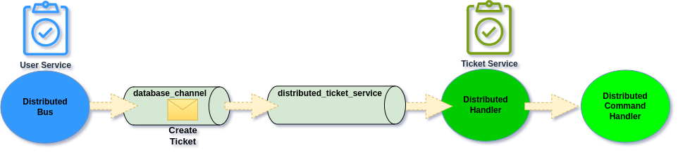

# Custom Features

## Outbox Distributed Bus

We may send Message via Distributed Bus together with other actions, most likely database changing ones. For those scenarios, we may instruct Distributed Bus to first persist Message in given Database Message Channel and then distribute it to external Service.&#x20;

<figure><figcaption><p>Send first through database channel and then forward to distributed one</p></figcaption></figure>

To configure this up, we need to have our [Database Message Channel](../../../asynchronous-handling/) registered and then we can instruct Distributed Bus to make use of it:

```php
#[ServiceContext]
public function serviceMap(): DistributedServiceMap
{
    return DistributedServiceMap::initialize()
              ->withCommandMapping(
                        targetServiceName: "ticketService",
                        channelName: "distributed_ticket_service"
              )
              ->withAsynchronousChannel('database_channel')
}
```

After that Asynchronous Channel will be the first one to which Message will be send, therefore enabling ability to commit all changes within same transaction.

## Multiple Service Maps

In case we would like to explicitly separate Service Maps for specific integrations, for example having Service Map for internal Services (which given Team owns), and separate Service Map for cross Team integrations, then we can register more than one Distributed Bus:

```php
#[ServiceContext]
public function serviceMap(): DistributedServiceMap
{
    return [
        DistributedServiceMap::initialize(referenceName: 'internalDistributedBus')
           ->withCommandMapping(
                        targetServiceName: "ticketService",
                        channelName: "distributed_ticket_service"
           )
           ->withEventMapping(
                        channelName: "distributed_ticket_service",
                        subscriptionKeys: ["internal.*"],
           ),
        DistributedServiceMap::initialize(referenceName: 'externalDistributedBus')
            ->withCommandMapping(
                        targetServiceName: "orderService",
                        channelName: "distributed_order_service"
            )
            ->withEventMapping(
                        channelName: "distributed_order_service",
                        subscriptionKeys: ["external.*"],
            )
    ];
}
```

**referenceName** will be the name at which **DistributedBus** for given Service Map will be registered in Dependency Container. Using that name we will be able to inject that into our Application level classes.


The default name under which Distributed Bus is registered is the class name of Distributed Bus. Therefore it works out of the box with auto-wire.


## Hiding consumption on the sending side

When we register Message Channel it becomes available for consumption in given Service.\
This means that we may register Message Channel, which we actually do not own.



```php
bin/console ecotone:list
+-----------------------------+
| Endpoint Names              |
+-----------------------------+
| distributed_ticket_service  |
+-----------------------------+
```



```php
artisan ecotone:list
+----------------------------+
| Endpoint Names             |
+----------------------------+
| distributed_ticket_service |
+----------------------------+
```



```php
$consumers = $messagingSystem->list();

// distributed_ticket_service
```



So from perspective of the Service which just publish to this Message Channel, it does not own and should not consume from it. To ensure no consumption happen, and that this Message Consumer will not be available under **ecotone:list** command, we can use of Dynamic Message Channel capability.&#x20;

When we register our Message Channel we will wrap it with [**DynamicMessageChannel**](../../../asynchronous-handling/dynamic-message-channels.md) with send only strategy:

```php
#[ServiceContext]
public function serviceMap(): DistributedServiceMap
{
    return DynamicMessageChannelBuilder::createWithSendOnlyStrategy(
       DbalBackedMessageChannelBuilder::createChannel('distributed_ticket_service')
    );
}
```

Now this Message Channel will be able to be used only sending, and won't be even visible for list of Message Consumers to run:



```php
bin/console ecotone:list
+-----------------------------+
| Endpoint Names              |
+-----------------------------+
```



```php
artisan ecotone:list
+----------------------------+
| Endpoint Names             |
+----------------------------+
```



```php
$consumers = $messagingSystem->list();

// ---
```



## Separate Event and Command and other customizations

Distributed Bus using Map allows for full customization of how we want to distribute Messages. \
This way we can for example decide, we would like to distribute Events and Commands separately, or send given Event to some custom Message Channel separately from the rest.&#x20;

Whatever context of our Applications needs, we can customize using Distributed Map with [Dynamic Message Channels](../../../asynchronous-handling/dynamic-message-channels.md).

```php
#[ServiceContext]
public function serviceMap(): DistributedServiceMap
{
    return DynamicMessageChannelBuilder::createNoStrategy('distributed_ticket_channel')
            ->withHeaderSendingStrategy(
                headerName: 'ecotone.distributed.payloadType',
                headerMapping: [
                    'command' => 'distributed_ticket_command',
                    'event' => 'distributed_ticket_event'
                ]
            )
            ->withInternalChannels([
                SqsBackedMessageChannelBuilder::create("distributed_ticket_command"),
                SqsBackedMessageChannelBuilder::create("distributed_ticket_event")
            ]);
}
```

The above configuration use special header which Ecotone adds, when sends Message via Distributed Bus: **ecotone.distributed.payloadType.**\
This header hold the type of used Message, whatever it's command or event. Therefore we can make use of it, to route the Message to different Channels. We use Internal Channels here, as those will be only visible for this Dynamic Message Channel.


As we have created DynamicMessageChannel with **createNoStrategy**, and provided sending strategy in form of **withHeaderSendingStrategy.** This means that no receiving strategy was given, therefore this Message Consumer will be hidden from the Message Consumer list (works like ["Hiding consumption on the sending side"](custom-features.md#hiding-consumption-on-the-sending-side)).


## Passing Metadata

Whatever we send Command or Event we may pass alongside with it Metadata. \
Metadata can be any additional information, that brings context yet is not part of the Command or Event itself (e.g. Executor Id, Occurred at time).

```php
$distributedBus->convertAndSendCommand(
    targetServiceName: "ticketService",
    routingKey: "ticketService.createTicket",
    command: new CreateTicket($personId, "Call Customer to collect more details"),
    metadata: [
        "executorId" => $executorId
    ]
);
```

then we access metadata on the Distributed Handler

```php
#[Distributed]
#[CommandHandler("ticketService.createTicket")]
public function changeBillingDetails(
        CreateTicket $command, 
        #[Header("executorId")] string $executorId
): void
{
    // create new Ticket
}
```

## Intercepting Sending Messages

To intercept Distributed Bus before Message is send we can use [Interceptors](../../../extending-messaging-middlewares/interceptors/).

```php
#[Before(pointcut: DistributedBus::class, changeHeaders: true)]
public function addHeaders(#[Reference] $authenticationService): array
{
    return [
        "executorId" => $authenticationService->getCurrentUser(),
    ];
}
```

Intercepting Distributed Buses can be useful for example for adding extra metadata or ensuring given set of headers are filtered out.


Take under consideration that Presend interceptors do not work with Distributed Bus, however Before Interceptor works exactly the same in this context, and can be used instead.

