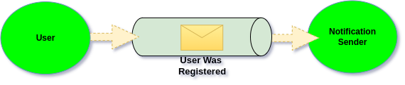

# Introduction

## The foundation idea

The roots of Object Oriented Programming were mainly about communication using Messages and logic encapsulation. The aim was to focus on the flows and communication, not on the objects itself. Objects were meant to be encapsulating logic, and expose clear interfaces of what they do, and what have they done.

If you know things like Events, Commands and Aggregates, then what was written above should feel familiar to you. This is because those concepts are build around same principles of old OOP where communicate is done through Messages. \
And this is what Ecotone is about, it's about returning to the roots of OOP, about explicit System design where Messages are playing the main role.&#x20;

## Message based communication

There is no possibility to immerse fully into Message based communication, as long as the foundation is not fully Message Driven. This means that each communication within the Application (not only between Applications) has to happen through Messages. This way it can become natural practice of how the system is designed.

Ecotone follows on this making the Messaging the core of the Framework. It introduce Message based communication build around [Enterprise Integration Patterns](https://www.enterpriseintegrationpatterns.com/) as the underlying foundation. This way even communication between PHP Objects can be done through Messages in seamless way.&#x20;

<figure><figcaption><p>Communication between Objects using Messages</p></figcaption></figure>

As Ecotone follows Enterprise Integration Patterns, it makes the **communication between Objects happening through Message Channels.** We can think of Message Channel as pipe, that one side sends too, and the second side consumes from. As communication goes through Message Channels, it becomes really easy to switch the pipes. This basically means we can make choose Message Channel which is backed by different Message Brokers, we can use synchronous or asynchronous Channel, and yet our Objects will not be affected that anyhow.

## Application level code

Ecotone provides different levels of abstractions, which we can choose to use from. Each abstraction is described in more details in related sections. In this Introduction we will  go over high level on how things can be used, to feel what is Message based flows about.

### Command Handlers

Suppose our example from the above, where we want to register User and trigger Notification Sender.\
In Ecotone flows, we would introduce **Command Handler** being responsible for user registration:

```php
class UserService
{
    #[CommandHandler]
    public function register(RegisterUser $command, EventBus $eventBus): void
    {
        // store user
        
        $eventBus->publish(new UserWasRegistered($userId));
    |
}
```

As you can see, we also inject **Event Bus** which will publish our Event Message of **User Was Registered**.


Command and Events are the sole of higher level Messaging. On the low level everything is Message, yet each Message can either be understood as Command (intention to do), or Event (fact that happened). This make the clear distinction between - what we want to happen vs what had happened.


In our Controller we would inject **Command Bus** to send the Command Message:

```php
public function registerAction(Request $request, CommandBus $commandBus): Response
{
    $command = // construct command
    $commandBus->send($command);
}
```

After sending Command Message, our Command Handler will be executed. **Command and Event Bus is available in our Dependency Container** after Ecotone installation out of the box.


What is important here is that, Ecotone never forces to implement or extend Framework specific classes. This means that our Command or Event Messages are POPO (clean PHP object). In most of the scenarios we will simply mark given method with Attribute and Ecotone will glue the things for us.&#x20;


### Command Handlers with Routing

From here we could decide to make use Message routing functionality to decouple Controllers from constructing Command Messages.

```php
#[CommandHandler("user.register")]
public function register(RegisterUser $command, EventBus $eventBus): void
```

with this in mind, we can now user **CommandBus with routing** and even let Ecotone deserialize the Command, so our Controller does not even need to be aware of transformations:

```php
public function registerAction(Request $request, CommandBus $commandBus): Response
{
    $commandBus->sendWithRouting(
        routingKey: "user.register", 
        command: $request->getContent(), 
        commandMediaType: "application/json"
    );
}
```


When controllers simply pass through incoming data to Command Bus via routing, there is not much logic left in controllers. We could even have single controller, if we would be able to get routing key.  It's really up to us, what work best in context of our system.


### Interceptors

What we could decide to do is to add so called Interceptors (middlewares) to our Command Bus to add additional data or access validation.&#x20;

```php
#[Before(pointcut: CommandBus::class)]
public function validateAccess(
    RegisterUser $command,
    #[Reference] AuthorizationService $authorizationService
): void
{
    if (!$authorizationService->isAdmin) {
        throw new AccessDenied();
    }
}
```

Pointcut provides the point which this interceptor should trigger on. In above scenario it will trigger when Command Bus is triggered before Message is send to given Command Handler.\
The reference attribute stays that given parameter is Service from Dependency Container and Ecotone should inject it.


There are multiple different interceptors that can hook at different moments of the flow. \
With that besides of things like validations, we can also modify Message itself, for example by enriching the Command with additional data, or add custom Metadata to the Message.


### Message Metadata

When we send Command using Command Bus, Ecotone under the hood construct a Message. \
**Message contains of two things - payload and metadata.**\
Payload is our Command and metadata is any additional information we would like to carry.

```php
public function registerAction(Request $request, CommandBus $commandBus): Response
{
    $commandBus->sendWithRouting(
        routingKey: "user.register", 
        command: $request->getContent(), 
        commandMediaType: "application/json",
        metadata: [
            "executorId" => $this->currentUser()->getId()
        ]
    );
}
```

Metadata can be easily then accessed from our Command Handler or Interceptors

```php
#[CommandHandler(routingKey: "user.register")]
public function register(
    RegisterUser $command, 
    EventBus $eventBus,
    #[Header("executorId")] string $executorId,
): void
```

Besides metadata that we do provide, Ecotone provides additional metadata that we can use whenever needed, like Message Id, Correlation Id, Timestamp etc.


Ecotone take care of automatic Metadata propagation, no matter if execution synchronous or asynchronous. Therefore we can easily access any given metadata in targeted Message Handler, and also in resulting sub flows like Event Handlers. This make it really easy to carry any additional information, which can not only be used in first executed Message Handler, but also in any flow triggered later.


### Event Handlers

We mentioned Notification Sender to be executed when User Was Registered Event happens.\
For this we follow same convention of using Attributes:

```php
class NotificationSender
{
    #[EventHandler]
    public function when(UserWasRegistered $event): void
    {
        // send notification
    }
}
```

This Event Handle will be automatically triggered when related Event will be published. \
As we mentioned at the beginning of this introduction, communication happen through Message Channels, and it's really easy to switch code from synchronous to asynchronous. For that we would simply state that this Handler should be asynchronous:

```php
#[Asynchronous("async")]
#[EventHandler]
public function when(UserWasRegistered $event): void
```

Now before this Event Handler will be executed, it **will land in Asynchronous Message Channel** named "async" first.&#x20;


There maybe multiple Event Handlers subscribing to same Event Message. \
We can easily imagine that some of them may fail and things like retries become problematic (As they may trigger successful Event Handlers for the second time).\
\
That's why Ecotone deliver a copy of the Message to each related Event Handler. \
As a result each Asynchronous Event Handler is handling it's own Message in full isolation, and in case of failure only that Handler will be retried.


### Aggregates

If we are using Eloquent, Doctrine ORM, or Models with our storage implementation, we could push this even further and send the Command directly to our Model.&#x20;

```php
#[Aggregate]
class User
{
    use WithEvents;

    #[Identifier]
    private UserId     $userId;
    private UserStatus $status;

    #[CommandHandler(routingKey: "user.register")]
    public static function register(RegisterUser $command): self
    {
        $user = //create user
        $user->recordThat(new UserWasRegistered($userId));
        
        return $user;
    }
    
    #[CommandHandler(routingKey: "user.block")]
    public function block(): void
    {
        $this->status = UserStatus::blocked;
    }
}
```

We are marking our model as **Aggregate**, this is concept from Domain Driven Design, which describe a **model that encapsulates the business logic**.&#x20;


Ecotone will take care of loading the Aggregate and storing them after the method is called. \
Therefore all we need to do it to send an Command.


Like you can, we also added block method, we can know send an Command which will block the user. Yet it does not hold any Command as parameter. In this scenario we don't even need Command Message, because if we would allow to pass status from outside, potentially wrong status could be passed. Therefore all we want to know is that there is intention to block the user, the rest happens within the method.&#x20;

To execute our block method we would call Command Bus this way:

```php
public function blockAction(Request $request, CommandBus $commandBus): Response
{
    $commandBus->sendWithRouting(
        routingKey: "user.block", 
        metadata: [
            "aggregate.id" => $request->get('userId'),
        ]
    );
}
```

There is one special metadata here, which is "**aggregate.id**", this tell Ecotone the instance of User which it should fetch from storage and execute this method on. There is no need to create Command Class at all, because there is no data we need to pass there. \
This way we can build features with ease and protect internal state of our Models, so they are not modified in incorrect way.&#x20;

### Workflows

On of the powers that Message Driven Architecture brings is ability to build most sophisticated workflows with ease. This is possible thanks for each Message Handler being considered as Endpoint being able to connect to input, yet produce and output. This is often referenced as pipe and filters architecture, but in general this is characteristic of true message-driven systems.

Let's suppose that our registered user can apply for credit card, and for this we need to pass his application through series of steps to verify if we can issue him with card.

```php
class CreditCardApplicationProcess
{
    #[CommandHandler(
        routingKey: "apply_for_card",
        outputChannelName: "application.verify_identity"
    )]
    public function apply(CardApplication $application): CardApplication
    {
        // store card application
        
        return $application;
    }
}
```

We are using **outputChannelName** here to indicate where to pass Message after it's handled by our Command Handler. In here we could enrich our CardApplication with some additional data, or create new object. However it's fully fine to pass same object to next step, if there was no need to modify it. \
Having ability to pass same object between steps simplify the workflow a lot, as we are not in need to create custom objects, doing transformation logic, just for the sake of the Framework limitations.

Let's define now location where our Message will land after:

```php
#[Asynchronous("async")]
#[InternalHandler(
    inputChannelName: "application.verify_identity",
    outputChannelName: "application.send_result"
)]
public function verifyIdentity(CardApplication $application): ApplicationResult
{
    // do the verification
    
    return new ApplicationResult($result);
}
```

We are using here InternalHandler, internal handlers are not connected to any Command or Event Buses, therefore we can use them as part of the workflow steps, that we don't want to expose outside.&#x20;

Our Internal Handler contains of **inputChannelName** which points to the same channel as our Command Handlers **outputChannelName**. This way we bind Message Handlers together to create workflows. As you can see we also added Asynchronous attribute, as process of identity verification can take a bit of time, we would like it to happen in background.&#x20;


Workflows can be started from Command and Event Handlers, and also directly through Business Interfaces. It's really easy to switch given step of the workflow from synchronous to asynchronous, just like we did for the Event Handler above.


Let's define our last step in Workflow:

```php
#[InternalHandler(
    inputChannelName: "application.send_result"
)]
public function sendResult(ApplicationResult $application): void
{
    // send result
}
```

This we've made synchronous which is the default if no Asynchronous attribute is defined. Therefore it will be called directly after Identity verification.&#x20;


We have been building stateless workflows here, however Ecotone provides also stateful workflows in form of Sagas.


This all works in seamless way, when we are dealing with Ecotone's Message Driven Architecture.\
We simply use PHP classes that we've created ourselves and use Messaging capabilities, yet we are freed from Messaging implementation concerns. This all can be achieved thanks to Ecotone's architecture built on top of three main pillars which we will take a look on now.

## Business Oriented Architecture

[Ecotone](https://blog.ecotone.tech/revolutionary-boa-framework-ecotone/) embrace the concept of Business-Oriented Architecture, which follows fundamental principle of making business logic the primary citizen in our Applications. It shifts the focus from technical details to the actual business processes. \
**Business Oriented Architecture** is built around three main pillars:

<figure><figcaption><p>When all thee pillars are solved by Ecotone, what is left to write is Business Oriented Code</p></figcaption></figure>

1. **Resilient Messaging** **-** At the heart of Ecotone lies a resilient messaging system that enables loose coupling, fault tolerance, and self-healing capabilities.
2. **Declarative Configuration -** Introduces declarative programming which simplifies development, reduces boilerplate code, and promotes code readability. It empowers developers to express their intent clearly, resulting in more maintainable and expressive codebases.
3. **Building Blocks -** Building blocks like Message Handlers, Aggregates, Sagas, facilitate the implementation of the business logic. By making it possible to bind Building Blocks with Resilient Messaging, Ecotone makes it easy to build and connect even the most complex business workflows.

By providing all those three Pillars, Ecotone provides an foundation which then allows us to fully focus on the business side of the things. \


Having this foundation knowledge and understanding how Ecotone works on high level, it's good moment to dive into [Tutorial section](../tutorial-php-ddd-cqrs-event-sourcing/), which will provide hands on experience to deeper your understanding.

## Materials

Ecotone blog provides articles which describes Ecotone's architecture and related features in more details. Therefore if you want to find out more, follow bellow links:&#x20;

### Links

* [Robust and Developer Friendly Architecture in PHP](https://blog.ecotone.tech/building-resilient-and-scalable-systems-by-default/)
* [Practical Domain Driven Design](https://blog.ecotone.tech/practial-domain-driven-design/)
* [Reactive and Message Driven Systems in PHP](https://blog.ecotone.tech/building-reactive-message-driven-systems-in-php/)

