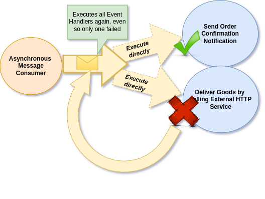
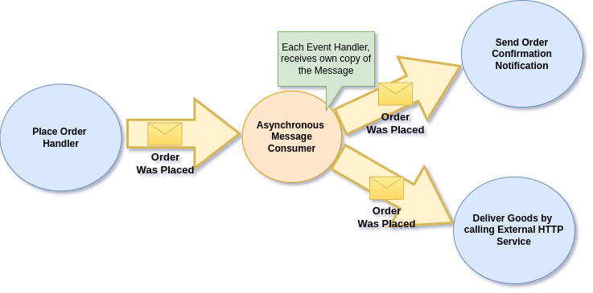
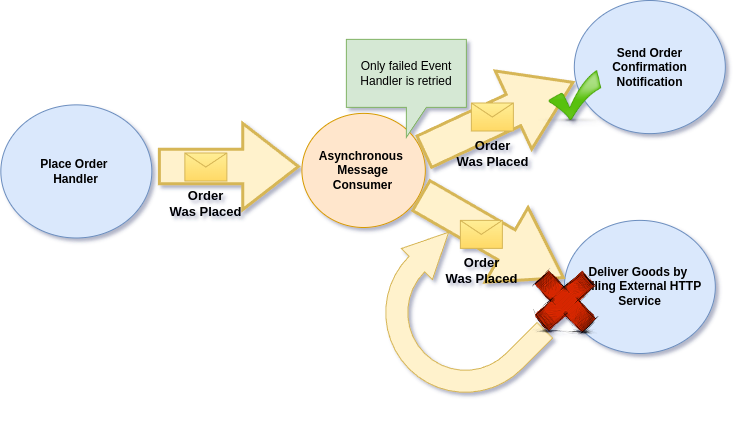

# Message Handling Isolation

It's good to know how Ecotone solves the problem of **Message Handling Isolation**, which is one of the key features that allows us to build Resilient Messaging Systems.

## Sending an Event Message

In Message-Based Systems we will have situation that as a result of given Event, we will want to trigger some actions. This can sending notification, but also calling an external Service or starting fully new separate flow etc.

However those actions may actually fail for various of reasons and depending on how Messaging is implemented, it may help us to recover from this safely, or trigger unexpected side effects that may harm the business.

## Common Event Bus Implementation

Let's first consider typical implementation of Message Bus, where we send an Event Message which is consumed by more than one Message Handler (Subscriber / Event Handler).

<figure><figcaption><p>Executing all Event Handlers after consuming Order Was Plcaed Event</p></figcaption></figure>

After placing an Order we send Asynchronous _Order Was Placed Event Message, which as_ as a result triggers all related _Event Handlers_. As we can easily imagine, one of those Event Handlers may fail. However this creates a problem, because it's not only the Event Handler that have failed will be retried, but all the Event Handlers connected to given Event Message.

<figure><figcaption><p>Retrying each Evet Handler may produce unexpected side effects</p></figcaption></figure>

This of course may produce unexpected side effects, like sending confirmation twice, or delivering goods to the Customers more than once. Idempotency may help here, but it's not always available or implemented correctly, therefore we may try to solve it on higher level code.

To solve it using higher level code we may introduce multiple Messages Queues having single Message Handler connected, or produce Command Messages from Event Handlers in order to provide isolation. However all of those solutions make infrastructure, configuration or application level code more complex. This is because we try to solve _Message Handling Isolation_ in upper levels, instead of having it solved on the foundation level.&#x20;

## Ecotone's Event Bus Implementation

Ecotone solves _Message Handling Isolation_ at the foundation level, by delivering a copy of a Message to each of the related Event Handler separately:

<figure><figcaption><p>Each Event Handler receives own copy of Message and handles it in complete isolation</p></figcaption></figure>

Whenever Event Message is sent, a copy of this Message will be delivered to each of the related Event Handlers. This as a result make each Handler consume the Message in complete isolation and enables safe retries.

&#x20;

<figure><figcaption><p>Only the failed Event Handler will be retried</p></figcaption></figure>

Handling each Event Handler in complete isolation, creates environment where safe retries are possible, as only Event Handler that have failed will be retried. By solving this on the foundation, the higher level code can stay focused on business part of the system, not solving _Message Handling Isolation_ problems.&#x20;

There are of course more benefits that this solution enables:

* Possibility to safely retry [instantly and with delay](resiliency/retries.md)
* [Delaying execution of given Event Handler](../asynchronous-handling/delaying-messages.md) instead of whole Message
* [Prioritizing execution of given Event Handler](../asynchronous-handling/message-priority.md) instead of whole Message

## Safe Retries

Ecotone's implementation enables safe retries, thanks to the processing isolation it provides.

Let's consider asynchronous scenario, where we want send order confirmation and reserve products in Stock via HTTP call, when Order Was Placed. This could potentially look like this:

```php
#[Asynchronous("asynchronous_messages")]
#[EventHandler(endpointId: "notifyAboutNewOrder")]
public function notifyAboutNewOrder(OrderWasPlaced $event, NotificationService $notificationService) : void
{
    $notificationService->notifyAboutNewOrder($event->getOrderId());
}

#[Asynchronous("asynchronous_messages")]
#[EventHandler(endpointId: "reserveItemsInStock")]
public function reserveItemsInStock(OrderWasPlaced $event, StockClient $stockClient): void
{
    $stockClient->reserve($event->getOrderId(), $event->getProducts());
}
```

Now imagine that sending to Stock fails and we want to retry. If we would retry whole Event, we would retry "notifyAboutNewOrder" method, this would lead to sending an notification twice. It's easy to imagine scenarios where this could lead to even worse situations, where side effect could lead to double booking, trigger an second payment etc. \
In Ecotone this does not happen, as each of the Handlers would receive it's own copy of the Message and proceed in isolation.

### Sending a copy to each of the Handlers

In Ecotone each of the Handlers will receive it's own copy of the Event and will handle it in full isolation.

This means that under the hood, there would be two messages sent to `asynchronous_messages` \
each targeting specific Event Handler.\
This bring safety to retrying events, as in case of failure, we will only retry the Handler that actually failed.


In Ecotone it's the Handler that becomes Asynchronous (not Event itself) you may customize the behaviour to your needs.\
If you want, you may:&#x20;

* Run one Event Handler synchronously and the other asynchronously.&#x20;
* You may decide to use different Message Channels for each of the Asynchronous Event Handlers.
* You delay or add priority to  one Handler and to the other not&#x20;


## Materials

### Links

* [How Ecotone's implementation differs from typical Message Bus implementation](https://blog.ecotone.tech/building-message-driven-framework-foundation/) \[Article]
