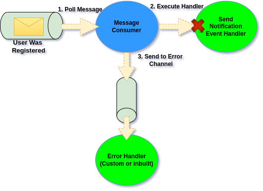
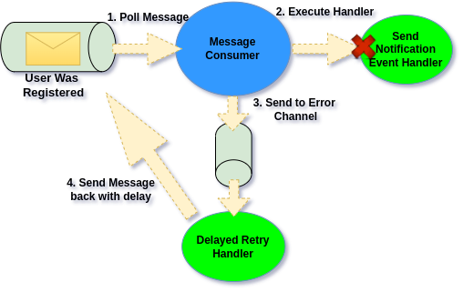
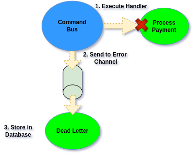
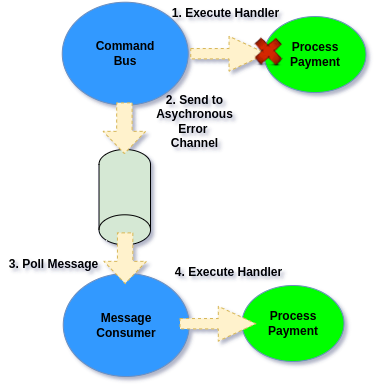
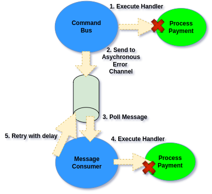

# Error Channel

Error Channel

`Ecotone` comes with solution called Error Channel. \
Error Channel is a place where unrecoverable Errors can go, this way we can preserve Error Messages even if we can't handle them anyhow at given moment. \
Error Channel may log those Messages, store them in database, push them to some Asynchronous Channel, it all depends on what Handler we will connect to the Error Channel.

## Error Channel Flow

On the high level Error Channel works as follows:

<figure><figcaption><p>Message is sent to Error Channel after failing</p></figcaption></figure>

1. Message Consumer is polling Messages from the Queue and executing related Message Handlers.
2. When execution of given Handler fails, Error is propagated back to Message Consumer
3. Message Consumer based on the configuration sends it to related Error Channel

## Configuration

Error Channel can be configured per Message Consumer, or globally as default Error Channel for all Message Consumers:

* [Set up default error channel for all consumers](../../../../messaging/service-application-configuration.md#ecotone-core-configuration)

&#x20;         \- [Symfony](../../../../modules/symfony/symfony-ddd-cqrs-event-sourcing.md#defaulterrorchannel)

&#x20;         \- [Laravel](../../../../modules/laravel/laravel-ddd-cqrs-event-sourcing.md#defaulterrorchannel)

&#x20;         \- [Lite](../../../../modules/ecotone-lite/#withdefaulterrorchannel)



**config/packages/ecotone.yaml**

```yaml
ecotone:
  defaultErrorChannel: "errorChannel"
```



**config/ecotone.php**

```php
return [
    'defaultErrorChannel' => 'errorChannel',
];
```



```php
$ecotone = EcotoneLite::bootstrap(
    configuration: ServiceConfiguration::createWithDefaults()
        ->withDefaultErrorChannel('errorChannel')
);
```



* [Set up for specific consumer](../../../asynchronous-handling/#static-configuration)

```php
class Configuration
{    
    #[ServiceContext]
    public function configuration() : array
    {
        return [
            // For Message Consumer orders, configure error channel
            PollingMetadata::create("orders")
                 ->setErrorChannelName("errorChannel")
        ];
    }
}
```


Setting up Error Channel means that [Message Consumer](../../../../messaging/contributing-to-ecotone/demo-integration-with-sqs/message-consumer-and-publisher.md#message-consumer) will send Error Message to error channel and then continue handling next messages.\
\
After sending Error Message to Error Channel, message is considered handled as long as Error Handler does not throw exception.


## Handling Error Messages

### Manual Handling

To handle incoming Error Messages, we can bind to our defined Error Channel using [ServiceActivator](../../../../messaging/messaging-concepts/):

```php
#[InternalHandler("errorChannel")]
public function handle(ErrorMessage $errorMessage): void
{
    // handle exception
    $exception = $errorMessage->getExceptionMessage();
}
```


Internal Handlers are endpoints like Command Handlers, however they are not exposed using Command/Event/Query Buses. \
You may use them for internal handling.


## Delayed Retries

Ecotone provides inbuilt retry mechanism, in case of failure Error Message will be resent to its original Message Channel with a delay. This way we will give application a chance to self-heal and return to good state.&#x20;

<figure><figcaption><p>Using inbuilt retry mechanism to resend Message with delay</p></figcaption></figure>

To configure Delayed Retries we need to set up Error Configuration and connect it to our Error Channel:

```php
#[ServiceContext]
public function errorConfiguration()
{
    return ErrorHandlerConfiguration::create(
        "errorChannel",
        RetryTemplateBuilder::exponentialBackoff(1000, 10)
            ->maxRetryAttempts(3)
    );
}
```

### Discarding all Error Messages

If for some cases we want to discard Error Messages, we can set up error channel to default inbuilt one called **"nullChannel"**. \
That may be used in combination of retries, if after given attempt Message is still not handled, then discard:

```php
#[ServiceContext]
public function errorConfiguration()
{
    return ErrorHandlerConfiguration::createWithDeadLetterChannel(
        "errorChannel",
        RetryTemplateBuilder::exponentialBackoff(1000, 10)
            ->maxRetryAttempts(3),
        // if retry strategy will not recover, then discard
        "nullChannel"
    );
}
```

## Dbal Dead Letter

Ecotone comes with full support for managing full life cycle of a error message. \
This allows us to store Message in database for later review. Then we can review the Message, replay it or  delete.&#x20;

<figure><figcaption><p>Using Dead Letter for storing Error Message</p></figcaption></figure>

\
Read more in next [section](dbal-dead-letter.md).


Dead Letter can be combined with Delayed Retries, to store only Error Messages that can't self-heal. \
Read more in related section.


## Command Bus Error Channel

Ecotone provides ability to define Error Channel on the level of Command Bus. This way we can handle synchronous Command Handler execution failures with grace. \
For example we may receive webhooks and in case of failure instead of throwing exception, we can store related Message in Dead Letter for later review, or push it for reprocessing on asynchronous channel. \
This way we can ensure stability of our system, even for synchronous scenarios like HTTP integrations.


Command Bus Error Channel is available as part of **Ecotone Enterprise.**


### Command Bus with Error Channel

To set up Error Channel for Command Bus, we will extend Command Bus with our Interface and add ErrorChannel attribute.

<figure><figcaption><p>Command Bus with Dead Letter</p></figcaption></figure>

```php
#[ErrorChannel("dbal_dead_letter")]
interface ResilientCommandBus extends CommandBus
{
}
```

Now instead of using **CommandBus**, we will be using **ResilientCommandBus** for sending Commands.\
Whenever failure will happen, instead being propagated, it will now will be redirected to our Dead Letter and stored in database for later review.&#x20;

### Command Bus with Error Channel and Instant Retry

We can extend our Command Bus with Error Channel by providing instant retries. \
This way we can do automatic retries before we will consider Message as failed and move it to the Error Channel. This way we give ourselves a chance of self-healing automatically in case of transistent errors, like database or network exceptions.

<pre class="language-php"><code class="lang-php">#[InstantRetry(retryTimes: 2)]
#[ErrorChannel("dbal_dead_letter")]
<strong>interface ResilientCommandBus extends CommandBus
</strong>{
}
</code></pre>

Now instead of using **CommandBus**, we will be using **ResilientCommandBus** for sending Commands.\
Whenever failure will happen, instead being propagated, it will now will be redirected to our Dead Letter and stored in database for later review.&#x20;

### Command Bus with Asynchronous Error Channel

Instead of pushing Message to Error Channel, we can push it to Asynchronous Message Channel from which Message will be consumed and retried again. This way in case of failure we can make it possible for Message to be retried and end up self-healing.&#x20;

<figure><figcaption><p>Command Bus with Asynchronous Error Channel</p></figcaption></figure>

```php
#[ErrorChannel("async_channel")]
interface ResilientCommandBus extends CommandBus
{
}
```

and then for use RabbitMQ Message Channel:

```php
final readonly class EcotoneConfiguration
{
    #[ServiceContext]
    public function databaseChannel()
    {
        return AmqpBackedMessageChannelBuilder::create('orders');
    }
}
```


It's good practice to use different Message Channel implementation than the storage used during process the Message. For example if our processing requires database connection and our database went down, then if our configured channel is RabbitMQ channel, then we will be able to push those Messages into the Queue instead of failing.


### Command Bus with Asynchronous Error Channel and Delayed Retries

We can combine Asynchronous Error Channel together with delayed retries, creating robust solution, that our Application is able to self-heal from transistent errors even if they take some period of time. \
For example if our calling some external Service fails, or database went down, then we may receive the same error when Message is retrieved by Async Channel. However if we will delay that by 20 seconds, then there is huge chance that everything will get back on track, and the Application will self-heal automatically.&#x20;

<figure><figcaption><p>Command Bus with Asynchronous Error Channel and delayed retries</p></figcaption></figure>


Command Bus configuration:

```php
#[ErrorChannel("async_channel")]
interface ResilientCommandBus extends CommandBus
{
}
```

And delayed retry configuration:

```php
#[ServiceContext]
public function errorConfiguration()
{
    return ErrorHandlerConfiguration::create(
        "async_channel",
        RetryTemplateBuilder::exponentialBackoff(1000, 10)
            ->maxRetryAttempts(3)
    );
}
```


Of course we could add Dead Letter channel for our delayed retries configuration. Closing the full flow, that even if in case delayed retries failed, we will end up with Message in Dead Letter.

