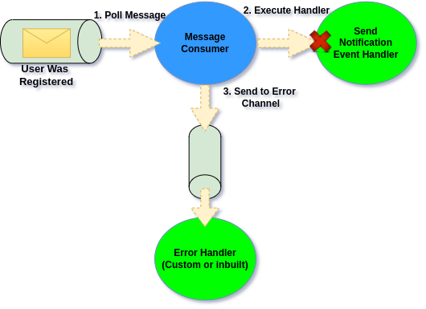
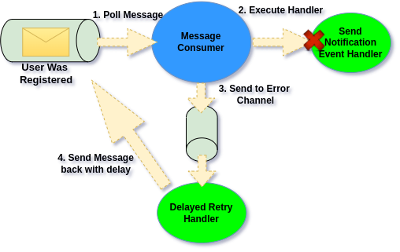
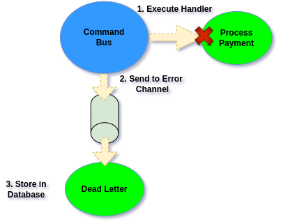
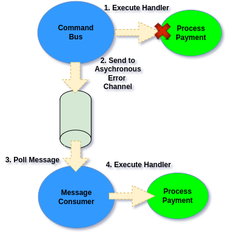
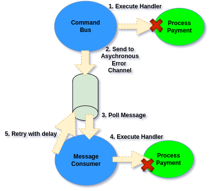

# Error Channel

A handler throws after three retries. Without somewhere to put the failed message, you have two options: lose it or stop the consumer. The **Error Channel** is the third option — a holding place for failed messages so you can fix the bug, replay them, and keep processing the rest.

The Error Channel is just another channel; what happens to messages depends on the handler you connect to it: log them, store them in a database table, push them to another async channel for later replay, or send them to an alerting system.

## Error Channel Flow

On the high level Error Channel works as follows:

<figure><figcaption><p>Message is sent to Error Channel after failing</p></figcaption></figure>

1. Message Consumer is polling Messages from the Queue and executing related Message Handlers.
2. When execution of given Handler fails, Error is propagated back to Message Consumer
3. Message Consumer based on the configuration sends it to related Error Channel

## Configuration

Error Channel can be configured per Message Consumer, or globally as default Error Channel for all Message Consumers:

* [Set up default error channel for all consumers](../../../../messaging/service-application-configuration.md#ecotone-core-configuration)

&#x20;         \- [Symfony](../../../../modules/symfony/symfony-ddd-cqrs-event-sourcing.md#defaulterrorchannel)

&#x20;         \- [Laravel](../../../../modules/laravel/laravel-ddd-cqrs-event-sourcing.md#defaulterrorchannel)

&#x20;         \- [Lite](../../../../modules/ecotone-lite/#withdefaulterrorchannel)



**config/packages/ecotone.yaml**

```yaml
ecotone:
  defaultErrorChannel: "errorChannel"
```



**config/ecotone.php**

```php
return [
    'defaultErrorChannel' => 'errorChannel',
];
```



```php
$ecotone = EcotoneLite::bootstrap(
    configuration: ServiceConfiguration::createWithDefaults()
        ->withDefaultErrorChannel('errorChannel')
);
```



* [Set up for specific consumer](../../../asynchronous-handling/#static-configuration)

```php
class Configuration
{    
    #[ServiceContext]
    public function configuration() : array
    {
        return [
            // For Message Consumer orders, configure error channel
            PollingMetadata::create("orders")
                 ->setErrorChannelName("errorChannel")
        ];
    }
}
```


Setting up Error Channel means that [Message Consumer](../../../../messaging/contributing-to-ecotone/demo-integration-with-sqs/message-consumer-and-publisher.md#message-consumer) will send Error Message to error channel and then continue handling next messages.\
\
After sending Error Message to Error Channel, message is considered handled as long as Error Handler does not throw exception.


## Handling Error Messages

### Manual Handling

To handle incoming Error Messages, we can bind to our defined Error Channel using [ServiceActivator](../../../../messaging/messaging-concepts/):

```php
#[InternalHandler("errorChannel")]
public function handle(ErrorMessage $errorMessage): void
{
    // handle exception
    $exception = $errorMessage->getExceptionMessage();
}
```


Internal Handlers are endpoints like Command Handlers, however they are not exposed using Command/Event/Query Buses. \
You may use them for internal handling.


## Delayed Retries

Ecotone provides inbuilt retry mechanism, in case of failure Error Message will be resent to its original Message Channel with a delay. This way we will give application a chance to self-heal and return to good state.&#x20;

<figure><figcaption><p>Using inbuilt retry mechanism to resend Message with delay</p></figcaption></figure>

To configure Delayed Retries we need to set up Error Configuration and connect it to our Error Channel:

```php
#[ServiceContext]
public function errorConfiguration()
{
    return ErrorHandlerConfiguration::create(
        "errorChannel",
        RetryTemplateBuilder::exponentialBackoff(1000, 10)
            ->maxRetryAttempts(3)
    );
}
```


**Delayed Retries require an asynchronous Message Channel as the source.**

The retry mechanism reschedules the failed Message back onto the originating pollable Channel with a `DELIVERY_DELAY`. That requires the Message to have come from an async [Message Channel](../../../asynchronous-handling/asynchronous-message-handlers.md) (queue/database channel).

For sources that don't have a pollable channel to retry into — synchronous Command Bus invocations, or [inbound Channel Adapters](../../../../messaging/messaging-concepts/inbound-outbound-channel-adapter.md) like `#[KafkaConsumer]` — `ErrorHandlerConfiguration` will throw `MessageHandlingException` with a clear message about the missing origination channel. For those use cases prefer:

* **Synchronous gateway** — combine `#[ErrorChannel]` with `#[InstantRetry]` on the gateway, or route the Error Channel to an async Message Channel.
* **Inbound Channel Adapter (Kafka, AMQP inbound, `#[Scheduled]`)** — route the Error Channel directly to a Dead Letter (e.g. `dbal_dead_letter`) without a delayed retry template; the failed Message can be replayed from the Dead Letter once the underlying problem is fixed.


### Discarding all Error Messages

If for some cases we want to discard Error Messages, we can set up error channel to default inbuilt one called **"nullChannel"**. \
That may be used in combination of retries, if after given attempt Message is still not handled, then discard:

```php
#[ServiceContext]
public function errorConfiguration()
{
    return ErrorHandlerConfiguration::createWithDeadLetterChannel(
        "errorChannel",
        RetryTemplateBuilder::exponentialBackoff(1000, 10)
            ->maxRetryAttempts(3),
        // if retry strategy will not recover, then discard
        "nullChannel"
    );
}
```

## Dbal Dead Letter

Ecotone comes with full support for managing full life cycle of a error message. \
This allows us to store Message in database for later review. Then we can review the Message, replay it or  delete.&#x20;

<figure><figcaption><p>Using Dead Letter for storing Error Message</p></figcaption></figure>

\
Read more in next [section](dbal-dead-letter.md).


Dead Letter can be combined with Delayed Retries, to store only Error Messages that can't self-heal. \
Read more in related section.


## Command Bus Error Channel

Route failed synchronous commands to dedicated error handling with a single `#[ErrorChannel]` attribute. Instead of catching exceptions in each handler and manually routing to error handling, declare the error channel once. Failed messages are automatically routed for retry, logging, or dead-letter processing.

**You'll know you need this when:**

* Failed commands need specific error handling: alerting, manual review, or audit trails
* Payment or financial operations require failure tracking for compliance
* You receive webhooks and need to handle failures gracefully instead of throwing exceptions
* Scattered try/catch blocks in handlers are becoming unmanageable
* Different command categories need different error handling strategies


Command Bus Error Channel is available as part of **Ecotone Enterprise.**


### Command Bus with Error Channel

To set up Error Channel for Command Bus, we will extend Command Bus with our Interface and add ErrorChannel attribute.

<figure><figcaption><p>Command Bus with Dead Letter</p></figcaption></figure>

```php
#[ErrorChannel("dbal_dead_letter")]
interface ResilientCommandBus extends CommandBus
{
}
```

Now instead of using **CommandBus**, we will be using **ResilientCommandBus** for sending Commands.\
Whenever failure will happen, instead being propagated, it will now will be redirected to our Dead Letter and stored in database for later review.&#x20;


**`#[ErrorChannel]` must be placed on the messaging entry-point — not on the Message Handler.**

The attribute is read only from gateway interfaces (extensions of `CommandBus`, `EventBus`, `QueryBus`, `MessagePublisher`, `#[BusinessMethod]` interfaces) and from the consumer entry-points like `#[KafkaConsumer]`. Placing it on a `#[CommandHandler]`, `#[EventHandler]` or `#[QueryHandler]` method has no effect — the exception will simply propagate back to the bus caller.

This placement is required so the gateway-level interceptor stack (e.g. `#[WithTransactional]`, `#[InstantRetry]`) wraps the handler call. On failure those interceptors fully unwind their effects — for example a database transaction is rolled back — **before** the failed Message is captured to the configured Error Channel. If the attribute were on the handler, side effects produced before the throw would be persisted alongside the error record, and the rollback boundary would be lost.

```php
// ✅ Correct — on the entry-point
#[ErrorChannel("dbal_dead_letter")]
interface ResilientCommandBus extends CommandBus {}

// ❌ Wrong — silently ignored
final class TicketService
{
    #[ErrorChannel("dbal_dead_letter")] // no effect
    #[CommandHandler("createTicket")]
    public function create(CreateTicket $command): void { /* ... */ }
}
```


### Command Bus with Error Channel and Instant Retry

We can extend our Command Bus with Error Channel by providing instant retries. \
This way we can do automatic retries before we will consider Message as failed and move it to the Error Channel. This way we give ourselves a chance of self-healing automatically in case of transistent errors, like database or network exceptions.

<pre class="language-php"><code class="lang-php">#[InstantRetry(retryTimes: 2)]
#[ErrorChannel("dbal_dead_letter")]
<strong>interface ResilientCommandBus extends CommandBus
</strong>{
}
</code></pre>

Now instead of using **CommandBus**, we will be using **ResilientCommandBus** for sending Commands.\
Whenever failure will happen, instead being propagated, it will now will be redirected to our Dead Letter and stored in database for later review.&#x20;

### Command Bus with Asynchronous Error Channel

Instead of pushing Message to Error Channel, we can push it to Asynchronous Message Channel from which Message will be consumed and retried again. This way in case of failure we can make it possible for Message to be retried and end up self-healing.&#x20;

<figure><figcaption><p>Command Bus with Asynchronous Error Channel</p></figcaption></figure>

```php
#[ErrorChannel("async_channel")]
interface ResilientCommandBus extends CommandBus
{
}
```

and then for use RabbitMQ Message Channel:

```php
final readonly class EcotoneConfiguration
{
    #[ServiceContext]
    public function databaseChannel()
    {
        return AmqpBackedMessageChannelBuilder::create('orders');
    }
}
```


It's good practice to use different Message Channel implementation than the storage used during process the Message. For example if our processing requires database connection and our database went down, then if our configured channel is RabbitMQ channel, then we will be able to push those Messages into the Queue instead of failing.


### Command Bus with Asynchronous Error Channel and Delayed Retries

We can combine Asynchronous Error Channel together with delayed retries, creating robust solution, that our Application is able to self-heal from transistent errors even if they take some period of time. \
For example if our calling some external Service fails, or database went down, then we may receive the same error when Message is retrieved by Async Channel. However if we will delay that by 20 seconds, then there is huge chance that everything will get back on track, and the Application will self-heal automatically.&#x20;

<figure><figcaption><p>Command Bus with Asynchronous Error Channel and delayed retries</p></figcaption></figure>


Command Bus configuration:

```php
#[ErrorChannel("async_channel")]
interface ResilientCommandBus extends CommandBus
{
}
```

And delayed retry configuration:

```php
#[ServiceContext]
public function errorConfiguration()
{
    return ErrorHandlerConfiguration::create(
        "async_channel",
        RetryTemplateBuilder::exponentialBackoff(1000, 10)
            ->maxRetryAttempts(3)
    );
}
```


Of course we could add Dead Letter channel for our delayed retries configuration. Closing the full flow, that even if in case delayed retries failed, we will end up with Message in Dead Letter.


### Command Bus with Delayed Retry

For the common case of "retry with delay, then dead-letter on exhaustion" you don't need to wire an `ErrorHandlerConfiguration` separately — declare the policy inline on your gateway with `#[DelayedRetry]`:

```php
#[DelayedRetry(
    initialDelayMs: 1000,
    multiplier: 2,
    maxAttempts: 3,
    deadLetterChannel: 'dbal_dead_letter',
)]
interface ResilientCommandBus extends CommandBus
{
}
```

Failures from any command sent through `ResilientCommandBus` are routed to a generated Error Channel, retried with the configured backoff and, on exhaustion, routed to `dbal_dead_letter`.

`#[DelayedRetry]` and `#[ErrorChannel]` are mutually exclusive on the same gateway interface — choose `#[ErrorChannel]` when the failure destination is a channel you've already configured (typically via `ErrorHandlerConfiguration`) and want to share across multiple gateways; choose `#[DelayedRetry]` when the policy is specific to that gateway and you don't need to share it.


`#[DelayedRetry]` on a gateway interface is available as part of **Ecotone Enterprise**. Bootstrapping an application that declares `#[DelayedRetry]` on a gateway without an Enterprise licence will throw a `LicensingException` at startup.


## Per-Handler Error Channel for Asynchronous Handlers

When multiple asynchronous handlers share the same transport channel (e.g. `'orders'`), each handler can declare its own Error Channel via the `asynchronousExecution` parameter of `#[Asynchronous]`. Failures are routed per-handler, so different handlers on the same transport can have different error-handling policies.

```php
final class OrderProjectors
{
    #[Asynchronous('orders', asynchronousExecution: [new ErrorChannel('paymentsErrors')])]
    #[CommandHandler('order.process_payment', 'paymentsHandler')]
    public function processPayment(ProcessPayment $command): void
    {
        // ...
    }

    #[Asynchronous('orders', asynchronousExecution: [new ErrorChannel('shippingErrors')])]
    #[CommandHandler('order.ship', 'shippingHandler')]
    public function ship(ShipOrder $command): void
    {
        // ...
    }
}
```

Both handlers consume from the `'orders'` async transport, but a failure in `processPayment` lands in `paymentsErrors`, and a failure in `ship` lands in `shippingErrors`. The two policies can be completely different — one queue could feed a Dead Letter, the other could resend with delayed retries.


Per-handler `#[ErrorChannel]` via `asynchronousExecution` is available as part of **Ecotone Enterprise.**


### Resolution Order

When resolving where a failed message should go, Ecotone applies the most specific configuration first:

1. **Per-handler** `#[ErrorChannel]` or `#[DelayedRetry]` declared via `#[Asynchronous(asynchronousExecution: [...])]` — wins for that specific handler.
2. **Per-channel** error channel set explicitly on the consumer's `PollingMetadata` (e.g. `PollingMetadata::create('orders')->setErrorChannelName(...)`).
3. **Global default** error channel from `withDefaultErrorChannel(...)`.

This means a per-handler attribute overrides the global default error channel for that handler only — other handlers on the same transport continue to use the default.

## Per-Handler Delayed Retry for Asynchronous Handlers

Use `#[ErrorChannel]` when you want the handler to use a **predefined** error channel — typically one set up via an [`ErrorHandlerConfiguration`](#delayed-retries) extension object — so several handlers can share the same retry + dead-letter policy.

Use `#[DelayedRetry]` when the policy is **specific to a single handler** and doesn't need to be reused. The retry shape and dead letter destination are declared inline on the handler — failures are retried with the configured delay/backoff and, on exhaustion, routed to the dead letter channel you specify.

```php
final class OrderHandlers
{
    #[Asynchronous('orders', asynchronousExecution: [
        new DelayedRetry(
            initialDelayMs: 1000,
            multiplier: 2,
            maxAttempts: 3,
            deadLetterChannel: 'dbal_dead_letter',
        ),
    ])]
    #[CommandHandler('order.charge', 'chargeHandler')]
    public function charge(ChargeOrder $command): void
    {
        // On failure: retried 3 times with exponential backoff (1s, 2s, 4s),
        // then routed to "dbal_dead_letter" if all retries are exhausted.
    }
}
```

### Parameters

| Parameter | Required | Description |
|---|---|---|
| `initialDelayMs` | yes | Delay before the first retry, in milliseconds |
| `multiplier` | no (default `1`) | Backoff multiplier between retries; `1` = constant delay, `>1` = exponential |
| `maxDelayMs` | no | Cap on the delay between retries; `null` = no cap |
| `maxAttempts` | no (default `3`) | Maximum number of retries before giving up; `null` = unlimited |
| `deadLetterChannel` | no | Where to route a Message after retries are exhausted; `null` = the failure throws and is handled by the consumer's `FinalFailureStrategy` |

### Mutual exclusion with `#[ErrorChannel]`

`#[DelayedRetry]` and `#[ErrorChannel]` cannot both appear on the same handler — they are alternative error-handling strategies:

* `#[ErrorChannel]` — point failures at an error channel you've already defined elsewhere (typically via an [`ErrorHandlerConfiguration`](#delayed-retries) extension object, which sets up retry + dead-letter behaviour once and gives it a name). Multiple handlers can share the same configured channel, so the retry/dead-letter policy lives in one place and is reused across the application.
* `#[DelayedRetry]` — declare the retry shape and dead letter destination directly on the handler; useful when the policy is specific to that handler and you don't want to share it.

If both attributes are declared on the same handler, the application fails to bootstrap with a descriptive `ConfigurationException`.


`#[DelayedRetry]` is available as part of **Ecotone Enterprise.**

