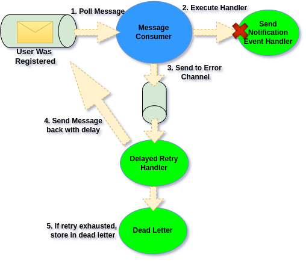

# Dbal Dead Letter

## Dbal Dead Letter

Ecotone comes with full support for managing full life cycle of a error message by using [Dbal Module](../../../../modules/dbal-support.md#dead-letter).

* Store failed Message with all details about the exception
* Allow for reviewing error Messages
* Allow for deleting and replaying error Message back to the [Asynchronous Message Channels](../../../asynchronous-handling/)

## Installation

To make use of Dead Letter, we need to have [Ecotone's Dbal Module](../../../../modules/dbal-support.md) installed.

## Storing Messages in Dead Letter

If we configure default error channel to point to **"dbal\_dead\_letter"** then all Error Messages will land there directly

<figure><figcaption><p>Storing Error Messages once they failed directly in Database</p></figcaption></figure>



**config/packages/ecotone.yaml**

```yaml
ecotone:
  defaultErrorChannel: "dbal_dead_letter"
```



**config/ecotone.php**

```php
return [
    'defaultErrorChannel' => 'dbal_dead_letter',
];
```



```php
$ecotone = EcotoneLite::bootstrap(
    configuration: ServiceConfiguration::createWithDefaults()
        ->withDefaultErrorChannel('dbal_dead_letter')
);
```



## Dead Letter with Delayed Retries

We may also want to try to recover before we consider Message to be stored in Dead Letter:

<figure><figcaption><p>Storing Error Messages in Dead Letter only if retries are exhausted</p></figcaption></figure>



**config/packages/ecotone.yaml**

```yaml
ecotone:
  defaultErrorChannel: "errorChannel"
```



**config/ecotone.php**

```php
return [
    'defaultErrorChannel' => 'errorChannel',
];
```



```php
$ecotone = EcotoneLite::bootstrap(
    configuration: ServiceConfiguration::createWithDefaults()
        ->withDefaultErrorChannel('errorChannel')
);
```



and then we use inbuilt Retry Strategy:

<pre class="language-php"><code class="lang-php">#[ServiceContext]
public function errorConfiguration()
{
    return ErrorHandlerConfiguration::createWithDeadLetterChannel(
        "errorChannel",
        // <a data-footnote-ref href="#user-content-fn-1">your</a> retry strategy
        RetryTemplateBuilder::exponentialBackoff(1000, 10)
            ->maxRetryAttempts(3),
        // if retry strategy will not recover, then send here
        "dbal_dead_letter"
    );
}
</code></pre>

## Dead Letter Console Commands

### Help

Get more details about existing commands



```php
bin/console ecotone:deadletter:help
```



```
artisan ecotone:deadletter:help
```



### Listing Error Messages

Listing current error messages



```php
bin/console ecotone:deadletter:list
```



```php
artisan ecotone:deadletter:list
```



```php
$list = $messagingSystem->runConsoleCommand("ecotone:deadletter:list", []);
```



### Show Details About Error Message

Get more details about given error message



```php
bin/console ecotone:deadletter:show {messageId}
```



```php
artisan ecotone:deadletter:show {messageId}
```



```php
$details = $messagingSystem->runConsoleCommand("ecotone:deadletter:show", ["messageId" => $messageId]);
```



### Replay Error Message

Replay error message. It will return to previous channel for consumer to pick it up and handle again.



```php
bin/console ecotone:deadletter:replay {messageId}
```



```php
artisan ecotone:deadletter:replay {messageId}
```



```php
$messagingSystem->runConsoleCommand("ecotone:deadletter:replay", ["messageId" => $messageId]);
```



### Replay All Messages

Replaying all the error messages.



```php
bin/console ecotone:deadletter:replayAll
```



```php
artisan ecotone:deadletter:replayAll
```



```php
$messagingSystem->runConsoleCommand("ecotone:deadletter:replayAll", []);
```



### Delete Message

Delete given error message



```php
bin/console ecotone:deadletter:delete {messageId}
```



```php
artisan ecotone:deadletter:delete {messageId}
```



```php
$messagingSystem->runConsoleCommand("ecotone:deadletter:delete", ["messageId" => $messageId]);
```



### Turn off Dbal Dead Letter

```php
#[ServiceContext]
public function dbalConfiguration()
{
    return DbalConfiguration::createWithDefaults()
        ->withDeadLetter(false);
}
```

## Managing Multiple Ecotone Applications

The above solution requires running Console Line Commands. If we want however, we can manage all our Error Messages from one place using [Ecotone Pulse](../../ecotone-pulse-service-dashboard.md).

This is especially useful when we've multiple Applications, so we can go to single place and see if any Application have failed to process Message.

[^1]: 
