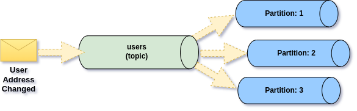
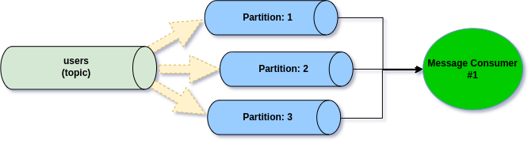
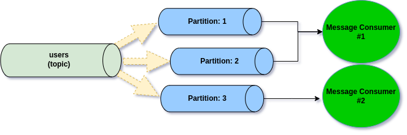

# Message partitioning

## Kafka architecture

Ecotone provides Message Channel abstraction, which is used for simplifying asynchronous processing. It's good to understand the difference in Kafka Message Channel vs typicial Queue based Message Channel, as it provides extra abilities. \
\
To register Kafka Message Channel, we will use Service Context:

```php
#[ServiceContext] 
public function orderChannel()
{
    return KafkaMessageChannelBuilder::create(
        channelName: "users"
    );
}
```

Now, when we will be sending Messages to Kafka Message Channel, we will **actually be sending to Kafka Topic**. **Topics can be split in multiple partitions**, and each partition divine our topic into separate processing unit.&#x20;

<figure><figcaption><p>Event Message placed in the topic combined of 3 partitions</p></figcaption></figure>

When we will start our Message Consumer process:



```php
bin/console ecotone:run users -vvv
```



```php
artisan ecotone:run users -vvv
```



```php
$messagingSystem->run("users");
```



\
our Message Consumer process will get partitions allocated:

<figure><figcaption><p>Message Consumer receiving Messages from three partitions</p></figcaption></figure>

The interesting part is, what will happen when we will start second Message Consumption process:

<figure><figcaption><p>Scaling Message Consumers triggers rebalance process, which reassigning partions</p></figcaption></figure>

As a result of running another Message Consumer for given Topic, Kafka will kick-off rebalance process (repartitioning) to re-assign partitions to given Message Consumers. Each partition can only be assigned to single Message Consumer. Therefore in our example, Kafka could decide to assign partition one and two to the first Message Consumer, and partition three to the second Message Consumer.


Scaling Message Consumers over amount of partitions won't speed up processing, as we can only scale, up to partitions volume for given Topic.\
\
It's good practice to over-provision partitions for given topic at the beginning, to ensure future scalability needs.


## Partition Order

Given partition is guaranteed to be handled by single Message Consumer at time. Therefore this enables order for the Messages, as we will be consuming Messages in order they have been published.

However for partitioning to be useful we need to ensure that related Messages will land in same partition, if Messages are placed randomly, benefits of partitioning are basically lost. \
To choose the partition Kafka use hashing mechanism based on provided Key. Hashed key will generate number to which partition provided Message should be assigned.&#x20;


Providing same key for correlated resource will ensure, that Messages will land in same partition, therefore will be handled in order.


### Providing partition key

When we are sending Message that goes over Kafka Message Channel, we can provide the key to be used explicitly

```php
$commandBus->->send(
  new ScheduleMeeting(),
  metadata: [
     KafkaHeader::KAFKA_TARGET_PARTITION_KEY_HEADER_NAME => '123'
  ]
);
```

Then this will be used for hashing and all Messages sent with key **"123"** will be placed in same partition and preserve the order.

### Default partitioning mechanism

By default if no partition key is provided, Ecotone will use Message Id as partition key. This means messages will be distributed randomly across partitions.&#x20;

However If we would like to provide partition key manually for each Message, to ensure correct partition, it would quickly become unmaintainable. Fortunately Ecotone comes with support for Aggregate Command and Events, so we don't need to think about this much

### Aggregate Commands partitioning mechanism

Whenever we send an Message to Aggregate, Ecotone will use the identifier of the Aggregate as partition key. This way order will be preserved within Aggregate instance.\
\
For example having Aggregate **Ticket** with **ticketId** identifier:

```php
#[Aggregate]
class Ticket
{
    #[Identifier]
    private int $ticketId;
    
    #[Asynchronous("async")]
    #[CommandHandler]
    public function close(CloseTicket $command): void
```

and Command **CloseTicket**

```php
final readonly class CloseTicket
{
    public function __construct(public string $ticketId)
    {
    }
}
```

Then if we would send an Command with id **"123",** it will be used as partition key:

```php
$commandBus->->send(new CloseTicket(123));
```


Ecotone recognizes to which Aggregate instance we are sending the Message, and will use as partition key without any additional code needed on our side.


### Aggregate Events partitioning mechanism

Events published from Aggregates are automatically assigned partition key. This way Events for same Aggregate instance will land in related partition automatically.

```php
#[Aggregate]
class Ticket
{
    use withEvents;

    #[Identifier]
    private int $ticketId;
    
    #[Asynchronous("async")]
    #[CommandHandler]
    public function close(CloseTicket $command): void
    {
        // do something
        $this->recordThat(new TicketClosed($this->ticketId));
    }
```


Partition key is automatically assigned to Events, no matter if we use Event Sourced or State-Stored Aggregates.&#x20;

