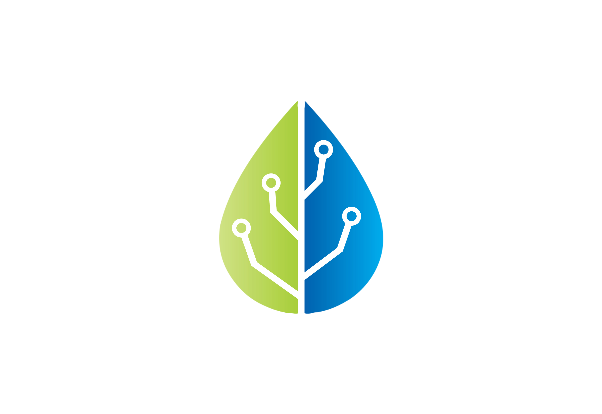

# Contact, Workshops and Support

<figure><figcaption></figcaption></figure>

## Sponsorship

Become sponsor of Ecotone's author - [Dariusz Gafka](https://medium.com/@dariuszgafka).


**Dariusz Gafka**:\
"Ecotone is open-source licenced under MIT, which means you will be always able to use it free of charge. The sponsorship is therefore optional, yet I highly appreciate it. This is a way of saying thanks, for my personal investment of almost 7 years of continues work. Work which I put into building Resilient Messaging Patterns based on [EIP](https://www.enterpriseintegrationpatterns.com/) and all the other features Ecotone provides, which are now available for the community."




## Workshops

In order to get you and your team, up and running with Ecotone quickly and to build understanding around topics like **Resilient Message Driven Architecture**, **DDD**, **Event Sourcing,** you may schedule workshop with Ecotone's founder [**Dariusz Gafka**](https://medium.com/@dariuszgafka).

## Ecotone Basics - Workshop

This workshop is built around 3 topics, which will build shared understanding on how to use **Ecotone** to **refocus** the code base back on the **Business Domain Logic** using **Message-Driven architecture**.\
We will touch important topics like **Messaging, asynchronous processing, system resiliency and fault tolerance**. We will explore **DDD Aggregates** which we will connect to Message-Driven architecture and most importantly we will explore how to **test** it all together.

### The basic tutorial includes:

1. **Resilient Messaging** - What is Message-Driven architecture, how to use it for decoupling the system and how to make the application self-heal application and recover from errors.
2. **Building Blocks** - What are Aggregates, how can we use them to protect our business logic and how can they be connected to Messaging.&#x20;
3. **Testing** - Testing in Message-Driven architecture, Aggregates and asynchronous scenarios.

**Price: 1500 EUR** \
**Place: Online**\
**Duration: Up to 5 hours**\
**Seats available: Up to 10 people**

## **Consulting**

In case of specific questions or problems, Ecotone's founder is **available for consulting sessions**. Consulting session allows for **pair programming**, **discussing your business or technical problems**, or even doing mini-workshop from the topics you're interested in.  \
Consulting session happens online at previously scheduled day for up to 5 hours. \
\
**Price: 1200 EUR** \
**Place: Online**\
**Duration: Up to 5 hours**

## **Contact:**

* [**Twitter**](https://twitter.com/EcotonePHP)
* **EcotoneFramework@gmail.com**
* [**Community on Discord**](https://discord.com/invite/CctGMcrYnV)

