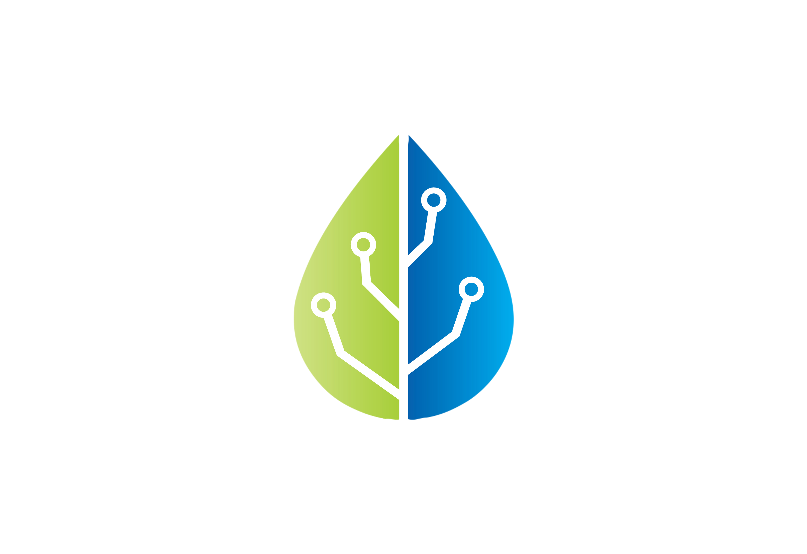

# Contact, Workshops and Support

<figure><figcaption>
Ecotone — the PHP architecture layer that grows with your system, without rewrites
</figcaption></figure>


Workshops and consulting are delivered remotely by Ecotone's author, [Dariusz Gafka](https://medium.com/@dariuszgafka). They combine presentation, hands-on coding, and Q\&A — customized to your stack (Laravel, Symfony, or Ecotone Lite) and the scenarios your team is actually facing.


## Sponsorship

Become sponsor of Ecotone's author - [Dariusz Gafka](https://medium.com/@dariuszgafka).



## Workshops

In order to get you and your team, up and running with Ecotone quickly and to build understanding around topics like **Resilient Message Driven Architecture**, **DDD**, **Event Sourcing,** you may schedule workshop with Ecotone's founder [**Dariusz Gafka**](https://medium.com/@dariuszgafka).

## Ecotone Basics - Workshop

This workshop is built around 3 topics, which will build shared understanding on how to use **Ecotone** to **refocus** the code base back on the **Business Domain Logic** using **Message-Driven architecture**.\
We will touch important topics like **Messaging, asynchronous processing, system resiliency and fault tolerance**. We will explore **DDD Aggregates** which we will connect to Message-Driven architecture and most importantly we will explore how to **test** it all together.

### The basic tutorial includes:

1. **Resilient Messaging** - What is Message-Driven architecture, how to use it for decoupling the system and how to make the application self-heal application and recover from errors.
2. **Building Blocks** - What are Aggregates, how can we use them to protect our business logic and how can they be connected to Messaging.
3. **Testing** - Testing in Message-Driven architecture, Aggregates and asynchronous scenarios.

**Price: 1500 EUR**\
**Place: Online**\
**Duration: Up to 5 hours**\
**Group size: up to 12 people**

An Event Sourcing workshop is also available — see [ecotone.tech/workshops](https://ecotone.tech/workshops) for the full curriculum and pricing.

## **Consulting**

In case of specific questions or problems, Ecotone's founder is **available for consulting sessions**. A consulting session allows for **pair programming**, **discussing your business or technical problems**, or even a mini-workshop on topics you're interested in.\
Consulting sessions happen online at a previously scheduled day for up to 5 hours.\
\
**Price: 1500 EUR**\
**Place: Online**\
**Duration: Up to 5 hours**

## **Contact:**

* **support@simplycodedsoftware.com**
* [**Community on Discord**](https://discord.gg/GwM2BSuXeg)
* [**Twitter/X**](https://twitter.com/EcotonePHP)
