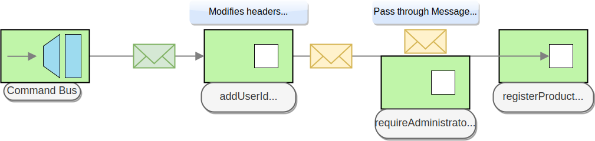
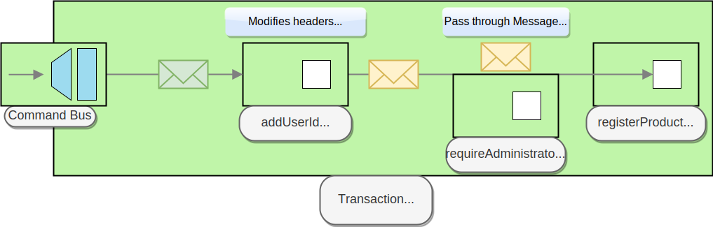

# Lesson 5: Interceptors


Not having code for _Lesson 5?_&#x20;

`git checkout lesson-5`


`Ecotone` provide us with possibility to handle [cross cutting concerns](https://en.wikipedia.org/wiki/Cross-cutting_concern) via `Interceptors`. \
`Interceptor` as name suggest, intercepts the process of handling the message. \
You may enrich the [message](../messaging/messaging-concepts/message.md), stop or modify usual processing cycle, call some shared functionality, add additional behavior to existing code without modifying the code itself.&#x20;


If you are familiar with [Aspect Oriented Programming](https://en.wikipedia.org/wiki/Aspect-oriented_programming) or Middleware pattern you may find some similarities.


### Before & After Interceptor

After one of our administrators went for holiday, the others found out, they can't change cost of the product and this become really problematic for them.&#x20;

`Administrators should be able to change the cost of a product`

We could copy paste the logic from `product.register` to `product.changePrice`but we want to avoid code duplication, especially logic that may happen more often. Let's intercept our `Command Handlers.`

Let's start by creating `Annotation` called `RequireAdministrator` in new namepace `App\Infrastructure\RequireAdministrator`

```php
namespace App\Infrastructure\RequireAdministrator;

#[\Attribute]
class RequireAdministrator {}
```

Let's create our first `Before Interceptor.` Start by removing old `UserService` and create new one in different namespace `App\Infrastructure\RequireAdministrator`. Remember to mark return type as `void`, we will see why it is so important soon.

```php
namespace App\Infrastructure\RequireAdministrator;

class UserService
{
    #[Before(pointcut: RequireAdministrator::class)]
    public function isAdmin(#[Header("userId")] ?string $userId) : void
    {
        if ($userId != 1) {
            throw new \InvalidArgumentException("You need to be administrator to perform this action");
        }
    }
}
```

`Before`- marks method as `Interceptor`, so it can be be found by `Ecotone.`

`Pointcut` - describes what should be intercepted.&#x20;

*   `CLASS_NAME` - indicates what should be intercepted using specific `Class Name` or `Attribute Name` annotated at the level of method or class

    ```php
    pointcut="App\Domain\Product\Product"
    ```
* `NAMESPACE*` - Indicating all [Endpoints](../messaging/messaging-concepts/message-endpoint/) starting with namespace e.g. `App\Domain\Product\*`
* `expression||expression` - Indicating one expression or another e.g. `Product\*||Order\*`&#x20;

Now we need to annotate our Command Handlers:

```php
use App\Infrastructure\RequireAdministrator\RequireAdministrator;
(...)

#[CommandHandler("product.register")]
#[RequireAdministrator]
public static function register(RegisterProductCommand $command, array $metadata) : self
{
    return new self($command->getProductId(), $command->getCost(), $metadata["userId"]);
}

#[CommandHandler("product.changePrice")]
#[RequireAdministrator]
public function changePrice(ChangePriceCommand $command) : void
{
    $this->cost = $command->getCost();
}
```

We told `Before Interceptor` that it should intercept all endpoints with annotation `RequireAdministrator.`\
Now, whenever we will call our command handlers, they will be intercepted by `UserService`.\
You can try it out, by providing different `userId`.

#### Enrich Message

`Before` and `After` interceptors are depending on the return type, to decide if they should modify [Message](../messaging/messaging-concepts/message.md) or pass it through.\
If return type is **different than void**, Message payload or headers can be enriched with data. \
If return type is **void** then message will be passed through and the process of message flow can be interrupted by throwing exception only.

Instead of providing the `userId` during calling the `CommandBus` we will enrich [Message](../messaging/messaging-concepts/message.md) with it before it will be handled by `Command Handler` using `Interceptor`.

Let's change our testing class to remove metadata and add the `Interceptor`.

```php
public function run() : void
{
    $this->commandBus->sendWithRouting(
        "product.register",
        \json_encode(["productId" => 1, "cost" => 100]),
        "application/json"
    );

    $this->commandBus->sendWithRouting(
        "product.changePrice",
        \json_encode(["productId" => 1, "cost" => 110]),
        "application/json"
    );

    echo $this->queryBus->sendWithRouting("product.getCost", \json_encode(["productId" => 1]), "application/json");
}
```

```php
namespace App\Infrastructure\AddUserId;

#[\Attribute]
class AddUserId {}
```

```php
namespace App\Infrastructure\AddUserId;

class AddUserIdService
{
    #[Before(precedence: 0, pointcut: AddUserId::class, changeHeaders: true)]
    public function add() : array
    {
        return ["userId" => 1];
    }
}
```

**`changeHeaders`** - Tells `Ecotone` if this Interceptor modifies `payload` or `headers`. The default is `payload`. \
If `changeHeaders=true` then`headers` are picked and associative array must be returned. The returned value is merged with current headers. \
If `changeHeaders=false` then `payload` is picked and current payload is replaced by returned value, the headers stays the same.\
You may of course inject current payload and headers into the method if needed, as with usual endpoint. \
\
&#xNAN;**`precedence`** - Tells `Ecotone` in what order interceptors should be called. The lower the value is the quicker interceptor will be called. The order exists within interceptor type: `before/around/after.`\
\
We want to call `AddUserId Interceptor` before `RequireAdministrator Interceptor` as it require `userId` to exists, in order to verify. \
`AddUserIdService` has precedence of `0` as default, so `UserService` must have at least `1`.

```php
class UserService
{
    #[Before(precedence: 1,pointcut: RequireAdministrator::class)]
    public function isAdmin(#[Header("userId")] ?string $userId) : void
    {
        if ($userId != 1) {
            throw new \InvalidArgumentException("You need to be administrator in order to register new product");
        }
    }
}
```

Let's annotate `Product` aggregate

```php
use App\Infrastructure\AddUserId\AddUserId;

#[Aggregate]
#[AddUserId]
class Product
{
```

If we annotate aggregate on the class level. Then it does work like each of the method would be annotated with specific annotation in this case `@AddUserId.`




Let's run our testing command:


```php
bin/console ecotone:quickstart
Running example...
Product with id 1 was registered!
110
Good job, scenario ran with success!
```

#### Breaking the flow

If during `Before` or `Around` you decide to break the flow, return `null`. `Null`indiciates, that there is no message and the current flow ends.  \
Null can not be returned in header changing interceptor, it does work only for payload changing interceptor.

### Around Interceptor

The `Around Interceptor` is closet to actual endpoint's method call. Thanks to that, it has access to `Method Invocation.`This does allow for starting some procedure and ending after the invocation is done. &#x20;


We will add real database to our example using [`sqlite`](https://www.sqlite.org/index.html) if you do not have extension installed, then  you will need to install it first. Yet if you are using `Quickstart's Docker` container, then you are ready to go.


&#x20;\
Let's start by implementing repository, that will be able to handle any aggregate, by storing it in `sqlite` database. \
Before we do that, we need to remove our In Memory implementation class `App\Domain\Product\InMemoryProductRepository` we will replace it with our new implementation.\
We will create using new namespace for it `App\Infrastructure\Persistence.` \
Besides we are going to use [doctrine/dbal](https://github.com/doctrine/dbal), as this is really helpful abstraction over the PDO.

```php
composer require doctrine/dbal
```

And the [Repository](../modelling/command-handling/repository/):

```php
namespace App\Infrastructure\Persistence;

use Doctrine\DBAL\Connection;
use Doctrine\DBAL\DriverManager;
use Ecotone\Messaging\Gateway\Converter\Serializer;
use Ecotone\Modelling\Attribute\Repository;
use Ecotone\Modelling\StandardRepository;

#[Repository]
class DbalRepository implements StandardRepository
{
    const TABLE_NAME = "aggregate";
    const CONNECTION_DSN = 'sqlite:////tmp/db.sqlite';

    private Connection $connection; // 1

    private Serializer $serializer; // 2

    public function __construct(Serializer $serializer)
    {
        $this->connection = DriverManager::getConnection(array('url' => self::CONNECTION_DSN));
        $this->serializer = $serializer;
    }

    public function canHandle(string $aggregateClassName): bool
    {
        return true;
    }

    public function findBy(string $aggregateClassName, array $identifiers): ?object
    {
        $this->createSharedTableIfNeeded(); // 3

        $record = $this->connection->executeQuery(<<<SQL
    SELECT * FROM aggregate WHERE id = :id AND class = :class
SQL, ["id" => $this->getFirstId($identifiers), "class" => $aggregateClassName])->fetch(\PDO::FETCH_ASSOC);

        if (!$record) {
            return null;
        }

        // 4
        return $this->serializer->convertToPHP($record["data"],  "application/json", $aggregateClassName);
    }

    public function save(array $identifiers, object $aggregate, array $metadata, ?int $expectedVersion): void
    {
        $this->createSharedTableIfNeeded();

        $aggregateClass = get_class($aggregate);
        // 5
        $data = $this->serializer->convertFromPHP($aggregate, "application/json");

        if ($this->findBy($aggregateClass, $identifiers)) {
            $this->connection->update(self::TABLE_NAME,
                ["data" => $data],
                ["id" => $this->getFirstId($identifiers), "class" => $aggregateClass]
            );

            return;
        }

        $this->connection->insert(self::TABLE_NAME, [
            "id" => $this->getFirstId($identifiers),
            "class" => $aggregateClass,
            "data" => $data
        ]);
    }

    private function createSharedTableIfNeeded(): void
    {
        $hasTable = $this->connection->executeQuery(<<<SQL
SELECT name FROM sqlite_master WHERE name=:tableName
SQL, ["tableName" => self::TABLE_NAME])->fetchColumn();

        if (!$hasTable) {
            $this->connection->executeStatement(<<<SQL
CREATE TABLE aggregate (
    id VARCHAR(255),
    class VARCHAR(255),
    data TEXT,
    PRIMARY KEY (id, class)
)
SQL
            );
        }
    }

    /**
     * @param array $identifiers
     * @return mixed
     */
    private function getFirstId(array $identifiers)
    {
        return array_values($identifiers)[0];
    }
}
```

1. `Connection` to sqlite database using dbal library
2. `Serializer` is [Gateway](../messaging/messaging-concepts/messaging-gateway.md) registered by `Ecotone.` \
   Serializer can handle serialization using [Converters](php-serialization-deserialization.md). \
   It this case it will know how to register `Cost` class, as we already registered Converter for it.\
   Serializer give us access for conversion `from PHP` type to specific Media Type or from specific Media Type `to PHP` type. We will use it to easily serialize our `Product` model into `JSON` and store it in database.
3. This does create database table, if needed. It does create simple table structure containing `id` of the aggregate, the `class` type and serialized `data` in `JSON`. Take a look at `createSharedTableIfNeeded` if you want more details.
4. Deserialize aggregate to `PHP`
5. Serialize aggregate to `JSON`


You do not need to focus too much on the Repository implementation, this is just example. \
In your application, you may implement it using your ORM or whatever fits you best. \
\
&#xNAN;_&#x54;his implementation will override aggregate for `registerProduct`, if one already exists. It will  will insert or update if aggregate exists._


We want to intercept `Command Bus Gateway` with transaction. So whenever we call it, it will invoke our Command Handler within transaction.

```php
namespace App\Infrastructure\Persistence;

use Doctrine\DBAL\Connection;
use Doctrine\DBAL\DriverManager;
use Ecotone\Messaging\Attribute\Interceptor\Around;
use Ecotone\Messaging\Handler\Processor\MethodInvoker\MethodInvocation;
use Ecotone\Modelling\CommandBus;

class TransactionInterceptor
{
    private Connection $connection;

    public function __construct()
    {
        $this->connection = DriverManager::getConnection(array('url' => DbalRepository::CONNECTION_DSN));
    }

    #[Around(pointcut: CommandBus::class)]
    public function transactional(MethodInvocation $methodInvocation)
    {
        echo "Start transaction\n";
        $this->connection->beginTransaction();
        try {
            $result = $methodInvocation->proceed();

            $this->connection->commit();
            echo "Commit transaction\n";
        }catch (\Throwable $exception) {
            $this->connection->rollBack();
            echo "Rollback transaction\n";

            throw $exception;
        }

        return $result;
    }
}
```

`pointcut="Ecotone\Modelling\CommandBus"`

This pointcut will intercept `CommandBus.`





Let's run our testing command:


```php
bin/console ecotone:quickstart
Start transaction
Product with id 1 was registered!
Commit transaction
Start transaction
Commit transaction
110
Good job, scenario ran with success!
```

We do have two transactions started, because we call the Command Bus twice.&#x20;

### Parameter Converters for Interceptors

Each of interceptors, can inject attribute, which was used for pointcut. Just type hint for it in method declaration. \
Around interceptors can inject intercepted class instance. In above example it would be `Command Bus.`\
In case of Command Bus it may seems not needed, but if we would intercept Aggregate, then it really useful as for example you may verify if executing user have access to it. \
You may read more about interceptors in [dedicated section](../modelling/extending-messaging-middlewares/interceptors/).


Great, we have just finished Lesson 5!\
Interceptors are very powerful concept. Without extending any classes or interfaces from `Ecotone`, we can build build up Authorization, Transactions, Delegate duplicated logic, Call some external service, Logging and Tracing before invoking endpoint, the amount of possibilities is endless. \
\
In the next chapter, we will learn about scheduling and polling endpoints&#x20;

