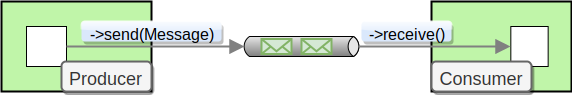
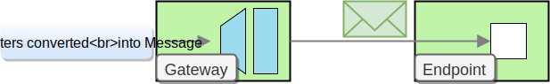

# Lesson 1: Messaging Concepts


Not having code for _Lesson 1?_&#x20;

`git checkout lesson-1`


Key concepts / background\


_Ecotone_ from the ground is built around messaging to provide a simple model that **allows to connects components, modules or even different Applications together, in seamless and easy way**. \
To achieve that fundamental messaging blocks are implemented using [Enterprise Integration Patterns](https://www.enterpriseintegrationpatterns.com)On top of what we get support for higher level patterns like CQRS, Events, DDD  - which **help us build systems that make the business logic explicit and maintainable, even in the long term.**\
\
In this first lesson, we will learn fundamental blocks in messaging architecture and we will start building back-end for Shopping System using CQRS. \
Before we will dive into implementation, let's briefly understand main concepts behind Ecotone.

### Message


A **Message** is a data record containing of **Payload** and **Message Headers (Metadata)**.\
The Payload can be of any PHP type (scalar, object, compound), and the Headers hold commonly required information such as ID, timestamp and framework specific information.\
Developers can also store any arbitrary key-value pairs in the headers, to pass additional meta information.

```php
interface Message
{
    public function getPayload();

    public function getHeaders() : MessageHeaders;
}
```

### Message Channel



_**Message channel**_ abstracts communication between components. It does allow for sending and receiving messages. This decouples components from knowledge about the transport layer, as it's encapsulated within the Message Channel.

### Message Endpoint

.jpg>)

Message Endpoints are consumers and producers of messages. Consumer are not necessary asynchronous, as you may build synchronous flow, compound of multiple endpoints.&#x20;


If you are familiar with Symfony Messager/Simplebus, for now you can think of Endpoint as a _Message Handler_, that can be connected to asynchronous or synchronous transport.&#x20;


### Messaging Gateway



The Messaging Gateway encapsulates messaging-specific code (The code required to send or receive a [Message](php-messaging-architecture.md#message)) and separates it from the rest of the application code.\
It take your domain specific objects an convert them into a [Message](php-messaging-architecture.md#message) that is send via [Message channel](php-messaging-architecture.md#message-channel). \
To not have dependency on the Messaging Framework `Ecotone` provides the Gateway as interface and generates proxy class for it.


Command/Query/Event buses are implemented using Messaging Gateway.


### Business Logic

You will not have to implement **Messages**, **Message Channels** or **Message Endpoints** directly, as those are lower level concepts. Instead you will be able to focus on your specific domain logic with an implementation based on plain PHP objects. By providing declarative configuration we will be able to connect domain-specific code to the messaging system.&#x20;


Great, now when we know fundamental blocks of `Ecotone` and _Messaging Architecture_, we can start implementing our Shopping System! \
If you did not understand something, do not worry, we will see how does it apply in practice in next step.&#x20;


## To The Code!

Do you remember this command from [Setup part](before-we-start-tutorial.md#setup-for-tutorial)?

```php
bin/console ecotone:quickstart
"Running example...
Hello World
Good job, scenario ran with success!"
```

If yes and this command does return above output, then we are ready to go.




```php
Go to "src/EcotoneQuickstart.php"

# This class is autoregistered using Symfony Autowire
```





```php
Go to "app/EcotoneQuickstart.php"

# This class is autoregistered using Laravel Autowire
```





```php


Go to "src/EcotoneQuickstart.php"

# This class is autoregistered using PHP-DI
```




this method will be run, whenever we execut&#x65;_`ecotone:quickstart`_. \
This class is auto-registered using auto-wire system, both [Symfony](https://symfony.com/doc/current/service_container/autowiring.html) and [Laravel](https://laravel.com/docs/7.x/container) provides this great feature. For `Lite` clean and easy to use [`PHP-DI`](https://github.com/PHP-DI/PHP-DI) is taken.\


Thanks to that, we will avoid writing configuration files for service registrations during this tutorial. \
And we will be able to fully focus on what can `Ecotone` provides to us.&#x20;

```php
<?php

namespace App;

class EcotoneQuickstart
{
    public function run() : void
    {
        echo "Hello World";
    }
}
```

### Command Handler - Endpoint

We will start by creating **Command Handler**.\
Command Handler is place where we will put our business logic. \
Let's create namespace **App\Domain\Product** and inside **RegisterProductCommand**, command for registering new product:

```php
<?php

namespace App\Domain\Product;

class RegisterProductCommand
{
    private int $productId;

    private int $cost;

    public function __construct(int $productId, int $cost)
    {
        $this->productId = $productId;
        $this->cost = $cost;
    }

    public function getProductId() : int
    {
        return $this->productId;
    }

    public function getCost() : int
    {
        return $this->cost;
    }
}
```


```php
private int $productId;
```

Describing types, will help us in later lessons with automatic conversion. Just remember right now, that it's worth to keep the types defined.


Let's register a Command Handler now by creating class **App\Domain\Product\ProductService**

```php
<?php

namespace App\Domain\Product;

use Ecotone\Modelling\Attribute\CommandHandler;

class ProductService
{
    private array $registeredProducts = [];
    
    #[CommandHandler]
    public function register(RegisterProductCommand $command) : void
    {
        $this->registeredProducts[$command->getProductId()] = $command->getCost();
    }
}
```

First thing worth noticing is **#\[CommandHandler]**. \
This [attribute](https://wiki.php.net/rfc/attributes_v2) marks our `register` method in **ProductService** as an [Endpoint](php-messaging-architecture.md#message-endpoint), from that moment it can be found by **Ecotone**`.`

Ecotone will read method declaration and base on the first parameter type hint will know that this **CommandHandler** is responsible for handling **RegisterProductCommand**.&#x20;


Ecotone make use [Attributes](https://wiki.php.net/rfc/attributes_v2) to provide declarative configuration. In most of the scenarios we will be stating "what" we want to achieve with Attributes, and Ecotone will take care of "how". **This way our application logic will stay decoupled from the technical concerns.**&#x20;



`#[ClassReference]` is a special [Attribute](https://wiki.php.net/rfc/attributes_v2)  it informs `Ecotone`how this service is registered in `Depedency Container`. As a default it takes the class name, which is compatible with auto-wiring system. \
If **ProductService** would be registered in **Dependency Container** as "**productService"**, we would use the Attribute this way:

```php
#[ClassReference("productService")
class ProductService
```


### Query Handler - Endpoint

We also need the possibility to query **ProductService** for registered products and this is the role of **Query Handlers**. Let's starts with **GetProductPriceQuery** _class._ This _query_ will tell us what is the price of specific product.

```php
<?php

namespace App\Domain\Product;

class GetProductPriceQuery
{
    private int $productId;

    public function __construct(int $productId)
    {
        $this->productId = $productId;
    }

    public function getProductId() : int
    {
        return $this->productId;
    }
}
```

We also need Handler for this query. Let's add `Query Handler` to the `ProductService`

```php
<?php

namespace App\Domain\Product;

use Ecotone\Modelling\Attribute\CommandHandler;
use Ecotone\Modelling\Attribute\QueryHandler;

class ProductService
{
    private array $registeredProducts = [];

    #[CommandHandler]
    public function register(RegisterProductCommand $command) : void
    {
        $this->registeredProducts[$command->getProductId()] = $command->getCost();
    }

    #[QueryHandler] 
    public function getPrice(GetProductPriceQuery $query) : int
    {
        return $this->registeredProducts[$query->getProductId()];
    }
}
```


Some CQRS frameworks expects Handlers be defined as a class, not method. This is somehow limiting and producing a lot of boilerplate. `Ecotone` does allow for full flexibility, if you want to have only one handler per class, so be it, otherwise just annotate next methods.




```php
# As default auto wire of Laravel creates new service instance each time 
# service is requested from Depedency Container, for our examples 
# we want to register ProductService as singleton.

# Go to bootstrap/QuickStartProvider.php and register our ProductService

namespace Bootstrap;

use App\Domain\Product\ProductService;
use Illuminate\Support\ServiceProvider;

class QuickStartProvider extends ServiceProvider
{
    public function register()
    {
        $this->app->singleton(ProductService::class, function(){
            return new ProductService();
        });
    }
(...)
```



```php
Everything is set up by the framework, please continue...
```



```
Everything is set up, please continue...
```



### Command and Query Bus - Gateways

It's time to call our Endpoints. You may remember that [endpoints](php-messaging-architecture.md#message-endpoint) need to be connected using [Message Channels](php-messaging-architecture.md#message-channel) and we did not do anything like this yet. Thankfully Ecotone does create synchronous channels for us, therefore we don't need to bother about it.&#x20;


Synchronous channels are created automatically for our Message Handlers.\
We will learn easily can they be replaced with asynchronous channels in next lessons.


We need to create [`Message`](php-messaging-architecture.md#message) and send it to correct [`Message Channel`](php-messaging-architecture.md#message-channel).&#x20;


In order to send Message we will use [Messaging Gateway](php-messaging-architecture.md#messaging-gateway). \
Message Gateways are responsible for creating `Message` from given parameters and send them to the correct `channel`.\
\
Special types of Gateways are Command and Query Buses:\
\- For sending Commands we will use **Command Bus.**\
\- For sending Queries we will use **Query Bus.**&#x20;


Let's inject and call Query and Command bus into EcotoneQuickstart class.&#x20;

```php
<?php

namespace App;

use App\Domain\Product\GetProductPriceQuery;
use App\Domain\Product\RegisterProductCommand;
use Ecotone\Modelling\CommandBus;
use Ecotone\Modelling\QueryBus;

class EcotoneQuickstart
{
    private CommandBus $commandBus;
    private QueryBus $queryBus;

// 1
    public function __construct(CommandBus $commandBus, QueryBus $queryBus)
    {
        $this->commandBus = $commandBus;
        $this->queryBus = $queryBus;
    }

    public function run() : void
    {
// 2    
        $this->commandBus->send(new RegisterProductCommand(1, 100));
// 3
        echo $this->queryBus->send(new GetProductPriceQuery(1));
    }
}
```

1. **Gateways** are auto registered in Dependency Container and available for auto-wire.  \
   `Ecotone` comes with few Gateways out of the box like Command and Query buses.&#x20;
2. We are sending command **RegisterProductCommand** to the **CommandHandler** we registered before.&#x20;
3. Same as above, but in that case we are sending query **GetProductPriceQuery** to the **QueryHandler**


As you can see we have not defined any Message Channels, Messages or Gateways, yet they all being used in this scenario. This is can happen because Ecotone is using high level abstractions so our daily development is focused on the business side of the code, yet under the hood is using powerful Messaging capabilities.&#x20;


If you run our testing command now, you should see the result.&#x20;

```php
bin/console ecotone:quickstart
Running example...
100
Good job, scenario ran with success!
```

### Event Handling

We want to notify, when new product is registered in the system. \
In order to do it, we will make use of **Event Bus Gateway** which can publish events.\
Let's start by creating **ProductWasRegisteredEvent**`.`

```php
<?php

namespace App\Domain\Product;

class ProductWasRegisteredEvent
{
    private int $productId;

    public function __construct(int $productId)
    {
        $this->productId = $productId;
    }

    public function getProductId() : int
    {
        return $this->productId;
    }
}
```


As you can see `Ecotone` does not really care what class Command/Query/Event is. It does not require to implement any interfaces neither prefix or suffix the class name.\
In fact commands, queries and events can be of any type and we will see it in next Lessons.\
In the tutorial however we use Command/Query/Event suffixes to clarify the distinction.


Let's inject **EventBus** into our **CommandHandler** in order to publish **ProductWasRegisteredEvent** after product was registered.

```php
use Ecotone\Modelling\EventBus;

 #[CommandHandler]
public function register(RegisterProductCommand $command, EventBus $eventBus) : void
{
    $this->registeredProducts[$command->getProductId()] = $command->getCost();

    $eventBus->publish(new ProductWasRegisteredEvent($command->getProductId()));
}
```

`Ecotone` does control method invocation for [endpoints](php-messaging-architecture.md#message-endpoint), if you have type hinted for specific class, framework will look in Dependency Container for specific service in order to inject it automatically. \
In this scenario it injects for us Event Bus. If you want to know more, check chapter about [Method Invocation](../messaging/conversion/method-invocation.md).

Now, when our event is published, whenever new product is registered, we want to subscribe to that Event and send notification. Let's create new class and annotate method with **EventHandler**.&#x20;

```php
<?php

namespace App\Domain\Product;

use Ecotone\Modelling\Attribute\EventHandler;

class ProductNotifier
{
    #[EventHandler] // 1
    public function notifyAbout(ProductWasRegisteredEvent $event) : void
    {
        echo "Product with id {$event->getProductId()} was registered!\n";
    }
}
```

1. **EventHandler** tells Ecotone to handle specific event based on declaration type hint, just like with **CommandHandler**.&#x20;


**Commands** are targeting single Handler, `Events` on other hand can have multiple Handlers subscribing to it.


If you run our testing command now, you should see the result.&#x20;

```php
bin/console ecotone:quickstart
Running example...
Product with id 1 was registered!
100
Good job, scenario ran with success!
```


Great, we have just finished Lesson 1. \
In this lesson we have learned basic of Messaging and CQRS. \
That was the longest lesson, as it had to introduce new concepts. Incoming lessons will be much shorter :)

\
We are ready for Lesson 2!



[php-domain-driven-design.md](php-domain-driven-design.md)

